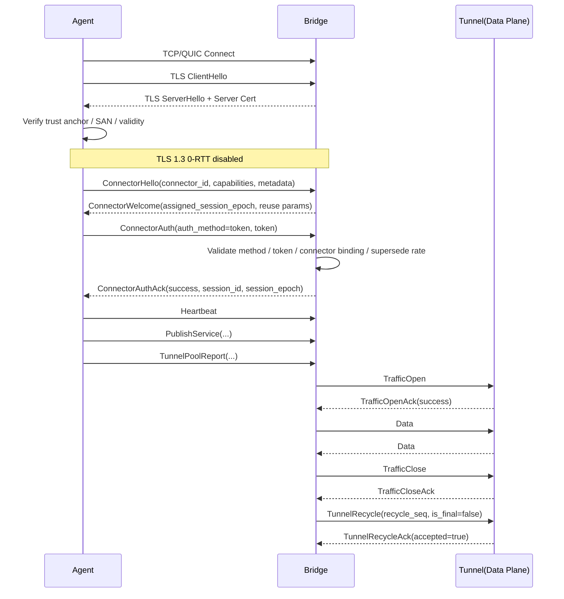

# Agent 与 Bridge 安全接入与认证技术方案

**文档状态**：Final
**文档版本**：v3.5
**适用范围**：LTFP 体系下 Agent 与 Bridge 之间的接入认证、链路加密、会话权威控制、Tunnel 串行复用场景下的数据面安全边界。
**关联文档**：`LTFP-v1-Draft.md`、`LTFP-TransportAbstraction.md`、`LTFP-TunnelMultiplex-Proposal.md`、`Agent-BridgeSecurityExecutionChecklist.md`。

---

## 1. 背景与目标

LTFP 当前已经完成控制面、数据面与 transport 分层。Control Plane 负责 connector 接入、认证、心跳、service publish / unpublish、service health report、状态同步、route sync（可选扩展）与错误通知；Data Plane 负责实际 traffic 转发、双向字节流传输、正常关闭与异常终止；Transport Binding Layer 负责底层连接承载、control channel 收发、data stream 映射、stream / datagram 能力抽象与安全连接。

Session 在 transport 层被定义为 Agent 与 Server 之间的一次长期传输会话，是控制面和数据面的共同上层上下文，也是 transport 侧聚合根。一个 Session 包含 1 条活动 Control Channel、若干 idle tunnel、若干 in-use tunnel、tunnel 生产 / 接收 / 池管理能力以及 session 级生命周期状态机。Session 状态固定为 `idle`、`connecting`、`connected`、`control_ready`、`authenticated`、`draining`、`closed`、`failed`。未进入 `authenticated` 前不得分配实际 traffic；`draining` 状态下不得再分配新的 tunnel；`failed` 后必须终止控制面并清理全部 tunnel。

主协议已经明确：`session_epoch` 由 server 分配，对同一 connector 单调递增；资源级消息必须带 `session_epoch`、`event_id`、`resource_version`；控制面固定顺序为 `ConnectorHello -> ConnectorWelcome -> ConnectorAuth -> ConnectorAuthAck -> PublishService / Heartbeat / TunnelPoolReport / TunnelRefillRequest / ControlError ...`。同时，`ConnectorWelcome.assigned_session_epoch` 是握手期临时预留值，`ConnectorAuthAck.session_epoch` 是认证成功后生效的最终权威值。

Tunnel 串行复用已经被正式引入。Tunnel 生命周期由 `created -> idle -> in-use -> closed` 扩展为 `created -> idle -> in-use -> recycling -> idle/closed`。正常关闭路径固定为 `TrafficClose -> TrafficCloseAck -> TunnelRecycle -> TunnelRecycleAck`；异常结束路径为 `TrafficReset -> 直接关闭`；达到最大复用次数时，Server 发送 `TunnelRecycle(is_final=true)`，回收后直接关闭并由 Agent 补充新 tunnel。`TunnelRecycle` 只能由 Server 发起，`recycle_seq` 必须单调递增，控制面不承载 `TunnelRecycle / TunnelRecycleAck`。

本方案在上述基线上，定义一套完整、正式、可评审的安全接入与认证方案，统一回答以下问题：

* Agent 如何证明自身是合法接入方；
* Agent 如何验证连接的是合法 Bridge；
* 认证如何与 `session_id / session_epoch` 对齐；
* token 如何与 `connector_id`、service publish、route scope 解耦；
* tunnel 串行复用启用后，认证边界如何与数据面回收边界完全分离。

本方案按**上线前最终态**编写。由于当前项目仍在开发阶段、尚未对外上线，本次不引入兼容迁移窗口与双栈协议兜底；实现必须在上线前一次性收敛到本文定义的最终协议与安全约束。

### 当前实现收敛（2026-03-30）

围绕 connector token 管理，当前实现已经收敛为以下运行模型：

* Bridge 新增 `connector_auth.token_store.driver`，默认值固定为 `file`
* `driver=file` 时，Bridge 从独立 token 文件加载并原子落盘 token 元数据；重启后仍可继续认证
* `driver=memory` 仅保留给本地开发联调，且只在无记录时注入开发 token
* Bridge Admin 提供 `connector-tokens` 资源接口用于创建、轮换、吊销与查询 token 元数据
* 明文 token 仅在创建/轮换当次响应返回一次，不进入普通快照、SSE 或日志
* Agent 后台仅保留 `session.auth_token` 手工录入能力，不再本地随机生成 token
* Agent 配置接口对 `session.auth_token` 采用“只写不回显”语义：读取不下发旧值，提交空值不覆盖原 token

---

## 2. 设计原则

### 2.1 认证层、资源层、路由层分离

接入认证只回答“当前连接进来的 Agent 属于哪个 connector”。服务发布回答“当前 session 发布了哪些 service”；路由层回答“这些 service 在哪些 scope 下可被哪些 route 选中”。这三层职责固定分离。

`PublishService` 明确包含 `service_id`、`service_key`、`namespace`、`environment`、`service_name`、`service_type`、`endpoints`、`exposure`、`health_check`、`discovery_policy`、`labels`、`metadata`；`RouteAssign` 明确包含 `route_id`、`namespace`、`environment`、`match`、`target`、`priority`、`policy_json`、`metadata`。因此，`namespace / environment` 属于资源上下文和路由作用域，不属于接入认证主身份。

### 2.2 接入认证绑定 Session

认证结果绑定 Session，而不是绑定单条 tunnel。Session 进入 `authenticated` 的唯一途径是 `ConnectorAuthAck(success=true)`。认证成功后，当前 session 获得实际 traffic 分配能力，并可维护 tunnel pool。Tunnel 的建立、关闭、回收与再利用继承该 session 的认证结果，不触发重新认证。

### 2.3 Tunnel 复用绑定数据面

Tunnel 复用只改变数据面 tunnel 生命周期，不改变接入身份，也不改变 `session_epoch`。复用安全性由 `TrafficCloseAck / TunnelRecycle / TunnelRecycleAck / recycle_seq` 与 tunnel 健康性共同保证，不由认证流程重复承担。

### 2.4 采用 Bearer Token over TLS 1.3

本方案固定采用 **Bearer Token over TLS 1.3** 模型。token 本身是接入凭证；TLS 1.3 负责传输保密性、完整性与 Bridge 身份证明；Bridge 不引入应用层 HMAC proof，不引入 challenge-response，不引入应用层 nonce/timestamp 防重放。该模型与“Bridge 仅保存 `token_secret_hash`”保持完全自洽。

### 2.5 禁用 TLS 1.3 0-RTT

TLS 1.3 Early Data（0-RTT）在所有 binding 实现中必须显式禁用。`ConnectorAuth`、`ConnectorHello`、`ConnectorWelcome` 以及任何携带认证、会话、资源状态意义的控制面消息，不得通过 Early Data 发送。该约束是 Bearer Token over TLS 模型成立的前提之一。

### 2.6 协议必须强类型化

对核心认证字段使用 Protobuf 强类型字段，不使用 `map<string, string>` 承载必填安全字段。弱类型 map 仅保留给非核心扩展 metadata。

---

## 3. 非目标

本方案明确排除以下内容：

* 不要求 mTLS；
* 不要求企业级重型 PKI 平台；
* 不引入 challenge-response；
* 不引入 HMAC proof；
* 不将 `namespace / environment` 绑定到 token；
* 不将 `TunnelRecycle` 作为重新认证过程；
* 不引入 session resume；
* 不改变既有 `ConnectorHello / ConnectorWelcome / ConnectorAuth / ConnectorAuthAck` 控制面骨架。

---

## 4. 标识模型与职责边界

### 4.1 connector_id

接入主体固定为 `connector_id`。Connector 资源模型包含 `connector_id`、`namespace`、`environment`、`node_name`、`display_name`、`version`、`labels`、`capabilities`、`status`、`metadata` 等字段，但接入认证只以 `connector_id` 为主绑定键。Session 资源字段明确包含 `session_id`、`connector_id`、`session_epoch`、`binding_type`、`state`、`authenticated`、`created_at`、`last_seen_at`、`remote_addr`、`metadata`。`session_epoch` 由 server 对同一 connector 单调递增。

### 4.2 service_key 与 service_id

`service_key` 是稳定服务引用键，格式固定为 `<service_name>/<protocol>`。其中 `service_name` 必填，`protocol` 来自 `PublishService.endpoints[*].protocol`，并按 `trim + lower-case` 规范化。同一条 `PublishService` 中所有 endpoint 的 `protocol` 必须一致；若需要多协议暴露，必须拆分为多条 service 发布。为避免键歧义，`service_name` 不允许包含 `/`。`namespace / environment` 仍保留为可选 scope 字段，但不再参与 `service_key` 拼接。

`service_id` 是 server 分配的全局唯一 opaque identity，用于标识逻辑服务池。`service_key` 是 canonical lookup key，`service_id` 是 canonical identity key。route target 使用 `service_key`；runtime / traffic / ACK / audit 使用 `service_id`。当 `PublishService.service_id` 为空时，若 `service_key` 已存在，server 必须复用既有 `service_id`；仅当 `service_key` 首次出现时，server 才分配新的 `service_id`。

同一 `service_key` 允许由多个 connector 并发发布，统一视为同一个逻辑服务池。Server 侧必须维护内部实例标识 `service_instance_id`（运行时字段，不要求进入协议 schema），用于区分池内不同 connector/session 的可用实例。

### 4.3 scope

`namespace / environment` 是 scope 字段，属于资源发布与路由作用域。默认规则为 `Route` scope 必须等于 target scope，首版不允许跨 scope 引用。接入认证不消费这两个字段作为成功条件。

### 4.4 event_id 作用域

`event_id` 的去重作用域固定为 **`session_id + event_id`**。Agent 必须保证同一 session 内的 `event_id` 唯一。Bridge 按复合键去重，不要求跨 session 的全局 `event_id` 唯一。推荐实现使用 UUID v4、ULID 或等价高熵唯一 ID。

### 4.5 recycle_seq 作用域

`recycle_seq` 的作用域固定为**单条 tunnel 生命周期**。同一 `tunnel_id` 存活期间，`recycle_seq` 必须严格递增。`tunnel_id` 在 session 生命周期内不得复用；tunnel 关闭后，新的 tunnel 必须分配新的 `tunnel_id`。该规则用于防止旧轮次回收消息污染新 tunnel。

---

## 5. TLS 与证书体系

### 5.1 证书模型

链路统一采用 TLS 1.3。Bridge 启动时必须支持两种服务端证书来源模式，并通过配置显式选择：

* 外部证书模式：运维侧提供 `tls_cert_file/tls_key_file`，Bridge 直接加载既有服务端证书与私钥；
* 自建 CA 模式：Bridge 初始化时生成或加载 Root CA 私钥与证书，再由 Root CA 签发 Bridge 服务端证书。

Agent 侧必须预置信任与所选模式对应的 trust anchor，并在 TLS 握手阶段校验服务端证书链、SAN 与有效期。Transport Binding Layer 负责安全连接，因此 TLS 证书体系属于 transport 层能力，而不是控制面业务协议的一部分。

证书来源配置必须同时支持**配置文件加载**与**环境变量覆盖**。环境变量优先级高于配置文件，便于在不同部署环境下切换“外部证书模式 / 自建 CA 模式”而不修改基础镜像或静态配置文件。

### 5.2 证书分层

证书分层按模式划分如下：

* 自建 CA 模式：`Root CA -> Bridge Server Certificate -> Agent Trust Anchor`
* 外部证书模式：`External CA / Intermediate CA -> Bridge Server Certificate -> Agent Trust Anchor`

其中：

* Root CA：仅在自建 CA 模式下存在，作为长期证书低频轮换；
* Bridge Server Certificate：两种模式下都存在，作为 Bridge 对外提供的服务端证书；
* Agent Trust Anchor：保存与当前模式对应的根证书或 CA 链信任锚。

### 5.3 Agent 校验要求

Agent 必须校验：

* 证书链可回溯到预置信任锚（自建 CA 的 Root CA 或外部 CA 链）；
* SAN 与访问地址一致；
* 证书未过期；
* 当前时间位于有效期内。

校验失败时，TLS 握手必须失败，session 进入 `failed`。

### 5.4 Root CA 轮换

自建 CA 模式下，Root CA 的分发与更新固定依赖**带外运维配置管理系统**完成，不通过本协议带内分发；Bridge Server Certificate 的常规轮换可由 Bridge 自身处理。外部证书模式下，服务端证书与对应 trust anchor 的更新由外部 PKI、配置中心、镜像更新或 Secret 管理系统完成。协议层不提供 trust anchor 的 in-band 自动轮换。

### 5.5 证书撤销问题说明

当前版本不要求实现 OCSP、CRL 或 OCSP Stapling，也不将证书撤销能力列为协议必须项。
但证书撤销问题被明确记录为安全边界问题：若 Bridge 服务端私钥泄露，仅依赖“证书链合法、SAN 匹配、未过期”的校验仍不足以完成受损证书的快速收敛。该场景下的处置方式固定为**带外紧急轮换**：停用受损证书、重新签发新的 Bridge Server Certificate；若启用自建 CA 且 CA 同步受损，则再重新签发 Root CA，并通过带外运维渠道更新 Agent 信任锚。

### 5.6 Bridge TLS 接入模式

Bridge 必须通过配置声明 Agent 接入模式（控制面与数据面统一约束），固定支持以下三种模式：

* `required`（强 TLS）：仅允许 TLS 连接；未启用 TLS 的 Agent 必须被拒绝连接。
* `optional`（可选 TLS）：同时允许 TLS 与明文连接；两类 Agent 均可接入。
* `plaintext`（明文）：仅允许明文连接；发起 TLS 握手的连接必须被拒绝。

生产环境默认应使用 `required`。`optional` 与 `plaintext` 仅用于开发、联调或受控内网场景。

### 5.7 证书来源配置命名冻结

Bridge 侧 TLS 证书来源配置命名固定如下。

YAML 配置键：

```yaml
control_plane:
  tls_mode: true # 是否启用强制 TLS 模式
  tls_cert_source: "external" # external | managed_ca

  # external 模式，支持自定义公钥和私钥证书
  tls_cert_file: ""
  tls_key_file: ""

  # managed_ca 模式，使用内置 CA 签发证书
  tls_ca_cert_file: ""
  tls_ca_key_file: ""
  tls_server_common_name: ""
  tls_server_san_dns: []
  tls_server_san_ips: []
  tls_server_cert_ttl: "168h"
  tls_server_cert_renew_before: "24h"
```

环境变量命名：

```text
DEV_BRIDGE_CFG_CONTROL_PLANE_TLS_MODE
DEV_BRIDGE_CFG_CONTROL_PLANE_TLS_CERT_SOURCE
DEV_BRIDGE_CFG_CONTROL_PLANE_TLS_CERT_FILE
DEV_BRIDGE_CFG_CONTROL_PLANE_TLS_KEY_FILE
DEV_BRIDGE_CFG_CONTROL_PLANE_TLS_CA_CERT_FILE
DEV_BRIDGE_CFG_CONTROL_PLANE_TLS_CA_KEY_FILE
DEV_BRIDGE_CFG_CONTROL_PLANE_TLS_SERVER_COMMON_NAME
DEV_BRIDGE_CFG_CONTROL_PLANE_TLS_SERVER_SAN_DNS
DEV_BRIDGE_CFG_CONTROL_PLANE_TLS_SERVER_SAN_IPS
DEV_BRIDGE_CFG_CONTROL_PLANE_TLS_SERVER_CERT_TTL
DEV_BRIDGE_CFG_CONTROL_PLANE_TLS_SERVER_CERT_RENEW_BEFORE
```

约束固定如下：

* `tls_cert_source` 仅允许 `external` 或 `managed_ca`；
* `external` 模式下必须提供 `tls_cert_file/tls_key_file`；
* `managed_ca` 模式下必须提供 `tls_ca_cert_file/tls_ca_key_file`，并至少提供一项 `tls_server_san_dns` 或 `tls_server_san_ips`；
* `tls_server_san_dns` 与 `tls_server_san_ips` 在环境变量中使用逗号分隔；
* 环境变量优先级高于 YAML 配置文件；
* 未显式指定 `tls_cert_source` 时，默认值固定为 `external`，以保持对现有外部证书路径的兼容。

### 5.8 证书续签、替换与热加载

Bridge 在 TLS 启用时必须维护证书热加载循环，运行策略固定如下：

* `external` 模式：周期轮询 `tls_cert_file/tls_key_file`，检测到证书替换后热加载到新连接握手路径；
* `managed_ca` 模式：按 `tls_server_cert_renew_before` 判断是否进入续签窗口，进入窗口后自动重新签发并热加载；
* 证书刷新失败时保留上一版可用证书继续服务，并记录错误日志。

### 5.9 模式切换与回滚路径

Bridge 证书来源模式切换与回滚通过同一组配置入口完成，操作顺序固定如下：

1. 准备目标模式所需证书材料（`external` 准备 cert/key；`managed_ca` 准备或规划 CA cert/key）。
2. 更新 `control_plane.tls_cert_source` 与对应字段（可通过 YAML 或环境变量覆盖）。
3. 重启 Bridge，使新模式在启动阶段完成校验与首轮证书加载。
4. 验证 Agent 握手与业务连通性后再放量。
5. 如出现异常，恢复上一版 `tls_cert_source` 及相关证书参数并重启，回退到前一已知可用模式。

### 5.10 Root CA 带外分发与紧急替换 Runbook

自建 CA 模式下，Root CA 运维固定走带外流程，不通过控制面协议分发：

1. Root CA 分发：通过配置中心/Secret 系统把 trust anchor 下发到 Agent 运行环境。
2. 常规轮换：预先分发新 trust anchor，确认 Agent 覆盖率后切换 Bridge 使用的新 Root CA。
3. 紧急替换：私钥泄露或证书受损时，立即停用旧 Root CA，重新签发 Bridge 服务端证书并强制更新 Agent 信任锚。
4. 回收旧证书：轮换完成后清理旧 Root CA 与旧服务端证书文件，避免误用。

### 5.11 密钥存储约束

密钥存储与权限约束固定如下：

* `managed_ca` 模式下，Root CA 私钥文件与 Bridge 服务端私钥必须分离；服务端私钥按短周期签发使用，不与 Root CA 共用文件。
* `external` 模式下，服务端私钥文件权限必须满足最小权限（不允许 group/other 读写执行）。
* 两种模式下，私钥不得出现在普通日志和通用备份快照中。

---

## 6. Token 模型

### 6.1 绑定关系

token 只绑定 `connector_id`。token 不绑定 `namespace`、`environment`、`service_key`、`service_id`。token 的职责固定为“允许某个 connector 接入 Bridge”，不承担资源发布和路由治理职责。

### 6.2 token 格式

token 固定采用两段式格式：

```text
dbt_<token_id>.<token_secret>
```

其中：

* `token_id` 为公开索引标识；
* `token_secret` 为高熵随机值，仅在 Agent 侧保存明文。

`token_id` 字符集固定为 `[A-Za-z0-9_-]+`。`token_secret` 必须使用不会引入分隔符歧义的安全字符集，推荐 base64url 或等价字符集。解析规则固定为：去掉 `dbt_` 前缀后，**按第一个 `.` 分割**，左侧为 `token_id`，右侧为 `token_secret`；解析失败必须返回 `auth_invalid_token`。

### 6.3 Bridge 存储模型

Bridge 必须保存：

* `connector_id`
* `token_id`
* `token_secret_hash`
* `status`
* `issued_at`
* `expires_at`
* `rotated_at`
* `metadata`

Bridge 不保存 `token_secret` 明文，不依赖可逆解密，不进行 HMAC 验证。认证时先按 `token_id` 定位 token 记录，再对 `token_secret` 进行 hash 比对。

### 6.4 token_secret_hash 算法要求

`token_secret_hash` 必须使用**抗暴力破解的密码哈希算法**。允许算法集合固定为：

* `argon2id`
* `scrypt`
* `bcrypt`

默认推荐 `argon2id`。
禁止使用以下方式直接存储 token secret：

* 明文
* MD5
* SHA-1
* SHA-256
* SHA-512
* 任何无 work factor / 无 memory-hard 特性的快速哈希直接存储

实现必须为密码哈希保留参数配置能力，并在系统中记录算法与参数版本。

### 6.5 token 状态

token 状态固定为：

* `active`
* `grace`
* `revoked`
* `expired`

`active` 表示当前有效；`grace` 表示轮换窗口内仍可接受；`revoked` 表示主动吊销，不允许建立新 session；`expired` 表示已过期，不允许建立新 session。

### 6.6 grace 上限

`grace` 必须是短期过渡状态。其最大持续时间不得超过 **24 小时**。超过上限后，旧 token 必须自动进入 `expired` 或 `revoked`。

### 6.7 token 与策略分离

资源发布能力与路由可达性由独立 publish policy / route policy 管理。publish policy 可以包含允许无 scope 发布、默认 scope、允许的 scope 集合、允许的服务模式、labels 约束、metadata 约束等。token 不承载这些策略。

### 6.8 Agent 侧 token 存储要求

Agent 侧必须将 token 视为高敏感凭证。
最低要求如下：

* 不得将 token 明文写入普通日志；
* 不得以宽松文件权限写入通用配置文件；
* 优先使用操作系统 keyring / Secret Service / Windows DPAPI / macOS Keychain 等安全存储；
* 容器环境优先使用 Secret 管理，并启用静态存储加密；
* 环境变量只可作为过渡载体，不作为长期高安全推荐方式。

---

## 7. 控制面认证协议

### 7.1 总体流程

控制面认证流程固定如下：

1. 建立底层传输连接；
2. Bridge 按 `tls_mode` 决定连接策略：`required` 仅接受 TLS、`optional` 同时接受 TLS/明文、`plaintext` 仅接受明文；
3. 当连接为 TLS 时，完成 TLS 1.3 握手并由 Agent 校验 Bridge 证书；
4. Control Channel 进入 `control_ready`；
5. Agent 发送 `ConnectorHello`；
6. Bridge 返回 `ConnectorWelcome`；
7. Agent 发送 `ConnectorAuth`；
8. Bridge 校验 token 与 session 竞争关系；
9. Bridge 返回 `ConnectorAuthAck`；
10. session 进入 `authenticated`；
11. 认证成功后，Agent 开始 `Heartbeat`、`PublishService`、`TunnelPoolReport` 等控制面行为。

### 7.2 ConnectorHello

`ConnectorHello` 承载：

* `connector_id`
* 可选 `namespace`
* 可选 `environment`
* `node_name`
* `display_name`
* `version`
* `capabilities`
* `labels`
* `metadata`

其中，`connector_id` 是接入主身份；`namespace / environment` 若存在，仅为附加上下文，不参与认证成功判定。
实现要求：`namespace / environment` 必须按可选字段处理，Bridge 与 Agent 侧校验器不得把两者缺失作为认证失败条件。

### 7.3 Hello 阶段限流与枚举抑制

未认证的 `ConnectorHello` 也必须纳入限流。Bridge 至少按以下维度实施速率控制：

* 源 IP
* `connector_id`
* 未认证连接总数

对于未知 `connector_id`、已注册 `connector_id`、后续 token 错误等场景，Bridge 对外返回的错误响应不得暴露高可区分度的枚举信息。日志中可保留精细诊断信息，但对协议外显行为必须做适度模糊化处理。

当前实现补充约束如下：

* Hello 阶段限流维度固定为 `source_ip + connector_id`，并附带未认证连接预算与认证并发预算；
* 认证失败封禁维度固定为 `source_ip + connector_id`，超过阈值后执行短时封禁；
* 未知 `connector_id`、无效 token、吊销 token 对外统一返回 `auth_invalid_token` 与统一拒绝文案，降低可枚举性。

### 7.4 ConnectorWelcome

`ConnectorWelcome` 固定返回：

* `selected_binding`
* `version_major`
* `version_minor`
* `heartbeat_interval_sec`
* `capabilities`
* `assigned_session_epoch`
* `metadata`

启用 tunnel 串行复用时，额外下发：

* `tunnel_max_reuse_count`
* `tunnel_recycle_timeout_sec`
* `tunnel_idle_ttl_sec`

若对端版本不支持新增帧 `TrafficCloseAck / TunnelRecycle / TunnelRecycleAck`，握手阶段必须直接拒绝会话。

### 7.5 `assigned_session_epoch` 语义

`ConnectorWelcome.assigned_session_epoch` 是当前握手上下文的**候选 epoch**，仅用于本次握手流程关联，不代表该 epoch 已经成为该 `connector_id` 的最终生效 session epoch。

`assigned_session_epoch` 的存在目的，是为当前握手提供一个可对齐的候选代际值，并在 `ConnectorAuthAck(success=true)` 返回时，与最终提交的 `session_epoch` 保持一致。

未成功完成认证提交流程的握手，不得将其 `assigned_session_epoch` 视为已提交值，不得创建 `ACTIVE` session，不得影响当前已生效 session 的权威状态，也不得污染该 `connector_id` 的最终 epoch 序列。

### 7.6 ConnectorAuth

`ConnectorAuth` 的 `auth_method` 固定为 `token`。认证字段改为强类型定义，不再使用弱类型 map 承载必填字段。固定字段如下：

* `auth_method`
* `token`
* `client_cap_version`
* `metadata`

本方案不包含 `timestamp_unix`、`client_nonce`、应用层 nonce 去重或时间窗口校验。认证模型固定为 Bearer Token over TLS 1.3。
`ConnectorAuth` 采用最终态强类型结构，不再保留 `auth_payload` 兼容路径；缺少 `token` 字段的请求必须被拒绝。

### 7.7 Bridge 认证逻辑

Bridge 认证流程以 **§7.11** 为唯一权威定义。本节仅保留索引，避免出现双份流程描述漂移。

### 7.8 session_epoch 权威规则

握手期权威规则固定如下：

* `ConnectorWelcome.assigned_session_epoch` 是本次握手的候选 epoch；
* `ConnectorAuthAck.session_epoch` 是认证成功并提交后的最终权威值；
* 只有在 `ConnectorAuthAck(success=true)` 提交完成后，`session_epoch` 才正式生效；
* 认证成功时，`ConnectorAuthAck.session_epoch` 必须等于该握手上下文对应的 `assigned_session_epoch`；
* 认证失败、超时、中断、被拒绝或被并发抢占淘汰的握手，不得消耗该 `connector_id` 的最终已提交 epoch 序列；
* 后续所有资源级消息必须以最终成功提交的 `ConnectorAuthAck.session_epoch` 为准。

### 7.9 `session_epoch` 提交原子性

对同一 `connector_id` 的并发握手，Bridge 必须保证 `session_epoch` 的提交是**原子的**。

Bridge 在生成 `ConnectorAuthAck(success=true)` 前，必须以 `connector_id` 为粒度，对以下动作执行原子提交保护。允许的实现手段包括但不限于：单键事务、Compare-And-Swap（CAS）、互斥锁、串行执行器或等价机制。

原子提交至少覆盖以下动作：

1. 读取当前 `connector_id` 的最新已提交 `session_epoch` 与当前权威 active session；
2. 判定本次握手是否仍具备成为最新 session 的资格；
3. 提交新的 `session_epoch`；
4. 将当前握手对应的 session 标记为 `ACTIVE`；
5. 将旧 session 标记为 `DRAINING` 或 `STALE`；
6. 持久化或发布新的权威 session 视图。

以上动作不得拆分为非原子的“先检查、后写入、再切换”多步松散流程。

任意时刻，对同一 `connector_id`，最终只能存在**一个**成功提交并生效的权威 `ACTIVE` session。

---

### 7.10 并发握手收敛规则

当同一 `connector_id` 存在多个并发认证握手时，收敛规则固定如下：

* 多个握手可以并行进入 `ConnectorHello -> ConnectorWelcome -> ConnectorAuth` 阶段；
* 多个握手都可以完成 token 合法性校验；
* 但在 `session_epoch` 提交阶段，最终只能有一个握手成功提交为 `ACTIVE` session；
* 其他并发握手即使已通过 token 校验，也必须在提交阶段失败，并返回 `auth_session_superseded`；
* 返回 `auth_session_superseded` 的握手不得创建 `ACTIVE` session，不得发布服务，不得接收实际 traffic，不得影响当前权威 session 的资源状态；
* 若某并发握手在提交阶段失败，其对应的 `assigned_session_epoch` 仅视为失效候选值，不得进入后续控制面权威判断。

该规则适用于以下场景：

* 同一宿主机上的重复进程启动；
* 两台宿主机误用相同 `connector_id + token`；
* 网络分区恢复后的双端并发重连；
* 编排系统假死重启、双活误拉起、split-brain 场景。


---

### 7.11 Bridge 认证逻辑

Bridge 收到 `ConnectorAuth` 后，按照以下固定顺序执行校验与提交流程：

1. 校验 `auth_method` 是否等于 `token`；
2. 校验 `connector_id` 是否存在；
3. 校验 `token` 格式是否合法；
4. 按 `token_id` 查找 token 记录；
5. 校验 token 是否归属于当前 `connector_id`；
6. 校验 token 状态是否为 `active` 或 `grace`；
7. 校验 token 是否未过期；
8. 校验当前 `connector_id` 是否触发成功抢占限流；
9. 进入 `session_epoch` 原子提交阶段；
10. 若原子提交成功，则生成 `ConnectorAuthAck(success=true, session_id, session_epoch)`；
11. 若原子提交失败，且原因是被同 connector 的并发握手抢占，则返回 `ConnectorAuthAck(success=false, error_code=auth_session_superseded)`；
12. 若原子提交失败，且原因是速率限制、内部状态冲突或存储异常，则返回对应错误码。

其中第 9 步是本流程的唯一权威提交点。
在第 9 步成功之前，Bridge 不得将当前握手视为已认证 session，不得为其分配实际 traffic，不得允许其发布服务。


---

## 8. Session 状态、抢占与风暴控制

### 8.1 Session 状态机

Session 状态机固定为：

```text
idle -> connecting -> connected -> control_ready -> authenticated
authenticated -> draining -> closed
authenticated -> failed
control_ready -> failed
connected -> failed
connecting -> failed
```

未进入 `authenticated` 前，不得发布服务、不得接收实际 traffic、不得进入 tunnel pool 工作态。进入 `draining` 后，不得再分配新的 tunnel。

### 8.2 旧 session 处理

同一 `connector_id` 建立新 `session_epoch` 后，旧 session 必须进入 `draining` 或 `stale` 语义，并禁止继续修改控制面资源状态。该规则用于防止旧会话污染新的资源真相源。

### 8.3 抢占限流

Bridge 必须实现 **connector 维度的 session supersede rate limit**。对同一 `connector_id`，若在滑动时间窗口内发生高频成功抢占，例如 60 秒内超过 3 次，Bridge 必须拒绝新的抢占建立，并返回 `auth_rate_limited`。

该规则独立于认证失败限流，也独立于并发握手原子提交规则。二者职责如下：

* **原子提交规则**：保证同一时刻只有一个握手能成功提交为权威 `ACTIVE` session；
* **抢占限流规则**：保证短时间内不会发生过多次成功抢占，防止控制面风暴。

Agent 收到 `auth_session_superseded` 或 `auth_rate_limited` 后，必须进入指数退避，不得立即重试。

### 8.4 心跳与重连

控制链路默认心跳与重连策略固定为：

* Agent 每 5 秒发送一次 ping；
* 连续 5 次未收到 pong 视为 session 失活；
* 触发重连；
* 重连策略为指数退避 `1s -> 2s -> 4s -> 8s`，附加抖动。

---

## 9. 控制面一致性

资源级控制消息必须带：

* `session_id`
* `session_epoch`
* `event_id`
* `resource_version`

语义固定如下：

* `session_epoch`：判定消息是否来自当前有效会话；
* `event_id`：幂等去重；
* `resource_version`：资源代际控制。

关键 ACK 消息必须返回：

* `accepted`
* `accepted_resource_version`
* `current_resource_version`
* `error_code`
* `error_message`

至少适用于 `PublishServiceAck`、`UnpublishServiceAck`、`RouteAssignAck`、`RouteRevokeAck`。

---

## 10. 服务发布与路由作用域

`PublishService` 包含 `service_id`、`service_key`、`namespace`、`environment`、`service_name`、`service_type`、`endpoints`、`labels`、`metadata` 等字段；`RouteAssign` 包含 `route_id`、`namespace`、`environment`、`match`、`target`、`priority`、`policy_json`、`metadata` 等字段。scope 字段属于资源发布与 route 选择，不属于接入认证层。

接入层通过 token 判定 connector 是否允许建立 session；资源层通过 publish policy 判定当前 session 是否允许发布特定 service；路由层通过 route policy 与 scope 规则判定这些 service 是否可被对应 route 选中。三层职责固定，不交叉。

对于 L7 入口，`RouteMatch` 必须支持可选 `header_matches` 条件，用于在同一 host/path 下按请求头把流量分流到不同 target service。该能力只属于路由决策层，不影响 `service_key/service_id` 身份模型。

路由命中后，`connector_service.service_key` 解析到逻辑服务池，再从池内 `ACTIVE + HEALTHY` 实例集合中选择具体实例。首版策略固定为“随机或等价无状态均衡（如 P2C）”，并要求单条 traffic 生命周期内绑定同一实例，不做 mid-stream failover。该策略与 Cloudflare Tunnel 的 replica 高可用思路一致：优先提供副本冗余与故障收敛，不承诺固定命中某一副本。

---

## 11. Tunnel 串行复用场景下的数据面安全边界

### 11.1 复用不触发重新认证

Tunnel 串行复用只改变数据面 tunnel 生命周期，不改变 session 认证关系。一个 ACTIVE session 认证一次，之后该 session 下所有 tunnel 的建立、占用、关闭、回收、再利用均继承该 session 的认证结果。

### 11.2 标准闭环

正常关闭后的回收闭环固定为：

```text
TrafficClose -> TrafficCloseAck -> TunnelRecycle -> TunnelRecycleAck
```

异常结束时，`TrafficReset` 直接导致 tunnel 关闭，不进入 recycling。达到最大复用次数时，Server 发送 `TunnelRecycle(is_final=true)`，回收后直接关闭，并由 Agent 补充新 tunnel。

### 11.3 回收语义约束

* `TrafficCloseAck` 为新增帧；
* `TunnelRecycle` 必须在 `TrafficClose + TrafficCloseAck` 完成后发送；
* `TunnelRecycle` 只能由 Server 发起；
* Agent 必须验证 `recycle_seq` 严格递增；
* `TunnelRecycleAck.accepted=false` 时，双方均必须关闭 tunnel，不得重试回收；
* 回收握手超时后，Server 必须将 tunnel 标记为 `broken` 并关闭。

### 11.4 双端同时关闭规则

若任一侧已经发送 `TrafficClose` 且尚未收到 `TrafficCloseAck` 时，收到了对端的 `TrafficClose`，则判定为 **simultaneous close**。此时处理规则固定如下：

1. 双方均将当前 traffic 标记为 `closing-complete`；
2. 任一侧收到对端 `TrafficClose` 时，若本地尚未发送该 `traffic_id` 的 `TrafficCloseAck`，必须立即回送 `TrafficCloseAck`；若已发送则不得重复发送；
3. 完成必要的 `TrafficCloseAck` 处理后，双方不得进入“互等 ACK”循环；
4. 由于 `TunnelRecycle` 的决策权固定在 Server，后续统一由 Server 在确认本地缓冲排空且 tunnel 满足 `Recyclable()` 后发起 `TunnelRecycle`；
5. 若 Server 无法确认安全回收，则直接关闭 tunnel。

该规则确保双端同时关闭不会导致状态机互相等待或卡死。

### 11.5 可复用判定

Tunnel 可复用的前提固定为：

* `Flush()` 成功；
* 无 pending bytes；
* 底层 stream 健康；
* `Recyclable() == true`；
* `recycle_seq` 通过校验。

任一条件不满足时，必须关闭 tunnel，并通过标准补池机制补充新 tunnel。

### 11.6 idle tunnel 探活约束

idle tunnel 的探活必须在 **传输层 / binding 层控制协议** 完成。探活帧不得作为 `TrafficData` 或普通业务 payload 写入可复用 tunnel 的业务缓冲区。任何可能进入业务读写缓冲的数据，都会使 tunnel 判定为不可回收。

---

## 12. Token 生命周期管理

### 12.1 签发

Bridge 为指定 `connector_id` 生成 `token_id` 和高熵 `token_secret`，保存 `token_secret_hash`、状态与过期时间，并仅向 Agent 或运维展示一次明文 token。明文 token 不得二次展示，不得进入普通日志。

### 12.1.1 token store 驱动与持久化

Bridge 必须通过 `connector_auth.token_store.driver` 明确声明 token 存储后端。当前冻结的驱动集合为：

* `file`：默认值。token 元数据写入独立文件并原子替换，适用于正常运维与重启恢复。
* `memory`：仅用于开发联调。进程退出后 token 记录全部丢失。

当前设计允许后续增加 `sqlite` 等新驱动，但不得改变：

* 明文 token 仅创建/轮换时返回一次
* Bridge 只保存 `token_secret_hash`
* token 记录不混入普通运行配置 patch 资源

### 12.2 轮换

token 轮换采用双 token 过渡：

* 新 token 状态置为 `active`；
* 旧 token 状态置为 `grace`；
* 过渡窗口结束后，旧 token 自动进入 `expired` 或 `revoked`。

Bridge 在认证阶段同时接受 `active` 与 `grace`。

当前实现首期先采用更保守的“直接替换”语义：Bridge Admin 轮换后立即生成新的明文 token，并使旧 token 不再用于后续新建 session。`grace` 双 token 过渡窗口仍保留为后续增强项。

### 12.3 吊销类型

token 吊销分为两类：

#### 12.3.1 轮换型吊销

用于正常密钥切换。该场景下，被替换 token 不允许建立新 session；现有 active session 不主动中断，可保持到自然断开，或由实现平滑转入 `draining`。

#### 12.3.2 安全事件吊销

用于 token 泄露、主机失陷、异常登录等安全事件。该场景下，Bridge 必须支持对该 token 关联的 active sessions 执行**强制 drain 或强制关闭**。协议层要求实现具备这一管理能力或等价运维操作路径。

### 12.4 会话期间过期语义

token 的 `active / grace / revoked / expired` 判定只作用于**认证建立阶段**。对于认证时处于 `active` 或 `grace`、但在会话期间变为 `expired` 的 token，不主动中断已建立的 active session；该 token 仅影响后续新 session 建立。该规则与“认证只发生在握手期”保持一致。

---

## 13. 超时、TTL 与故障处理

`Session.Open()` 必须受 connect timeout、TLS timeout、control ready timeout、auth timeout 约束。任一阶段超时均可使 session 进入 `failed`。

空闲 tunnel 可以设置最大空闲寿命 TTL。TTL 到期后，Agent 关闭旧 tunnel 并补充新 tunnel。TTL 不能替代僵尸 tunnel 探测。对于长期驻留 idle pool 的 tunnel，binding/runtime 必须结合底层能力启用 keepalive 或轻量探测；探测失败时，该 tunnel 必须标记为 `broken` 并从池中移除。

`TrafficOpen` 阶段必须等待 `TrafficOpenAck`。若超时未收到 ack，则当前 tunnel 标记为 `broken`，当前 traffic 失败，tunnel 从池中移除，并由 Agent 补充新 tunnel。

---

## 14. 安全基线

### 14.1 失败限流

Bridge 必须针对源 IP 与 `connector_id` 两个维度实现认证失败限流。超过阈值后执行短时封禁，以降低暴力试探风险。

### 14.2 成功抢占限流

Bridge 必须实现同一 `connector_id` 的 session supersede rate limit。60 秒内超过允许次数的成功抢占必须被拒绝，并返回 `auth_rate_limited`。该机制用于防止控制面风暴。

### 14.3 Hello 阶段限流

Bridge 必须对未认证的 `ConnectorHello` 阶段实施限流与连接预算控制，防止 connector 枚举、握手洪泛与 epoch 扰动探测。

### 14.4 日志审计

允许记录：

* `connector_id`
* 脱敏后的 `token_id`
* 源 IP
* 认证时间
* 认证结果
* 错误码

禁止记录：

* 明文 token
* `token_secret`
* Bridge 私钥
* Root CA 私钥（仅自建 CA 模式）。

### 14.5 密钥存储

若启用自建 CA，Root CA 私钥与 Bridge 服务端私钥必须单独存储、最小权限访问，不得进入普通日志和通用备份快照；外部证书模式下，Bridge 至少必须保证服务端私钥满足相同的最小权限与备份隔离要求。

---

## 15. 错误码

`ConnectorAuthAck.error_code` 固定支持以下集合：

* `auth_invalid_method`
* `auth_invalid_token`
* `auth_token_expired`
* `auth_token_revoked`
* `auth_connector_mismatch`
* `auth_session_superseded`
* `auth_rate_limited`
* `auth_internal_error`

认证失败时必须返回其中之一，并附带 `error_message`。

`TunnelRecycleAck.error_code` 至少支持：

* `invalid_seq`
* `close_ack_required`
* `tunnel_unhealthy`
* `buffer_dirty`
* `tunnel_mismatch`
* `deadline_hit`（可选扩展，用于实现侧超时细分）

回收失败必须直接走关闭路径。

---

## 16. 协议定义

### 16.1 ConnectorAuth

`ConnectorAuth` 改为强类型定义：

```protobuf
message ConnectorAuth {
  string auth_method = 1;        // fixed: "token"
  string token = 2;              // required
  string client_cap_version = 3; // optional
  map<string, string> metadata = 4;
}
```

上述结构为最终态定义，不保留 `auth_payload` 兼容字段。

### 16.2 ConnectorAuthAck

```protobuf
message ConnectorAuthAck {
  bool success = 1;
  string session_id = 2;
  uint64 session_epoch = 3;
  string error_code = 4;
  string error_message = 5;
  map<string, string> metadata = 6;
}
```

### 16.3 ConnectorWelcome

```protobuf
message ConnectorWelcome {
  string selected_binding = 1;
  uint32 version_major = 2;
  uint32 version_minor = 3;
  uint32 heartbeat_interval_sec = 4;
  repeated string capabilities = 5;
  uint64 assigned_session_epoch = 6;
  map<string, string> metadata = 7;

  int32 tunnel_max_reuse_count = 8;
  uint32 tunnel_recycle_timeout_sec = 9;
  uint32 tunnel_idle_ttl_sec = 10;
}
```

### 16.4 StreamPayload

`StreamPayload` 继续承载：

```protobuf
message StreamPayload {
  oneof payload {
    TrafficOpen      open_req    = 1;
    TrafficOpenAck   open_ack    = 2;
    bytes            data        = 3;
    TrafficClose     close       = 4;
    TrafficCloseAck  close_ack   = 5;
    TrafficReset     reset       = 6;
    TunnelRecycle    recycle     = 7;
    TunnelRecycleAck recycle_ack = 8;
  }
}
```

这些新增帧属于数据面复用扩展，不属于认证扩展。

---

## 17. Mermaid 时序图



---

## 18. 规范性结论

1. Agent 与 Bridge 的接入认证必须通过既有 `ConnectorAuth / ConnectorAuthAck` 完成，不得另起独立认证确认包。
2. 链路必须使用 TLS 1.3；Bridge 服务端证书来源必须同时支持“外部证书模式”和“自建 CA 模式”，并由启动配置显式选择。
3. TLS 1.3 Early Data（0-RTT）必须在所有 binding 实现中显式禁用。
4. Agent 必须预置与当前模式对应的 trust anchor，并校验 Bridge 服务端证书链。
5. Bridge 必须按 `connector_id` 维护 token 记录。token 与 `namespace / environment` 解耦。
6. 认证模型固定为 Bearer Token over TLS 1.3；本协议不包含应用层 nonce/timestamp 防重放。
7. `token_secret_hash` 必须使用 `argon2id`、`scrypt` 或 `bcrypt` 等抗暴力破解算法，禁止快速哈希直接存储。
8. `ConnectorAuthAck.session_epoch` 是认证成功后的最终权威值；未通过认证的握手不得消耗最终 epoch 序列。
9. Bridge 必须拒绝任何非 `token` 的 `auth_method`。
10. `event_id` 去重作用域固定为 `session_id + event_id`。
11. `recycle_seq` 作用域固定为单条 tunnel 生命周期；`tunnel_id` 在 session 内不得复用。
12. 认证完成前不得发布服务、不得分配实际 traffic。
13. 同一 connector 的高频成功抢占必须被 Bridge 限流，防止控制面风暴。
14. Tunnel 串行复用不触发重新认证；复用安全边界由 `TrafficCloseAck / TunnelRecycle / TunnelRecycleAck / recycle_seq` 与 tunnel 健康性共同保证。
15. simultaneous close 必须按统一规则收敛，由 Server 决定是否发起 recycle，否则直接关闭。
16. trust anchor 更新必须通过带外运维机制完成；证书撤销问题在当前版本中被明确记录，但不作为协议必须实现项。
17. grace token 最大持续时间不得超过 24 小时；会话期间 token 过期不主动中断现有 active session。
18. idle tunnel 探活不得写入业务 payload 缓冲区。
19. Agent 侧 token 必须按高敏感凭证进行安全存储。
20. `ConnectorWelcome.assigned_session_epoch` 仅为候选值，不代表该 epoch 已正式生效。
21. 对同一 `connector_id` 的并发握手，Bridge 必须以原子方式提交 `session_epoch`；最终只能有一个握手成功提交为权威 `ACTIVE` session，其他并发握手必须返回 `auth_session_superseded`。
