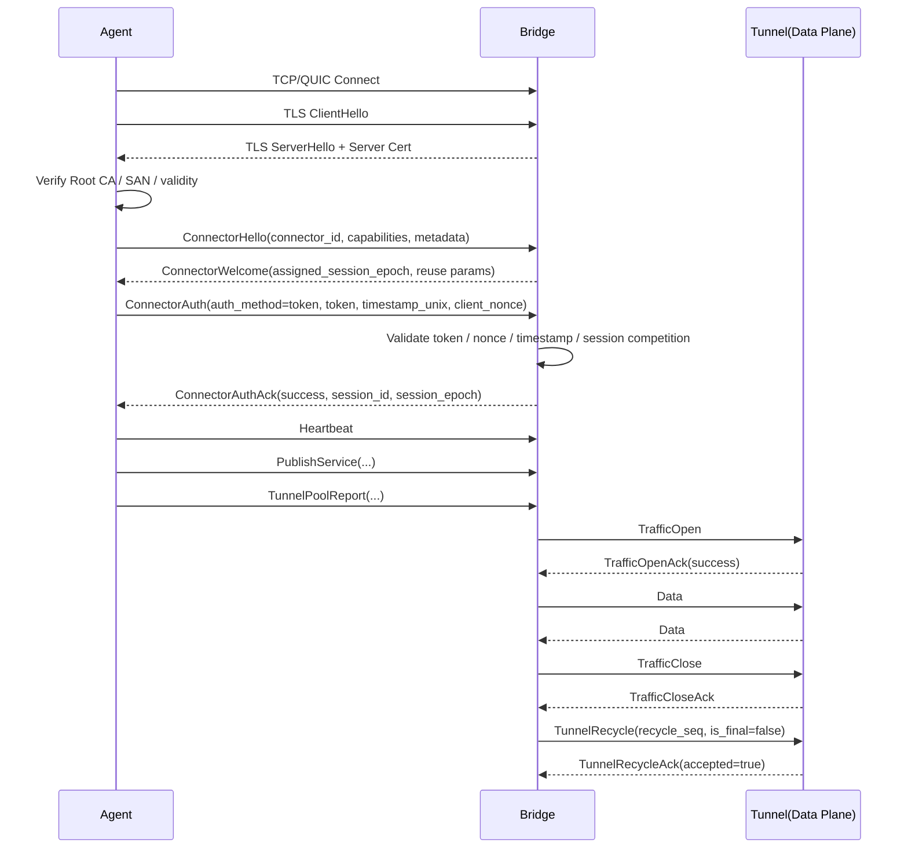

# Agent 与 Bridge 安全接入与认证技术方案

**文档状态**：Final
**文档版本**：v3.2
**适用范围**：LTFP 体系下 Agent 与 Bridge 之间的接入认证、链路加密、会话权威控制、Tunnel 串行复用场景下的数据面安全边界。
**关联文档**：`LTFP-v1-Draft.md`、`LTFP-TransportAbstraction.md`、`LTFP-TunnelMultiplex-Proposal.md`。现有控制面固定顺序为 `ConnectorHello -> ConnectorWelcome -> ConnectorAuth -> ConnectorAuthAck`，并要求在 `AuthAck(success=true)` 前不得发布业务服务。

---

## 1. 背景

LTFP 当前已经形成三条稳定约束。

第一，控制面已经具备明确的握手和认证骨架。Session 在 transport 层被定义为 Agent 与 Server 之间的一次长期传输会话，是控制面和数据面的共同上层上下文；其状态机包括 `idle`、`connecting`、`connected`、`control_ready`、`authenticated`、`draining`、`closed`、`failed`。Control Channel 是 Session 唯一长期控制通道，负责握手和认证、heartbeat、服务发布与状态同步、session 级错误上报以及 tunnel pool 的协调。

第二，控制面已经具备一致性约束。所有资源变更消息必须带 `session_id`、`session_epoch`、`event_id`、`resource_version`；其中 `session_epoch` 用于判断消息是否来自当前有效会话，`event_id` 用于幂等去重，`resource_version` 用于资源代际控制。握手期还进一步规定：`ConnectorWelcome.assigned_session_epoch` 是 server 为本次握手预分配的 epoch，`ConnectorAuthAck.session_epoch` 是认证成功后生效的最终权威值，成功时二者必须一致。

第三，Tunnel 模型已经由单次使用扩展为串行复用。旧状态机为 `created -> idle -> in-use -> closed`，新状态机扩展为 `created -> idle -> in-use -> recycling -> idle/closed`。Traffic 正常关闭后，必须先完成 `TrafficClose -> TrafficCloseAck`，随后由 Server 发起 `TunnelRecycle`，由 Agent 返回 `TunnelRecycleAck`，并以 `recycle_seq` 单调递增保证回收状态不会被旧消息污染。控制面不承载 `TunnelRecycle / TunnelRecycleAck`，二者固定走数据面 tunnel 本身。

在此基础上，需要形成一版完整、正式、可评审的安全认证方案，统一回答以下问题：

* Agent 如何证明自身是合法接入方；
* Agent 如何验证所连接的是合法 Bridge；
* 认证如何与 `session_id / session_epoch` 对齐；
* token 如何与 `connector_id`、服务发布、路由作用域解耦；
* tunnel 串行复用启用后，认证边界如何与数据面回收边界严格分离。

---

## 2. 方案目标

本方案定义以下正式目标。

### 2.1 定义接入身份模型

接入主体固定为 `connector_id`。接入认证只回答“当前连接进来的 Agent 属于哪个 connector”，不回答“该 connector 最终发布哪些服务、处于哪个 scope、参与哪些 route”。Session 资源本身围绕 `connector_id` 建立，并要求对同一 connector 的 `session_epoch` 单调递增，因此 `connector_id` 是接入认证的唯一主绑定键。

### 2.2 定义接入凭证模型

接入凭证固定为 Bridge 侧维护的 token。token 只绑定 `connector_id`，不绑定 `namespace`、`environment`、`service_key`、`service_id`。服务发布与路由选择所需的 scope 字段，继续由 `PublishService`、`UnpublishService`、`RouteAssign`、`RouteRevoke` 自身承载。

### 2.3 定义链路加密与 Bridge 身份证明机制

链路统一采用 TLS 1.3。Bridge 自建 CA，签发 Bridge 服务端证书；Agent 预置信任 Root CA，并在 TLS 握手阶段校验证书链、SAN 与有效期。Transport 层负责“安全连接”，控制面与数据面均运行在统一的安全传输上下文之上。

### 2.4 定义认证后的会话权威规则

认证结果以既有 `ConnectorAuthAck` 为唯一权威返回，不另起独立确认包。认证成功后，`ConnectorAuthAck.session_epoch` 成为本次会话的最终权威 epoch。认证完成前，session 不能进入 `authenticated`，也不得发布服务、接收实际 traffic 或进入 tunnel pool 工作态。

### 2.5 定义 tunnel 复用场景下的安全边界

接入认证绑定 session，不绑定单次 tunnel。Tunnel 串行复用只改变数据面 tunnel 的生命周期管理，不触发重新认证，不重新生成接入身份，也不改变 `session_epoch`。回收是否成功由 `TrafficCloseAck / TunnelRecycle / TunnelRecycleAck / recycle_seq` 与 tunnel 健康性共同决定。

---

## 3. 设计原则

### 3.1 认证层与路由层分离

`namespace`、`environment` 在主协议中属于资源上下文字段。`PublishService` 明确包含 `service_key`、`namespace`、`environment`、`service_name`、`service_type` 等字段；`RouteAssign` 明确包含 `route_id`、`namespace`、`environment`、`match`、`target`、`priority` 等字段。这说明 scope 本身属于服务发布与路由建模，而非接入认证。

因此，本方案固定如下边界：

* 接入认证层：`connector_id + token + session_id + session_epoch`
* 资源发布层：`service_key + service_id + namespace + environment + labels + metadata`
* 路由层：`route_id + namespace + environment + match + target + policy`

三层职责固定，不交叉、不混写。

### 3.2 传输安全与应用认证分层

TLS 1.3 负责保密性、完整性、Bridge 身份证明与中间人防护；token 负责 Agent 身份认证；`session_epoch` 负责会话代际；`event_id` 与 `resource_version` 负责资源级控制面一致性。该分层与现有控制面一致性语义保持一致，不引入重复职责。

### 3.3 认证绑定 Session

Session 被定义为 Agent 与 Server 之间的一次长期传输会话，是控制面与数据面的共同上层上下文。Session 包含 1 条活动 Control Channel、若干 idle tunnel、若干 in-use tunnel 以及 session 生命周期状态机。未进入 `authenticated` 前不得分配实际 traffic；进入 `draining` 后不得再分配新的 tunnel；进入 `failed` 后必须终止控制面并清理全部 tunnel。

因此，认证结果必须绑定 Session，而不能绑定某一条 tunnel。任何把 tunnel recycle 误写成“重新认证”的设计都与 Session 语义冲突。

### 3.4 复用绑定数据面

Tunnel 串行复用引入了新的数据面状态与回收握手。`TrafficClose` 仅表示业务关闭意图，不保证底层缓冲区已排空；回收握手的存在用于防止残留 bytes 污染下一次 traffic、避免单双方对可复用状态理解不一致，并通过 `recycle_seq` 防止旧消息污染新状态。回收失败必须直接降级为关闭。

因此，复用安全性由数据面协议本身负责，而不是由接入认证重复承担。

---

## 4. 非目标

本方案明确排除以下内容：

* 不要求 mTLS；
* 不要求企业级重型 PKI 平台；
* 不引入 challenge-response 二次认证；
* 不把 `namespace`、`environment` 绑定到 token；
* 不把 `TunnelRecycle` 作为重新认证过程；
* 不引入 session resume；
* 不改变既有 `ConnectorHello / ConnectorWelcome / ConnectorAuth / ConnectorAuthAck` 骨架。

---

## 5. 术语与职责定义

### 5.1 Connector

Connector 是接入身份主体。其稳定身份字段是 `connector_id`。Connector 可以携带附加上下文，例如 `namespace`、`environment`、`labels`、`metadata`，但这些字段不是接入认证成立的必要条件。

### 5.2 Session

Session 是 transport 侧聚合根。Session 负责聚合控制面、数据面、tunnel pool 与生命周期状态。认证一旦成功，权威身份固定在 `session_id + connector_id + session_epoch` 这一组合上。

### 5.3 Service

Service 是资源层对象。`service_key` 是稳定作用域引用键，格式为 `<namespace>/<environment>/<service_name>`；`service_id` 是 server 分配的全局唯一 opaque identity。route target 使用 `service_key` 做声明式引用，运行态、traffic、ACK、审计使用 `service_id`。

### 5.4 Route

Route 是资源层对象。它显式包含 `route_id`、`namespace`、`environment`、`match`、`target`、`priority`，用于决定外部流量如何映射到 connector service、external service 或 hybrid target。

### 5.5 Tunnel

Tunnel 是数据面双向字节通道。在 transport 层，Tunnel 只表示底层流对象，不感知 Traffic 协议状态。复用提案引入 `created / idle / in-use / recycling / closed` 状态，以及 `Flush()`、`ReuseCount()`、`Recyclable()` 等能力。

---

## 6. 总体架构

### 6.1 角色划分

Bridge 负责：

* 自建 CA 与服务端证书签发；
* token 签发、吊销、过期与轮换；
* 认证与会话权威确认；
* 服务与路由资源的一致性维护；
* tunnel pool 水位协调与回收决策。

Agent 负责：

* 预置信任 Bridge Root CA；
* 保存自身 token 明文；
* 发起底层连接与 TLS 握手；
* 发送 `ConnectorHello / ConnectorAuth`；
* 在认证成功后发布服务、上报健康状态、维护 tunnel pool；
* 在数据面执行 `TrafficCloseAck / TunnelRecycleAck` 等回收配合动作。

### 6.2 安全边界

本方案形成三层边界：

* 传输边界：TLS 1.3 保护链路；
* 会话边界：`session_id / session_epoch` 保护控制面代际；
* 数据面边界：`TrafficCloseAck / TunnelRecycle / TunnelRecycleAck / recycle_seq` 保护可复用 tunnel 的数据清洁性与状态一致性。

---

## 7. TLS 与证书体系

### 7.1 证书体系模型

Bridge 采用自建 CA 模型。初始化时生成 Root CA 私钥与证书，再由 Root CA 签发 Bridge 服务端证书。Agent 预置信任 Root CA，只需要验证服务端证书，不需要持有客户端证书。由于 transport 层负责安全连接，TLS 证书体系属于底层传输能力的一部分，不侵入控制面业务语义。

### 7.2 证书分层

证书分层固定如下：

* Root CA：长期证书，低频轮换；
* Bridge Server Certificate：短周期证书，按固定周期自动续签；
* Agent Trust Anchor：Root CA 证书。

该分层满足中小团队部署条件，同时保留标准 TLS 信任链。

### 7.3 Agent 校验要求

Agent 在 TLS 握手阶段必须执行以下校验：

* 证书链由预置信任 Root CA 签发；
* SAN 与实际访问地址一致；
* 证书未过期；
* 当前时间在有效期内。

任一项失败，TLS 握手必须失败，session 进入 `failed`。Transport 文档明确规定 session 建立阶段应区分 connect timeout、TLS timeout、control ready timeout、auth timeout，任一阶段超时均可使 session 进入 `failed`。

### 7.4 不采用 mTLS 的原因

本方案不使用 mTLS。原因是当前目标是为中小团队提供低复杂度部署路径，而不是建立企业级双向证书管理体系。Bridge 身份由 TLS 证书证明，Agent 身份由 token 证明，二者职责清晰且实现复杂度可控。该分层已经满足当前控制面与数据面安全边界要求。

---

## 8. Token 模型

### 8.1 绑定关系

token 只绑定 `connector_id`。token 不绑定 `namespace`、`environment`、`service_key`、`service_id`。任何资源级 scope 限制都不在 token 结构中硬编码。资源层约束通过 publish policy 和 route policy 处理。

### 8.2 token 格式

token 固定采用两段式格式：

```text
dbt_<token_id>.<token_secret>
```

`token_id` 为公开索引标识，`token_secret` 为高熵随机值，仅在 Agent 侧保存明文。该格式允许 Bridge 先按 `token_id` 定位记录，再对 `token_secret` 做 hash 比对。

### 8.3 Bridge 侧存储模型

Bridge 必须保存以下字段：

* `connector_id`
* `token_id`
* `token_secret_hash`
* `status`
* `issued_at`
* `expires_at`
* `rotated_at`
* `metadata`

Bridge 不保存 `token_secret` 明文，不依赖可逆解密，也不采用“保存 hash 后再恢复 secret 做 HMAC”的自相矛盾实现。认证时只进行索引定位与 hash 比对。

### 8.4 token 状态

token 状态固定为：

* `active`
* `grace`
* `revoked`
* `expired`

`active` 表示当前有效；`grace` 表示轮换窗口中仍可接受；`revoked` 表示主动吊销，不允许建立新 session；`expired` 表示已过期，不允许建立新 session。

### 8.5 token 与策略分离

token 只解决“是否允许该 connector 接入”。资源发布能力与路由生效范围通过独立 publish policy / route policy 管理，例如允许无 scope 发布、默认 scope、允许的 scope 集合、允许的服务模式、labels 约束、metadata 约束等。这些策略属于资源层与治理层，不写入 token 主模型。

---

## 9. 控制面认证协议

### 9.1 认证总流程

控制面认证流程固定如下：

1. 建立底层传输连接；
2. 完成 TLS 1.3 握手；
3. Agent 校验 Bridge 证书；
4. Control Channel 进入 `control_ready`；
5. Agent 发送 `ConnectorHello`；
6. Bridge 返回 `ConnectorWelcome`；
7. Agent 发送 `ConnectorAuth`；
8. Bridge 校验 token、nonce、时间戳与 session 竞争关系；
9. Bridge 返回 `ConnectorAuthAck`；
10. session 进入 `authenticated`；
11. Agent 开始 `Heartbeat`、`PublishService`、`TunnelPoolReport` 等控制面行为。

这一路径与现有 control channel 典型顺序完全一致。`AuthAck(success=true)` 前不得发布业务服务。

### 9.2 ConnectorHello

`ConnectorHello` 固定承载：

* `connector_id`
* 可选 `namespace`
* 可选 `environment`
* `node_name`
* `display_name`
* `version`
* `capabilities`
* `labels`
* `metadata`

其中，`connector_id` 是认证主身份；`namespace` 与 `environment` 若存在，仅作为附加上下文，不参与 token 校验结果。Connector 附加字段保留用于后续资源发布和观测，但不改变接入认证成立条件。

### 9.3 ConnectorWelcome

`ConnectorWelcome` 固定返回：

* `selected_binding`
* `version_major`
* `version_minor`
* `heartbeat_interval_sec`
* `capabilities`
* `assigned_session_epoch`
* `metadata`

当启用 tunnel 串行复用时，额外下发：

* `tunnel_max_reuse_count`
* `tunnel_recycle_timeout_sec`
* `tunnel_idle_ttl_sec`

Tunnel Multiplex 提案明确要求这些参数通过握手阶段下发，不引入灰度开关字段。对端如果不支持新增帧，握手阶段直接拒绝会话，避免进入不兼容运行态。

### 9.4 ConnectorAuth

`ConnectorAuth` 的 `auth_method` 固定为 `token`。`auth_payload` 必须包含：

* `token`
* `timestamp_unix`
* `client_nonce`

可选包含：

* `client_cap_version`

本方案不引入 HMAC proof，不引入 challenge-response。TLS 已提供链路机密性与完整性，token 作为 bearer credential 足以完成接入认证。

### 9.5 Bridge 认证逻辑

Bridge 收到 `ConnectorAuth` 后必须按照以下固定顺序执行校验：

1. 校验 `connector_id` 是否存在；
2. 解析 token 并校验格式合法；
3. 按 `token_id` 查找 token 记录；
4. 校验 token 是否归属于当前 `connector_id`；
5. 校验 token 状态是否为 `active` 或 `grace`；
6. 校验 token 是否未过期；
7. 校验 `timestamp_unix` 是否位于允许窗口内；
8. 校验 `(connector_id, client_nonce)` 在窗口期内未被重复使用；
9. 校验是否存在更高 `session_epoch` 的活跃 session；
10. 认证成功后签发 `session_id`，确认最终 `session_epoch`。

该流程将 token 校验、重放保护、时间窗口保护与会话竞争控制统一收敛到 `ConnectorAuth` 阶段。

### 9.6 ConnectorAuthAck

`ConnectorAuthAck` 是唯一权威认证结果消息，字段固定为：

* `success`
* `session_id`
* `session_epoch`
* `error_code`
* `error_message`
* `metadata`

认证成功时必须返回 `success=true`、非空 `session_id` 和最终权威 `session_epoch`。认证失败时必须返回 `success=false` 和明确错误码，并结束本次认证流程。禁止引入平行的 `code=200` 类独立确认包。

### 9.7 session_epoch 权威规则

握手期权威规则固定如下：

* `ConnectorWelcome.assigned_session_epoch` 是本次握手预分配值；
* `ConnectorAuthAck.session_epoch` 是认证成功后生效的最终权威值；
* 成功时二者必须相等；
* 认证失败时，该预分配值不得进入 ACTIVE session；
* 后续所有资源变更消息必须以 `ConnectorAuthAck.session_epoch` 为准。

---

## 10. Session 状态与控制面约束

### 10.1 Session 状态机

Session 状态固定为：

* `idle`
* `connecting`
* `connected`
* `control_ready`
* `authenticated`
* `draining`
* `closed`
* `failed`

状态转换固定为：

```text
idle -> connecting -> connected -> control_ready -> authenticated
authenticated -> draining -> closed
authenticated -> failed
control_ready -> failed
connected -> failed
connecting -> failed
```

该状态机由 transport 层强制约束。

### 10.2 认证前限制

未进入 `authenticated` 前：

* 不得发布业务服务；
* 不得分配实际 traffic；
* 不得进入 tunnel pool 工作态。

Control Channel 虽已存在，但只能承载握手、认证、错误上报与必要的高优先级控制消息。

### 10.3 认证后职责

进入 `authenticated` 后：

* 可发送 heartbeat；
* 可发送 `PublishService`、`ServiceHealthReport`、`TunnelPoolReport`；
* 可接收 `TunnelRefillRequest`；
* 可维护 idle / in-use tunnel pool；
* 可承载实际 traffic。

### 10.4 旧 session 处理

同一 connector 建立新 `session_epoch` 后，旧 session 必须进入 `DRAINING` 或 `STALE`，且禁止再修改资源状态。该规则用于防止旧会话污染新的资源真相源。

---

## 11. 控制面一致性与资源消息约束

所有资源变更消息必须带：

* `session_id`
* `session_epoch`
* `event_id`
* `resource_version`

语义固定如下：

* `session_epoch`：判定消息是否来自当前有效会话；
* `resource_version`：控制资源代际，新的资源版本必须大于旧版本；
* `event_id`：实现幂等去重，重复事件必须被 server 安全识别并 ACK。

关键 ACK 消息必须返回：

* `accepted`
* `accepted_resource_version`
* `current_resource_version`
* `error_code`
* `error_message`

至少适用于：

* `PublishServiceAck`
* `UnpublishServiceAck`
* `RouteAssignAck`
* `RouteRevokeAck`。

该机制保证接入认证完成后，控制面资源不会因为旧 session、重复事件或版本回退而产生污染。

---

## 12. 服务发布与路由作用域模型

### 12.1 PublishService 边界

`PublishService` 明确包含：

* `service_id`
* `service_key`
* `namespace`
* `environment`
* `service_name`
* `service_type`
* `endpoints`
* `exposure`
* `health_check`
* `discovery_policy`
* `labels`
* `metadata`

其中 `service_key` 采用 `<namespace>/<environment>/<service_name>` 形式，属于服务级逻辑标识与路由引用键；`service_id` 属于运行态 opaque identity。该设计已经足以承载 scope 与服务声明，不需要回流到 token。

### 12.2 RouteAssign 边界

`RouteAssign` 明确包含：

* `route_id`
* `namespace`
* `environment`
* `match`
* `target`
* `priority`
* `policy_json`
* `metadata`

route scope 因此是路由层问题，而不是接入认证问题。接入认证只保证“某个 connector 合法进入”，不保证“它发布的所有服务都自动可被任意 route 选中”。

### 12.3 权限层次

Bridge 的治理能力固定分为两层：

* 接入层：通过 token 决定 `connector_id` 是否允许建立 session；
* 资源层：通过 publish policy 与 route policy 决定该 session 能发布哪些服务、位于哪些 scope、能被哪些 route 选中。

---

## 13. Tunnel 串行复用场景下的安全边界

### 13.1 认证不因复用而重复发生

Tunnel 串行复用只改变数据面 tunnel 生命周期，不改变 session 认证关系。一个 ACTIVE session 认证一次，之后所有 tunnel 的建立、关闭、回收与再利用均继承该 session 的认证结果。

### 13.2 复用闭环

Traffic 正常结束后的复用闭环固定为：

```text
TrafficClose -> TrafficCloseAck -> TunnelRecycle -> TunnelRecycleAck
```

异常路径中，若以 `TrafficReset` 结束，则 tunnel 直接关闭，不进入 recycling。达到最大复用次数后，Server 发送 `TunnelRecycle(is_final=true)`，回收后直接关闭，并由 Agent 补充新 tunnel。

### 13.3 回收握手约束

回收握手语义约束固定如下：

* `TrafficCloseAck` 是协议新增帧；
* `TunnelRecycle` 必须在 `TrafficClose + TrafficCloseAck` 完成后发送；
* `TunnelRecycle` 只能由 Server 发起；
* Agent 必须验证 `recycle_seq` 严格递增；
* `TunnelRecycleAck.accepted=false` 时双方都必须关闭 tunnel；
* 回收握手超时后，Server 必须将 tunnel 标记为 `broken` 并关闭。

### 13.4 可复用判定

Tunnel 可复用的前提固定为：

* `Flush()` 成功；
* 无 pending bytes；
* 底层 stream 健康；
* `Recyclable() == true`；
* `recycle_seq` 通过校验。

不满足条件时，必须关闭 tunnel，并按标准流程补充新 tunnel。复用机制的引入不得降低协议健壮性。

### 13.5 控制面与复用状态分离

Control Channel 不承载 `TunnelRecycle / TunnelRecycleAck`。`TunnelRefillRequest` 语义保持不变，仍然只是“idle tunnel 不足”的水位提示，不被实现成瞬时硬命令。Agent 必须通过平滑控制循环逐步逼近目标容量，而不是收到 `delta=N` 就立即并发创建 N 条 tunnel。

---

## 14. Token 生命周期管理

### 14.1 签发

Bridge 为指定 `connector_id` 生成 `token_id` 和高熵 `token_secret`，保存 `token_secret_hash`、状态与过期时间，并仅向 Agent 或运维展示一次明文 token。明文 token 不得再次展示，不得进入普通日志。

### 14.2 轮换

token 轮换采用双 token 过渡：

* 新 token 状态为 `active`；
* 旧 token 状态为 `grace`；
* 过渡窗口结束后，旧 token 自动变为 `expired` 或 `revoked`。

Bridge 在认证阶段同时接受 `active` 与 `grace`。

### 14.3 吊销

Bridge 将 token 状态置为 `revoked` 后，该 token 不允许建立新 session。现有 active session 可以保持到自然断开，也可以由实现按运维策略转入 `draining`。无论采用哪种实现，token 吊销后都不得允许新连接继续使用被吊销 token。

### 14.4 过期

Bridge 在认证阶段校验 `expires_at`。过期 token 不允许建立新 session。该规则作用于新连接建立，不改变当前已经建立并进入 ACTIVE 的 session 语义。

---

## 15. 超时、心跳与重连

### 15.1 建立阶段超时

`Session.Open()` 必须受以下超时约束：

* connect timeout
* TLS timeout
* control ready timeout
* auth timeout

任一阶段超时均可使 session 进入 `failed`。

### 15.2 控制面 heartbeat

控制面必须存在显式 heartbeat 机制。默认策略为：

* Agent 每 5 秒发送一次 ping；
* 连续 5 次未收到 pong 视为控制链路不可用；
* 进入重连流程；
* 重连退避采用 `1s -> 2s -> 4s -> 8s`，附带抖动；
* heartbeat 超时阈值必须覆盖控制面队列抖动与大消息发送延迟。

### 15.3 idle tunnel TTL 与探活

空闲 tunnel 可设置最大空闲寿命。TTL 到期后，Agent 关闭旧 tunnel 并补充新 tunnel。TTL 不能替代僵尸 tunnel 探测；对于长期驻留 idle pool 的 tunnel，binding/runtime 需要结合底层能力启用 keepalive 或轻量探活。探活失败时，该 tunnel 必须标记为 `broken` 并从池中移除。

### 15.4 TrafficOpen 超时

Server 发送 `TrafficOpen` 后必须等待 `TrafficOpenAck`。若超时未收到 ack，则当前 tunnel 标记为 `broken`，当前 traffic 失败，tunnel 从池中移除，并由 Agent 补充新 tunnel。该机制确保数据面打开阶段异常不会污染后续 reuse。

---

## 16. 安全加固要求

### 16.1 防重放

Bridge 必须维护最近窗口内的 `(connector_id, client_nonce)` 缓存，并执行去重。建议 TTL 为 300 秒。重复 nonce 必须直接拒绝并返回明确错误码。

### 16.2 时间窗口

Bridge 必须校验 `timestamp_unix` 是否位于允许窗口内。推荐偏差窗口为 ±300 秒。超出窗口必须拒绝认证。

### 16.3 失败限流

Bridge 必须针对源 IP 与 `connector_id` 两个维度实现认证失败限流。超过阈值后执行短时封禁，以降低暴力试探和撞库风险。

### 16.4 审计要求

允许记录：

* `connector_id`
* 脱敏后的 `token_id`
* 源 IP
* 认证时间
* 认证结果
* 错误码

禁止记录：

* 明文 token
* `token_secret`
* Bridge 私钥
* Root CA 私钥。

### 16.5 密钥存储

Root CA 私钥与 Bridge 服务端私钥必须单独存储、最小权限访问，不得进入普通日志和通用备份快照。

---

## 17. 错误码定义

`ConnectorAuthAck.error_code` 固定支持以下集合：

* `auth_invalid_token`
* `auth_token_expired`
* `auth_token_revoked`
* `auth_connector_mismatch`
* `auth_nonce_replayed`
* `auth_clock_skew`
* `auth_session_superseded`
* `auth_internal_error`

认证失败时必须返回其中之一，并附带 `error_message`。`ConnectorAuthAck` 继续作为唯一权威认证响应。

`TunnelRecycleAck.error_code` 至少支持：

* `invalid_seq`
* `tunnel_unhealthy`
* `deadline_hit`
* `buffer_dirty`

这些错误码用于明确回收握手失败原因，并驱动“关闭而非强行回收”的降级策略。

---

## 18. 配置模型

### 18.1 Bridge 配置要求

Bridge 配置固定包含三部分：

* TLS 配置：`ca_cert_file`、`ca_key_file`、`server_cert_file`、`server_key_file`、`min_version=TLS1.3`
* 认证配置：`method=token`、`nonce_ttl_sec`、`clock_skew_sec`、失败限流参数
* connector token 记录：`connector_id`、多条 token 状态、独立 publish policy

### 18.2 Agent 配置要求

Agent 配置固定包含三部分：

* Bridge 地址与 Root CA 路径
* `connector_id` 与节点元信息
* 认证方法与 token 明文

`namespace` 与 `environment` 可以存在，但默认视为资源上下文，不参与接入认证判定。

---

## 19. 协议定义

### 19.1 ConnectorAuth

```protobuf
message ConnectorAuth {
  string auth_method = 1; // fixed: token
  map<string, string> auth_payload = 2;
}
```

`auth_payload` 必须包含 `token`、`timestamp_unix`、`client_nonce`，可包含 `client_cap_version`。该结构将 token 认证收敛到现有控制面协议，不引入平行认证协议。

### 19.2 ConnectorAuthAck

```protobuf
message ConnectorAuthAck {
  bool success = 1;
  string session_id = 2;
  uint64 session_epoch = 3;
  string error_code = 4;
  string error_message = 5;
  map<string, string> metadata = 6;
}
```

`session_epoch` 是认证成功后的最终权威值。

### 19.3 ConnectorWelcome

```protobuf
message ConnectorWelcome {
  string selected_binding = 1;
  uint32 version_major = 2;
  uint32 version_minor = 3;
  uint32 heartbeat_interval_sec = 4;
  repeated string capabilities = 5;
  uint64 assigned_session_epoch = 6;
  map<string, string> metadata = 7;

  int32 tunnel_max_reuse_count = 8;
  uint32 tunnel_recycle_timeout_sec = 9;
  uint32 tunnel_idle_ttl_sec = 10;
}
```

这是 tunnel 串行复用场景下的正式握手参数承载方式。

### 19.4 StreamPayload 扩展

```protobuf
message StreamPayload {
  oneof payload {
    TrafficOpen      open_req    = 1;
    TrafficOpenAck   open_ack    = 2;
    bytes            data        = 3;
    TrafficClose     close       = 4;
    TrafficCloseAck  close_ack   = 5;
    TrafficReset     reset       = 6;
    TunnelRecycle    recycle     = 7;
    TunnelRecycleAck recycle_ack = 8;
  }
}
```

这些新增帧属于数据面协议扩展，不属于接入认证扩展。

---

## 20. Mermaid 时序图



该时序图反映了“TLS 证明 Bridge、token 证明 Agent、认证绑定 session、recycle 绑定数据面”的完整路径。

---

## 21. 规范性结论

1. Agent 与 Bridge 的接入认证必须通过既有 `ConnectorAuth / ConnectorAuthAck` 完成，不得另起独立认证确认包。
2. 链路必须使用 TLS 1.3，证书体系必须采用 Bridge 自建 CA。
3. Agent 必须预置 Bridge Root CA，并校验 Bridge 服务端证书链。
4. Bridge 必须按 `connector_id` 维护 token 记录。token 与 `namespace / environment` 解耦。
5. `ConnectorAuthAck.session_epoch` 是认证成功后的最终权威值。
6. 认证完成前不得发布服务、不得分配实际 traffic。
7. 控制面资源消息必须依赖 `session_id / session_epoch / event_id / resource_version` 保证一致性。
8. Tunnel 串行复用不触发重新认证；复用安全边界由 `TrafficCloseAck / TunnelRecycle / TunnelRecycleAck / recycle_seq` 与 tunnel 健康性共同保证。
9. 回收失败必须降级为关闭，不得强行回收。
10. 首版不要求 mTLS，不要求 challenge-response，不要求重型 PKI。

