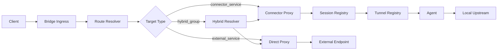
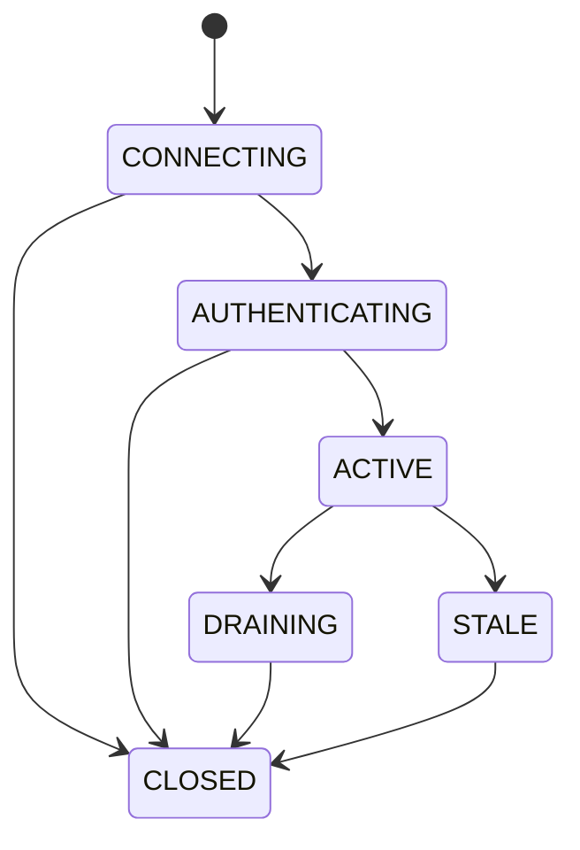
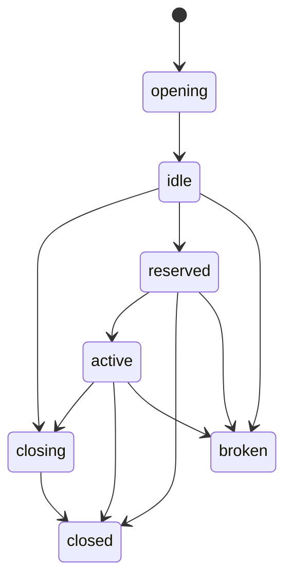
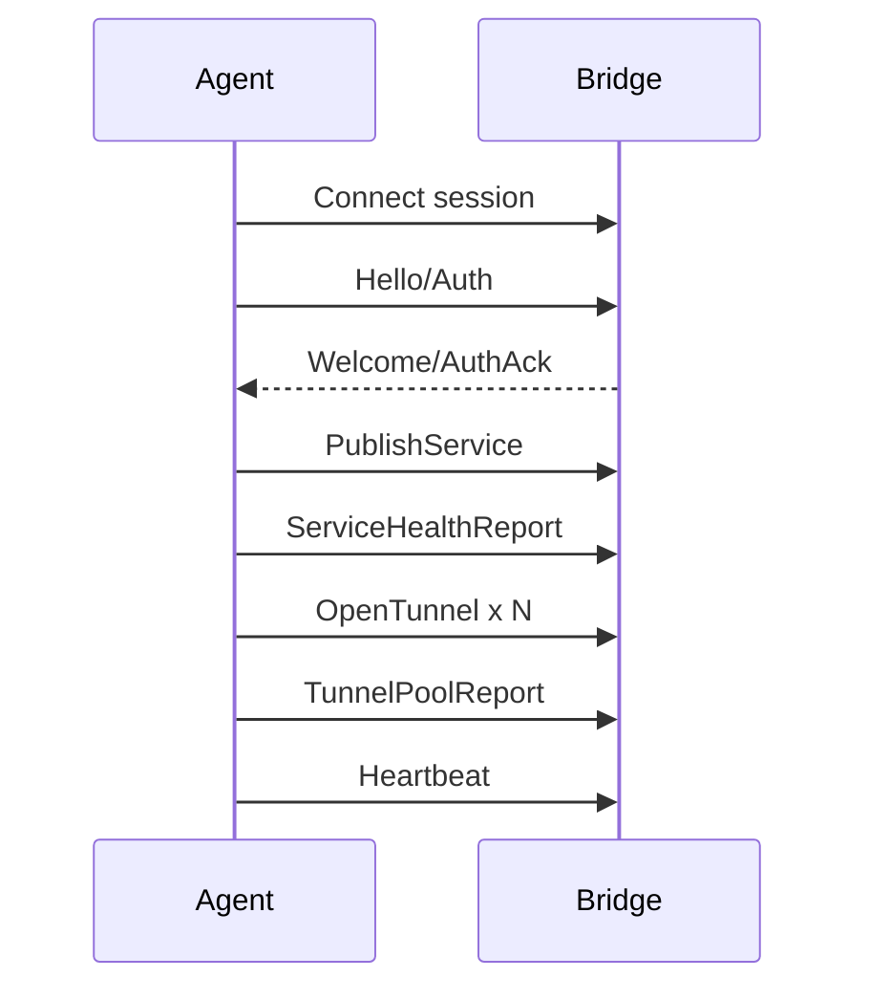
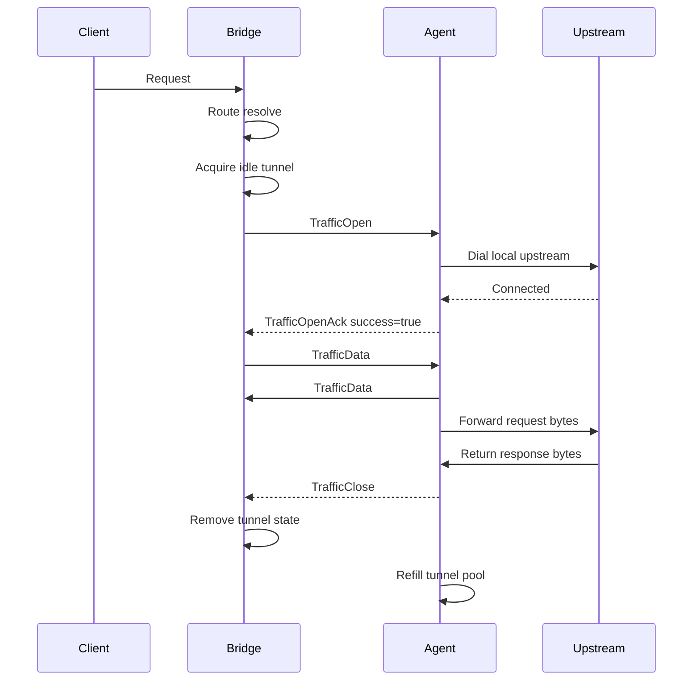
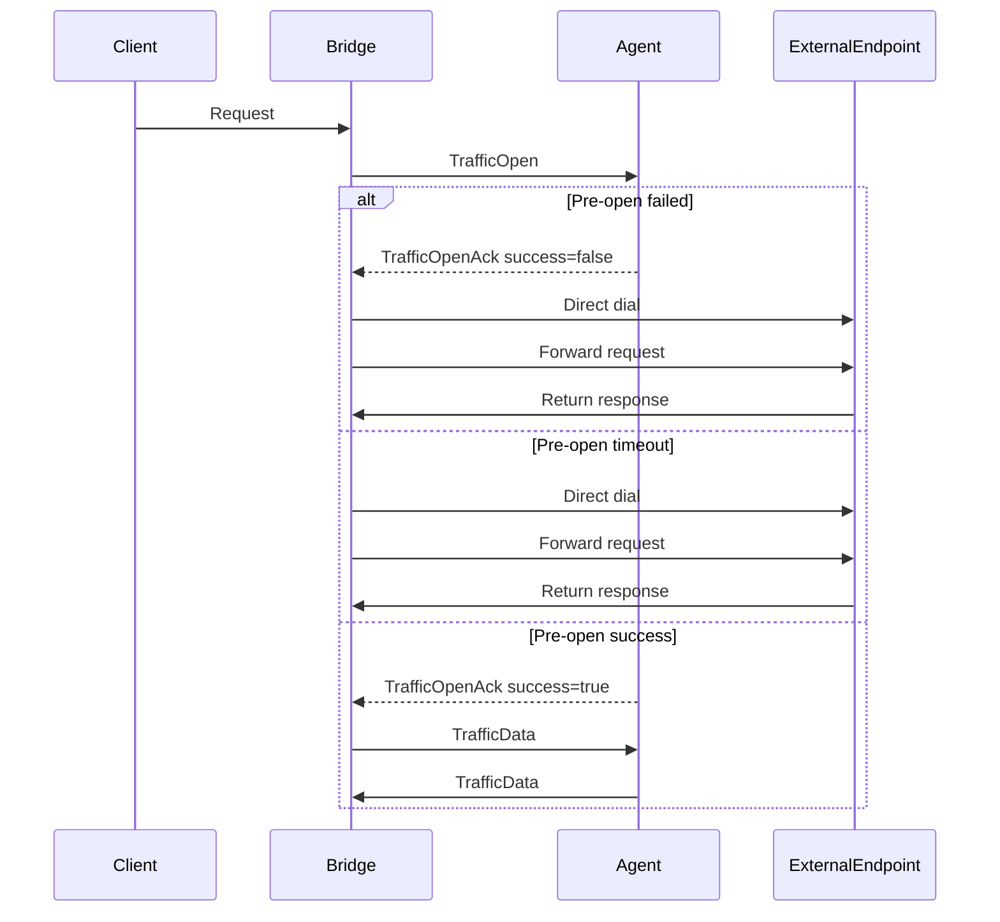

# Agent 与 Bridge 实现技术方案（修订最终版）

## 1. 文档目标

本文档定义基于 **LTFP 协议** 与 **Transport 抽象** 的首期运行时实现方案，明确 **Agent** 与 **Bridge** 的职责边界、模块划分、状态管理、数据路径、容量处理、错误语义与实施顺序，作为研发实现与技术评审的统一依据。

本文档不重新冻结协议字段，只在现有两份规范的约束下补齐运行时细节，特别是：

* idle tunnel 的接收与读路径
* `TrafficOpen` 的处理与取消
* tunnel pool 容量不足时的行为
* 控制面 HOL 规避
* timeout 预算与状态机一致性  

---

## 2. 本期范围

## 2.1 系统组成

本期系统仅包含两个应用：

* **Agent**：部署在内网或受限网络中，负责连接 Bridge、维护 session、发布 service、执行健康检查、预建 tunnel pool、接收 `TrafficOpen` 并代理到本地 upstream。
* **Bridge**：部署在公网或可被客户端访问的网络中，负责统一入口、route resolve、session/service/tunnel registry、connector proxy、direct proxy 与 hybrid fallback 执行。

## 2.2 本期约束

本期只支持：

* 一个 Agent 连接一个 Bridge
* 一个 Bridge 单体部署
* Bridge 内部分层，但不拆独立服务
* Agent 预建 tunnel pool
* **单 tunnel 单 traffic**
* traffic 结束后 tunnel 关闭，由 Agent 补池
* `connector_service` / `external_service` / `hybrid_group` 分路执行
* `hybrid_group` 仅支持 `pre_open_only` fallback  

## 2.3 本期不做

本期不实现：

* Agent 多 Bridge
* 多 Bridge 负载均衡与高可用
* 跨 Bridge 集群一致性
* tunnel 多次复用
* mid-stream failover
* datagram
* 完整租户系统与复杂 RBAC

---

## 3. 设计原则

## 3.1 协议层与传输层解耦

Transport 层只负责：

* session
* control channel
* tunnel
* 字节流承载与生命周期
* close / reset / deadline
* binding 能力暴露

Transport 不负责：

* route 决策
* `service_key` 查找
* `TrafficOpen/Ack/Data/Close/Reset` 的业务状态机

## 3.2 控制面与数据面分离

控制面负责：

* 握手
* 认证
* 心跳
* 服务发布
* 健康同步
* tunnel 池状态同步
* refill 事件与控制错误

数据面负责：

* 单次 traffic 承载
* `TrafficOpen/Ack/Data/Close/Reset`
* traffic 生命周期与 tunnel 关闭

## 3.3 Agent 主动建 tunnel，Bridge 消费 tunnel

固定链路为：

1. Agent 主动建立 tunnel
2. tunnel 进入 idle pool
3. Bridge 为实际 traffic 分配 idle tunnel
4. Bridge 在该 tunnel 上发送 `TrafficOpen`
5. Agent 处理并返回 `TrafficOpenAck`
6. 双向 relay
7. traffic 结束后 tunnel 关闭
8. Agent 补新 tunnel  

## 3.4 单 tunnel 单 traffic 是本期硬约束

一条 tunnel：

* 只承载一次 traffic
* 不允许再次复用
* traffic 结束后必须关闭
* `closed` / `broken` tunnel 不得重回池中复用 

## 3.5 connector_service 与 external_service 必须分路

对于 `connector_service`：

* Bridge 只选择 connector 和 service
* 最终 endpoint 由 Agent 选择
* `TrafficOpen` 不携带权威 `target_addr`，只允许携带非权威 `endpoint_selection_hint` 

对于 `external_service`：

* Bridge 自己查询 discovery
* Bridge 自己选择 endpoint
* Bridge 自己建立连接并代理转发 

## 3.6 fallback 只允许 pre-open 阶段

`hybrid_group` 仅在以下阶段失败时允许 fallback：

* route resolve miss
* service unavailable
* `TrafficOpenAck` 失败
* agent 侧 pre-open timeout

收到 `TrafficOpenAck success` 后禁止 fallback。首版不做 mid-stream failover。

---

## 4. 总体架构



Bridge 虽然本期是单体应用，但内部逻辑必须至少拆为：

* ingress
* routing
* registry
* connector proxy
* direct proxy
* control handlers

这样后续才能平滑演进为多进程或多服务结构。

---

## 5. 运行时核心模型

## 5.1 Session

Session 是 Agent 与 Bridge 之间的长期传输会话。会话状态机修订为：

* `CONNECTING`
* `AUTHENTICATING`
* `ACTIVE`
* `DRAINING`
* `STALE`
* `CLOSED`

并显式补上：

* `CONNECTING -> CLOSED`

因为在 TCP/TLS/binding 建立阶段即失败时，也需要对外收敛到 `CLOSED`。现有草案图中未画出这条边，但规则层面应补齐。



## 5.2 Tunnel

Tunnel 是由 Agent 主动建立的数据面双向字节通道。在 Transport 层，Tunnel 只表示底层流对象，不感知 Traffic 协议状态。

## 5.3 Tunnel Pool

Session 维护一组 tunnel：

* idle
* reserved
* active
* closing
* closed
* broken

Agent 负责：

* 建立 idle tunnel
* 在 tunnel 被消费或损坏后补充新 tunnel
* 定期清理过期 idle tunnel
* 上报池状态 

## 5.4 Traffic

Traffic 是一次实际代理请求在某条 tunnel 上的协议生命周期。建议状态为：

* `reserved`
* `open_sent`
* `established`
* `closing`
* `closed`
* `reset`
* `rejected` 

---

## 6. Tunnel 状态与约束

## 6.1 Tunnel 状态

* `opening`
* `idle`
* `reserved`
* `active`
* `closing`
* `closed`
* `broken` 

## 6.2 Tunnel 状态图



## 6.3 Tunnel 约束

1. 只有 `idle` tunnel 才能被分配
2. `reserved` tunnel 已被独占，不得再次分配
3. `active` 仅表示该 tunnel 正在被当前 traffic 使用
4. `closed` / `broken` tunnel 不得重回池中复用
5. 一条 tunnel 只能承载一次 traffic
6. 同一 tunnel 允许“一侧读、一侧写”的并发使用
7. 多个并发 `WriteFrame` 必须由更高层串行化
8. 多个并发 `ReadFrame` 不保证安全，必须维持单 reader 模型 
9. idle tunnel 的回收必须走 `idle -> closing -> closed`，不得直接复活或回池

---

## 7. Agent 技术设计

## 7.1 Agent 职责

Agent 负责：

1. 建立并维护到单个 Bridge 的 session
2. 处理认证、心跳、session_epoch
3. 发布和下线 service
4. 执行本地健康检查并上报
5. 预建并维护 tunnel pool
6. 在 idle tunnel 上等待 `TrafficOpen`
7. 根据 `service_id` 选择本地 endpoint
8. 建立本地 upstream 连接
9. 在 tunnel 上进行 framed 数据双向转发
10. traffic 结束后关闭 tunnel，并补充新 tunnel

## 7.2 Agent 模块划分

```text
runtime/agent/
  app/
    bootstrap.go
    config.go

  session/
    manager.go
    auth.go
    heartbeat.go

  control/
    publisher.go
    health_reporter.go
    tunnel_reporter.go
    refill_handler.go
    ack_deduper.go

  tunnel/
    manager.go
    producer.go
    registry.go
    reaper.go
    ttl_reaper.go

  traffic/
    acceptor.go
    opener.go
    relay.go
    closer.go
    reset.go

  service/
    catalog.go
    endpoint_selector.go
    health/
      tcp.go
      http.go
      grpc.go

  obs/
    metrics.go
    logs.go
```

### 命名修正

原 `recycler.go` 改为 `reaper.go`，避免产生“回收再复用”的误导。本期不做 tunnel 复用。

## 7.3 Agent 启动流程



## 7.4 Agent SessionManager

职责：

* 建立底层 binding
* 完成认证
* 驱动 heartbeat
* 管理 session 状态切换
* 处理断线重连
* 使用 `session_epoch` 防止旧 session 污染新状态

控制面所有资源级消息必须带：

* `session_id`
* `session_epoch`
* `event_id`
* `resource_version` 

## 7.5 Agent TunnelManager

职责：

* 在 session ACTIVE 后预建 idle tunnel
* 维持 `minIdleTunnels`
* 控制 `maxInflightTunnelOpens`
* 控制建连速率
* 在 tunnel 被消费或损坏后补充新 tunnel
* 定期清理 idle tunnel
* 上报 `TunnelPoolReport`

建议参数：

```yaml
agent:
  tunnelPool:
    minIdleTunnels: 8
    maxIdleTunnels: 32
    idleTunnelTtlSec: 90
    acquireWaitHintMs: 150
    maxInflightTunnelOpens: 4
    tunnelOpenRateLimit: 10
    tunnelOpenBurst: 20
```

这些参数与 transport 文档的容量模型一致。

### 参数策略（修订新增）

* 保持以上默认值作为首版默认配置（default profile）
* Agent 初始化入口必须支持外部传入 `tunnelPool` 参数覆盖默认值（配置文件 / 环境变量 / 启动参数均可）
* 未显式传入的字段必须回落到上述默认值
* 本期只要求“启动时可配置”，不要求运行时热更新
* 后续 Agent 产品化阶段可直接开放用户自定义这些参数，保持字段语义不变

## 7.6 新增：trafficAcceptor goroutine 归属

这是本次修订新增的强制实现点。

### 归属

`TunnelManager` 在 tunnel 创建成功并注册为 `idle` 后，必须立即为该 tunnel 启动一个**绑定 tunnel 生命周期的 `trafficAcceptor goroutine`**。

### 职责

该 goroutine：

* 独占该 tunnel 的 `ReadFrame()`
* 阻塞等待首帧 `TrafficOpen`
* 收到 `TrafficOpen` 后，将 tunnel 从 acceptor 阶段移交给 `TrafficRuntime`
* 若首帧不是 `TrafficOpen`，视为协议错误，关闭 tunnel
* 若 tunnel 被关闭、session 失效或 `ReadFrame()` 出错，则退出

### 约束

一个 tunnel 在任何时刻只能有一个 reader。
因此，`trafficAcceptor` 是 idle tunnel 阶段唯一合法 reader；一旦移交给 `TrafficRuntime`，reader 所有权也随之移交。这个设计直接落实了 transport 规范中的“单 reader 模型”。

## 7.7 Agent ServiceCatalog

职责：

* 维护本地 service 配置
* 将 `service_key`、endpoint、metadata 组织成运行时对象
* 触发 `PublishService`
* 配置变化时重新发布
* 在收到 `TrafficOpen(service_id)` 后定位目标 service

标识规则：

* `service_key`：lookup key
* `service_id`：runtime identity key

## 7.8 Agent HealthReporter

职责：

* 探测本地 endpoint
* 先维护 endpoint 粒度状态
* 再聚合为 service 粒度状态
* 上报 `ServiceHealthReport`

Bridge 不得主动探测 Agent 本地 upstream，只能依赖 Agent 上报与运行时软信号。

## 7.9 Agent TrafficRuntime

职责：

1. 接收 `trafficAcceptor` 移交的 tunnel 与 `TrafficOpen`
2. 校验 `session_epoch`、`service_id`、scope
3. 用 `service_id` 找到本地 service
4. 使用 `endpoint_selection_hint` 作为非权威 hint
5. 最终由 Agent 选择 endpoint
6. 本地拨号
7. 拨号成功后回 `TrafficOpenAck(success=true)`，并在 `metadata` 中回传最终实际 endpoint（如 `actual_endpoint_id`、`actual_endpoint_addr`）
8. 进入数据 relay
9. traffic 结束后发送 `TrafficClose` 或 `TrafficReset`
10. 关闭 tunnel，并通知 TunnelManager 补建

### 新增：hint 降级语义

`endpoint_selection_hint` 仅作为软引导。若 hint 指向的 endpoint 当前不存在、不健康、不可达或不满足本地策略，Agent 可自主选择其他健康 endpoint；发生重选时，必须通过 `TrafficOpenAck.metadata` 回传最终实际 endpoint（如 `actual_endpoint_id`、`actual_endpoint_addr`）给 Bridge。仅当整个 service 无可用 endpoint 时，才返回 `TrafficOpenAck(success=false)`。这与“最终 endpoint 由 Agent 选择”的规则一致。

### 关键约束

只有本地 upstream dial 成功后，才允许返回 `TrafficOpenAck success=true`。因为 `pre_open_only` 的 fallback 截止点就是收到 `TrafficOpenAck success` 之前。

---

## 8. Bridge 技术设计

## 8.1 Bridge 职责

Bridge 负责：

1. 暴露对外 ingress
2. route resolve
3. 管理 session / service / tunnel 的运行时索引
4. 对 `connector_service` 分配 idle tunnel
5. 发起 `TrafficOpen`
6. 在 `TrafficOpenAck success` 后 relay 数据
7. 对 `external_service` 执行 direct proxy
8. 对 `hybrid_group` 执行 pre-open fallback

## 8.2 Bridge 模块划分

```text
runtime/bridge/
  app/
    bootstrap.go
    config.go

  ingress/
    http_gateway.go
    grpc_gateway.go
    tls_sni_gateway.go
    tcp_port_gateway.go

  routing/
    matcher.go
    resolver.go
    selector.go
    hybrid.go

  registry/
    session_registry.go
    service_registry.go
    route_registry.go
    tunnel_registry.go

  connectorproxy/
    dispatcher.go
    tunnel_acquirer.go
    open_handshake.go
    relay.go
    cancel.go
    failure_mapper.go

  directproxy/
    discovery_adapter.go
    endpoint_cache.go
    dialer.go
    relay.go

  control/
    session_handler.go
    publish_handler.go
    health_handler.go
    tunnel_report_handler.go
    refill_controller.go

  obs/
    metrics.go
    logs.go
```

## 8.3 Bridge Ingress

Bridge 入口分三类：

* **L7 Shared Ingress**：HTTP、gRPC、WebSocket over HTTP
* **TLS SNI Shared Ingress**：TLS over TCP，按 SNI 路由
* **L4 Dedicated Port Ingress**：裸 TCP，一服务一端口 

## 8.4 Bridge RouteResolver

职责：

* 根据 ingress 输入匹配 route
* 判定 target 类型：

  * `connector_service`
  * `external_service`
  * `hybrid_group`
* 过滤 scope 不匹配、service 不健康、connector 离线、session 非 active 等状态

对 `connector_service`：

* Bridge 只选择 connector 和 service
* 最终 endpoint 由 Agent 选择

对 `external_service`：

* endpoint 由 Bridge 选择 

## 8.5 Bridge SessionRegistry

职责：

* 维护 `connector_id -> active session`
* 维护 `session_id -> session runtime`
* 管理 ACTIVE / DRAINING / STALE / CLOSED
* 为高频路径提供内存索引

## 8.6 Bridge TunnelRegistry

职责：

* 持有 Bridge 侧 tunnel 池视图
* 跟踪 tunnel 状态：`idle / reserved / active / closed / broken`
* 为新 traffic 分配 idle tunnel
* traffic 结束后回收本地状态
* 对 closed / broken tunnel 做摘除

## 8.7 Bridge ConnectorProxyExecutor

### 8.7.1 正常执行链路



- TrafficOpenAck success=true 后才进入正式 relay
- TrafficClose 或 TrafficReset 后该 tunnel 生命周期结束
- Bridge 移除 tunnel 状态，Agent 负责补池
- Bridge 必须把 `TrafficOpenAck.metadata` 中的 `actual_endpoint_*` 作为本次请求的最终观测真相写入日志与指标

### 8.7.2 新增：no idle tunnel 处理链路

本期明确采用：

**短等待 + 触发补池 + 超时失败**

处理流程：

1. `AcquireIdleTunnel()`
2. 若无 idle tunnel：

   * Bridge 立即发 `TunnelRefillRequest`
   * 同时进入短等待，最长不超过 `acquireWaitHintMs`
3. 等待期间若有新 idle tunnel 到达，则继续执行
4. 若超时仍无 tunnel，则返回失败（典型为 503 / connector unavailable）

这与 transport 文档的建议一致：允许短等待、超时快速失败、`TunnelRefillRequest` 只能表达容量意图而非瞬时硬命令。 

### 8.7.3 新增：两个超时的关系

对 connector path，首字节前的前置等待时间由两段串行组成：

1. idle tunnel 获取等待，最长 `acquireWaitHintMs`
2. `TrafficOpenAck` 等待，最长 `trafficOpenTimeoutMs`

因此最坏 pre-open 延迟预算约为：

`acquireWaitHintMs + trafficOpenTimeoutMs`

这个关系必须在容量规划和用户超时预算中明确。

### 8.7.4 新增：`TrafficOpenAck` 超时后的取消流程

这是本次修订新增的关键规则。

当 Bridge 在 `open_sent` 状态等待 `TrafficOpenAck` 超过 `trafficOpenTimeoutMs` 时，必须执行取消流程：

1. 将当前 traffic 标记为 timeout/failed
2. **优先尝试**在该 tunnel 上发送 `TrafficReset`（必须携带可唯一关联该 traffic 的身份信息；协议默认为 `traffic_id`，若实现依赖单 tunnel 上下文推导，也必须保证两端语义一致）
3. 若底层已不可写或无法保证送达，则直接关闭/Reset 该 tunnel
4. 将该 tunnel 标记为 `broken`
5. 从 Bridge 的 tunnel registry 移除
6. 若是 `hybrid_group` 且尚在 pre-open 阶段，可执行 fallback；否则直接失败
7. 该 traffic 一旦进入 timeout 终态，后续任何迟到 `TrafficOpenAck`（包括 `success=true`）必须丢弃，不得恢复状态
8. 记录迟到应答指标（建议：`bridge_traffic_open_ack_late_total`）

### 8.7.5 Agent 对取消信号的处理要求

Agent 侧 `TrafficRuntime` 必须把以下任一事件视为取消信号：

* 收到 `TrafficReset`
* tunnel 被关闭
* tunnel `ReadFrame/WriteFrame` 失败
* session 失效

一旦触发，Agent 必须：

* 中止 dial 或 relay
* 关闭本地 upstream
* 结束当前 traffic
* 不得保留悬挂的 upstream 连接

这样才能避免 `TrafficOpenAck` 超时后 Agent 侧资源泄漏。

## 8.8 Bridge DirectProxyExecutor

职责：

* 处理 `external_service`
* 查询 discovery provider
* 使用 endpoint cache
* 自己建立连接
* 自己 relay

首版策略建议：

* `cache_first`
* `refresh_on_miss`
* `stale_if_error` 

## 8.9 Bridge HybridResolver

仍然只允许 `pre_open_only`：



- hybrid_group 仅允许在 pre-open failed 或 pre-open timeout 时 fallback
- 一旦收到 TrafficOpenAck success=true，禁止切换到 direct path

收到 `TrafficOpenAck success` 后禁止 fallback。

---

## 9. 数据面协议与并发模型

## 9.1 Framed All The Way

数据面统一通过 frame 承载：

* `TrafficOpen`
* `TrafficOpenAck`
* `TrafficData`
* `TrafficClose`
* `TrafficReset`

Transport 只承载字节流，不定义这些帧的业务语义。 

## 9.2 并发约束

同一 tunnel 上：

* 可一个 goroutine 读
* 可一个 goroutine 写
* 多个并发 `WriteFrame` 必须串行化
* 多个并发 `ReadFrame` 不保证安全，必须维持单 reader 模型

因此：

* idle tunnel 阶段 reader 归 `trafficAcceptor`
* active traffic 阶段 reader 归 `TrafficRuntime`

任何时刻都不能存在两个 reader 并发读取同一 tunnel。

## 9.3 新增：数据面反压与内存边界

数据面 relay 必须显式依赖底层 transport 的阻塞与窗口流控，禁止“无界缓存硬顶吞吐”。

强制规则：

1. relay pump 必须使用有界缓冲，禁止无界 channel / queue 累积 `TrafficData`
2. 当下游写入阻塞（如客户端慢读）时，必须停止继续拉取上游数据（包括暂停继续 `ReadFrame`），让反压沿链路传播
3. `grpc_h2` / `quic_native` / `h3_stream` 必须依赖底层 window-based flow control；实现不得绕过该机制做无限预读
4. 若反压持续超过治理阈值（deadline/timeout），可按既定错误语义关闭或 reset traffic，但不得以无界缓存换取“表面不阻塞”

## 9.4 traffic 与 binding 的关系

当前协议要求：

* `grpc_h2`：1 traffic = 1 gRPC bidi stream
* `quic_native`：1 traffic = 1 QUIC stream
* `h3_stream`：1 traffic = 1 H3 stream
* `tcp_framed`：1 traffic = 1 条独立数据连接

禁止在单个大 stream 中手工复用多条 traffic。

---

## 10. TunnelPoolReport 与 TunnelRefillRequest

## 10.1 最小语义

实现必须满足：

1. Agent 能上报当前 tunnel 池状态
2. Bridge 能表达 idle tunnel 不足
3. 双方能基于该事件触发增补
4. 这些事件必须走控制面，而不是数据面 tunnel 

## 10.2 `TunnelPoolReport` 上报策略（修订新增）

首版明确采用：

**事件驱动 + 低频周期纠偏**

### 事件驱动立即上报的场景

* 新 tunnel 建成进入 idle
* tunnel 被 Bridge 分配
* tunnel 关闭 / 损坏
* idle_count 跨越关键阈值

### 周期纠偏

* 每 10s 上报一次摘要/全量快照，用于纠偏和状态对账

这样 Bridge 侧的 `refillTriggerThreshold` 才有稳定语义。

## 10.3 `TunnelRefillRequest` 语义

* `request_id` 必须作为幂等键
* `requested_idle_delta` 表示建议增量，不是绝对值硬命令
* Agent 可合并多个 refill request
* Agent 必须限制并发建连数与建连速率，平滑逼近目标容量 

---

## 11. 控制面 HOL 治理（前移）

## 11.1 规则

控制面虽然逻辑上是单一长期通道，但实现必须显式规避大消息导致的 HOL。规范建议：

* `Heartbeat`
* 认证消息
* `TunnelRefillRequest`
* `ControlError`

视为高优先级。

`PublishService`、`TunnelPoolReport` 如果较大，应支持分页、分块或增量同步。runtime/control loop 应提供优先级调度或独立发送队列。

## 11.2 本期落地要求（修订新增）

原方案把 HOL 放在阶段四，现修订为：

* **阶段一**：控制面框架必须预留优先级发送队列能力
* **阶段二结束前**：heartbeat / auth / refill / control error 的高优先级调度必须落地
* 大型 `PublishService` / `TunnelPoolReport` 的分页、分块或增量同步，可放到后续阶段完善

这意味着 HOL 规避不再是“稳态优化”，而是首期实现要求。

---

## 12. 错误处理与终止语义

## 12.1 connector path 失败

包括：

* route miss
* service unavailable
* no idle tunnel
* `TrafficOpenAck` reject
* pre-open timeout
* upstream dial 失败
* relay 中 reset / 协议错误

### 处理规则

* pre-open 失败（已分配 tunnel）：关闭/Reset tunnel；若 target 为 `hybrid_group`，允许 fallback
* pre-open 失败（未分配 tunnel，例如 no idle tunnel）：不执行 tunnel close/reset，直接返回 unavailable；若 target 为 `hybrid_group`，允许 fallback
* post-open 失败：关闭/Reset tunnel，直接中断，不 fallback
* broken tunnel：立即摘除并补池

## 12.2 external path 失败

包括：

* discovery miss
* provider 不可用
* refresh 失败
* direct dial 失败
* relay 中失败

### 处理规则

* 依赖 `cache_first / refresh_on_miss / stale_if_error`
* dial/relay 失败直接终止，不切回 connector

## 12.3 idle tunnel 回收

对于 idle tunnel：

* 到达 `idleTunnelTtlSec`
* 或池容量超过上限
* 或 session 进入 DRAINING / STALE

则优雅关闭；状态迁移必须为 `idle -> closing -> closed`，后续按水位由 Agent 补建。

---

## 13. 观测性设计

## 13.1 Agent 指标

* `agent_session_state`
* `agent_control_rtt_ms`
* `agent_tunnel_idle_count`
* `agent_tunnel_active_count`
* `agent_tunnel_open_rate`
* `agent_tunnel_open_fail_total`
* `agent_tunnel_broken_total`
* `agent_traffic_open_ack_latency_ms`
* `agent_upstream_dial_latency_ms`
* `agent_service_health_status`

## 13.2 Bridge 指标

* `bridge_ingress_requests_total`
* `bridge_route_resolve_latency_ms`
* `bridge_tunnel_acquire_wait_ms`
* `bridge_tunnel_idle_count`
* `bridge_tunnel_active_count`
* `bridge_traffic_open_timeout_total`
* `bridge_traffic_open_reject_total`
* `bridge_traffic_open_ack_late_total`
* `bridge_actual_endpoint_override_total`
* `bridge_direct_proxy_dial_latency_ms`
* `bridge_hybrid_fallback_total`

## 13.3 日志字段

至少带：

* `trace_id`
* `traffic_id`
* `route_id`
* `service_id`
* `actual_endpoint_id`
* `actual_endpoint_addr`
* `session_id`
* `session_epoch`
* `connector_id`
* `tunnel_id`

---

## 14. 配置设计

## 14.1 Agent 配置示例

```yaml
agent:
  connectorId: "agent-dev-001"
  namespace: "dev"
  environment: "alice"

  bridge:
    address: "bridge.example.com:443"
    binding: "grpc_h2"
    tls:
      enabled: true

  tunnelPool:
    minIdleTunnels: 8
    maxIdleTunnels: 32
    idleTunnelTtlSec: 90
    acquireWaitHintMs: 150
    maxInflightTunnelOpens: 4
    tunnelOpenRateLimit: 10
    tunnelOpenBurst: 20

  services:
    - serviceKey: "dev/alice/order-service"
      protocol: "http"
      endpoints:
        - "127.0.0.1:18080"
      healthCheck:
        type: "http"
        path: "/healthz"
        intervalSec: 10
        timeoutMs: 1000
```

参数生效规则（本期）：

1. 文档给出的 `tunnelPool` 数值为默认值，不做变更
2. 允许在 Agent 初始化时由外部传入同名参数覆盖默认值
3. 未传入字段按默认值回落
4. 首版不要求运行时热更新，参数变更在重启后生效

## 14.2 Bridge 配置示例

```yaml
bridge:
  listen:
    http: ":80"
    https: ":443" # HTTPS 与 TLS-SNI 必须复用同一 listener/端口，由统一入口分流，禁止两个模块独立 Listen
    tlsSni: ":443"
    l4:
      enabled: true

  routing:
    acquireWaitHintMs: 150
    trafficOpenTimeoutMs: 3000
    defaultFallbackPolicy: "pre_open_only"

  discovery:
    mode: "cache_first"
    refreshOnMiss: true
    staleIfErrorSec: 30

  control:
    heartbeatTimeoutSec: 30
    refillTriggerThreshold: 2
```

---

## 15. 实施顺序（修订版）

## 阶段一：控制面与基础骨架

* session 建立
* 认证与 heartbeat
* `session_epoch`
* `PublishService`
* `ServiceHealthReport`
* `TunnelPoolReport`
* 控制面优先级队列框架预留

## 阶段二：connector path 打通

* Agent 预建 tunnel
* `trafficAcceptor goroutine`
* Bridge 分配 idle tunnel
* `TrafficOpen/Ack`
* framed relay
* traffic 结束关闭 tunnel
* Agent 自动补池
* heartbeat / auth / refill / control error 高优先级调度完成

## 阶段三：direct path 与 hybrid

* discovery adapter
* external direct proxy
* `pre_open_only` fallback
* `TrafficOpenAck` 超时取消链路

## 阶段四：稳态优化

* 指标与日志
* 大消息分页 / 分块 / 增量同步
* tunnel 补池参数调优
* 错误码口径统一

---

## 16. 方案结论

本次修订后的首期方案明确收口为：

1. **Agent 主动外连 Bridge**
2. **Agent 预建 tunnel pool**
3. **Bridge 只从 idle pool 分配 tunnel**
4. **单 tunnel 单 traffic**
5. **traffic 结束后 tunnel 关闭，由 Agent 补新 tunnel**
6. **idle tunnel 阶段由 `trafficAcceptor goroutine` 独占 `ReadFrame`**
7. **no idle tunnel 时采用“短等待 + refill + 超时失败”**
8. **`TrafficOpenAck` 超时后，Bridge 必须进入取消流程；Agent 必须清理 upstream**
9. **控制面 HOL 治理前移到阶段二结束前完成**
10. **connector_service / external_service / hybrid_group 三条路径继续严格分治**
11. **最终 endpoint 选择责任保持不变：connector 由 Agent 选，external 由 Bridge 选**
