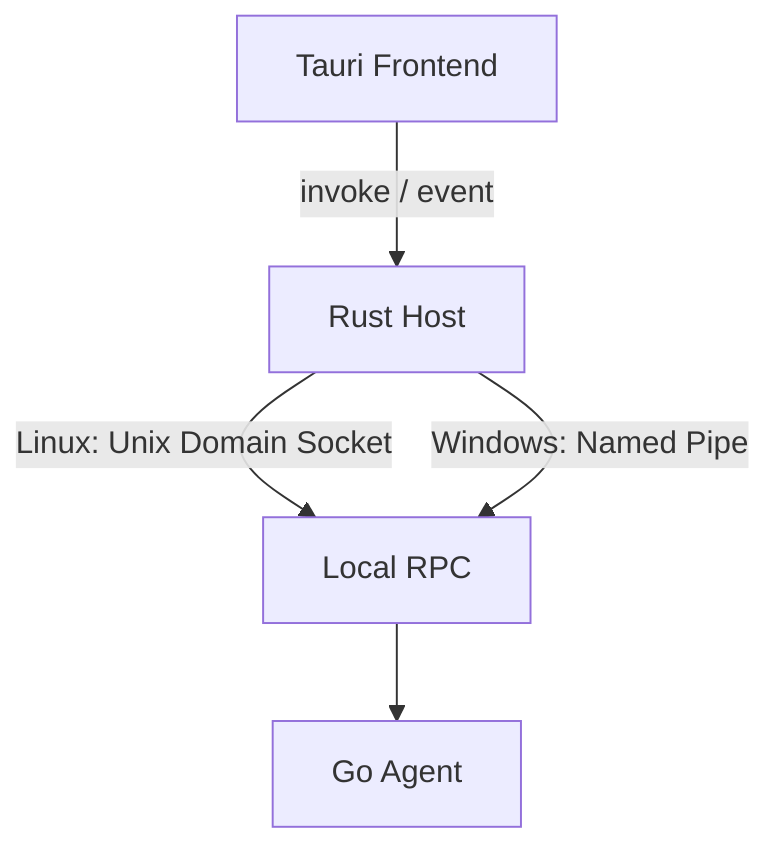
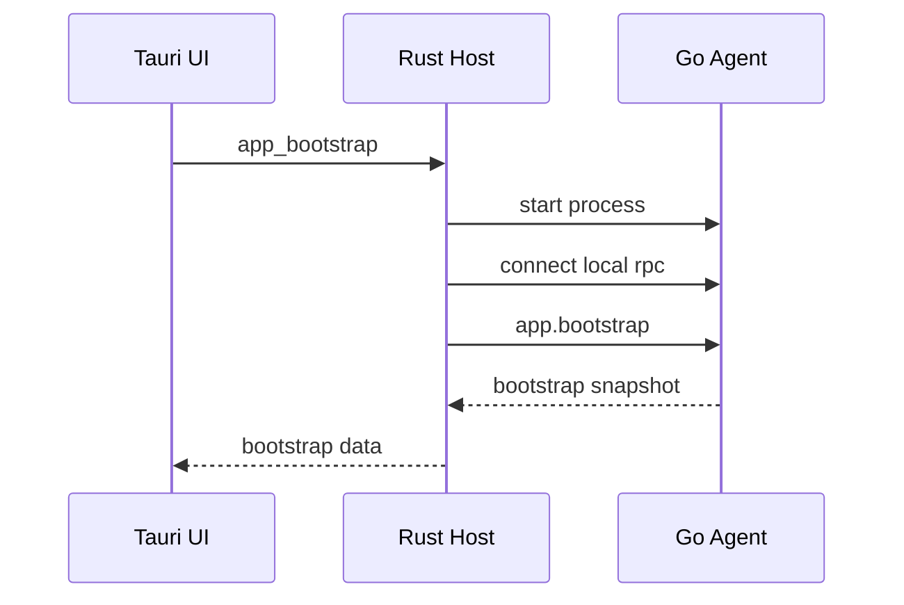

# Agent 与 Tauri 本地通信技术方案

## 1. 文档目标

本文档定义 **Tauri UI、Rust Host 与 Go Agent** 之间的本地通信与宿主集成方案，用于支撑 Agent 桌面端的以下能力：

1. Agent 生命周期管理
2. 配置查看、校验与更新
3. Session、Service、TunnelPool、Traffic 运行态快照展示
4. Agent 指标、日志、诊断结果展示
5. 本地运维命令下发
6. 本地宿主崩溃恢复与重连

本文档只讨论 **Agent 与 Tauri 的本地通信**，不展开：

* Agent 与远端服务之间的业务协议细节
* Tunnel 数据面协议细节
* Traffic 数据面转发实现细节
* 远端路由选择、发布、调度与回源逻辑

---

## 2. 适用范围

本方案适用于以下场景：

* Agent 使用 **Go** 实现
* 上层桌面 UI 使用 **Tauri** 实现
* Rust 仅作为本地宿主层，不承载主业务状态机
* Agent 是长期运行、重状态的本地后台进程
* UI 需要查看 Agent 状态、修改配置、执行诊断与运维操作
* Windows 与 Linux 均需支持

---

## 3. 核心结论

本方案的核心结论如下：

1. **Go Agent 是唯一业务运行时主体**
2. **Tauri UI 与 Rust Host 仅作为本地宿主与管理控制面**
3. **Agent 与 Tauri 之间通过本地 IPC 建立长期连接**
4. **Linux 使用 Unix Domain Socket，Windows 使用 Named Pipe**
5. **本地 IPC 只承载管理控制面，不进入 Agent 数据面**
6. **UI 只消费快照、聚合事件和诊断结果，不直接接触 tunnel/traffic 原始流**

---

## 4. 总体设计原则

### 4.1 Go Agent 是唯一业务核心

Agent 负责所有核心运行时能力，包括但不限于：

* Session 管理
* 认证、心跳、状态维护
* Service 管理与健康状态维护
* TunnelPool 管理
* Traffic 生命周期管理
* 本地 Upstream 连接建立
* 数据转发与回收
* 运行态指标与日志输出

桌面化之后，这一边界不变。

因此必须坚持：

* **Go Agent = Runtime Core**
* **Rust Host = 宿主层**
* **Tauri Frontend = 展示层**

Rust 不能演化为第二个业务状态机，也不能分担 Agent 内部的核心运行时逻辑。

---

### 4.2 Tauri 只承载本地管理面

Tauri UI 与 Rust Host 只负责：

* 配置输入与展示
* 状态快照读取
* 事件订阅
* 运维命令下发
* 日志与指标展示
* 诊断结果展示
* 宿主级能力接入（托盘、窗口、通知、文件选择等）

不得负责：

* Tunnel 原始帧读写
* Traffic 数据面接管
* Agent 内部对象直接暴露
* 运行时状态机驱动
* Relay 数据注入

---

### 4.3 本地 IPC 只做管理控制面

Agent 与 Tauri 之间的本地通信只能承载：

* Request / Response
* Snapshot
* Event
* Diagnose
* Lifecycle
* Config

不得承载：

* 数据面流量
* Tunnel 原始数据
* Traffic 原始帧
* 内部运行时对象引用
* 调试型数据注入能力

本地 IPC 的定位是：

**Agent 的本地宿主管理接口**

而不是新的业务通信层。

---

## 5. 总体架构



---

## 6. 组件职责划分

### 6.1 Tauri Frontend

负责：

* 页面渲染
* 用户输入
* 操作触发
* 状态订阅
* 配置展示与编辑
* 日志、指标、诊断结果可视化

不负责：

* 直接与 Agent 建立系统级 IPC
* 保存业务主状态
* 直接连接远端服务
* 处理 Tunnel / Traffic 原始协议

---

### 6.2 Rust Host

负责：

* 启动、停止、守护 Go Agent
* 建立本地 IPC 客户端连接
* 暴露 Tauri command 给前端
* 将 Agent event 转发到前端
* 管理窗口、托盘、通知等宿主能力
* 做进程级重连、崩溃恢复、单实例检查

不负责：

* 替代 Agent 执行业务逻辑
* 保存 Session / Tunnel / Traffic 主状态机
* 解析和执行数据面协议

---

### 6.3 Go Agent

负责：

* 所有既有业务运行时职责
* 提供 Local RPC 服务端
* 输出快照、事件、诊断结果
* 执行本地运维命令
* 输出运行态日志与指标

---

## 7. 通信方式设计

## 7.1 平台映射

本地通信统一采用本机 IPC：

* **Linux：Unix Domain Socket**
* **Windows：Named Pipe**

---

## 7.2 选择理由

采用 UDS / Named Pipe，而非 localhost HTTP/gRPC，原因如下：

1. 通信仅发生在本机 UI 与本机 Agent 之间，不需要暴露 TCP 端口
2. Agent 是长期驻留、重状态运行时，适合与宿主维持长期连接
3. 本地 IPC 可更明确地区分“宿主管理面”和“业务通信面”
4. 安全面更收敛，避免额外引入 localhost 端口暴露、端口占用、token 保护等问题
5. Linux 与 Windows 都有成熟的本地 IPC 机制，适合统一抽象

---

## 7.3 连接模型

采用：

**单长期连接 + 多路复用 request/response/event**

即：

* Rust Host 与 Go Agent 建立一条长期连接
* 请求通过帧头 `RequestId` 匹配响应
* Go Agent 可以主动推送事件
* Rust Host 再将事件转发给前端

该模型优于“每个请求建一个连接”或“前端直接轮询”。

---

## 8. 边界与运行时约束

### 8.1 UI 不得破坏 Agent 运行时边界

本方案要求桌面层不能侵入 Agent 内部运行时边界，尤其禁止以下行为：

* UI 直接读取 Tunnel 原始数据
* UI 直接订阅 Traffic 帧流
* Rust 直接操作 Agent 内部并发对象
* 本地 RPC 暴露底层转发能力
* 前端接管内部状态机控制权

---

### 8.2 UI 只能观察聚合后的状态

UI 获取的数据必须是：

* 快照
* 聚合事件
* 诊断结果
* 统计指标
* 结构化日志

而不能是：

* 底层内部帧流
* 未聚合的高频运行时噪声
* 内部 goroutine 行为细节
* 运行时私有对象引用

---

### 8.3 Rust 不能成为第二个 Runtime Core

Rust Host 的本质是 **宿主外壳**，而不是 Agent 的一部分运行时内核。

因此：

* 业务主状态在 Go Agent 内
* Rust 只保存 IPC 连接态、进程状态、UI 桥接态
* 所有关键业务状态都以 RPC 快照与事件形式暴露

---

## 9. Go Agent 侧模块设计

建议在 Agent 工程内新增本地宿主通信层。

### 9.1 建议目录结构

```text
runtime/agent/
  app/
    bootstrap.go
    config.go

  session/
    manager.go
    auth.go
    heartbeat.go

  control/
    publisher.go
    reporter.go

  tunnel/
    manager.go
    producer.go
    registry.go
    reaper.go

  traffic/
    acceptor.go
    opener.go
    relay.go
    closer.go
    reset.go

  service/
    catalog.go
    endpoint_selector.go
    health/
      tcp.go
      http.go
      grpc.go

  obs/
    metrics.go
    logs.go

  localrpc/
    server.go
    listener_linux.go
    listener_windows.go
    frame.go
    codec.go
    router.go
    subscription.go
    auth.go

  hostapi/
    snapshot.go
    lifecycle.go
    config.go
    diagnose.go
    event_view.go
```

---

### 9.2 `localrpc/` 模块职责

负责：

* 监听 UDS / Named Pipe
* 建立本地连接
* 解码帧协议
* 路由 request
* 推送 event
* 管理订阅
* 做本地握手与双向鉴权

---

### 9.3 `hostapi/` 模块职责

负责：

* 将 Agent 内部复杂运行态转换为 UI 可消费的快照
* 暴露受控的生命周期命令
* 提供配置、诊断、指标、日志查询接口
* 对内部状态做聚合和裁剪
* 保持对外接口稳定

---

### 9.4 明确禁止暴露的能力

`hostapi/` 不得暴露以下接口：

* Tunnel 原始读写接口
* Traffic 帧级控制接口
* Relay 注入接口
* 内部运行时对象句柄
* 低层状态机强制跳转接口

---

## 10. Rust Host 侧模块设计

### 10.1 建议目录结构

```text
src-tauri/
  src/
    commands/
      app.rs
      agent.rs
      session.rs
      service.rs
      tunnel.rs
      config.rs
      diagnose.rs

    agent_host/
      launcher.rs
      supervisor.rs
      ipc_client.rs
      frame.rs
      codec.rs
      router.rs
      event_bridge.rs

    state/
      app_state.rs
```

---

### 10.2 `launcher.rs`

职责：

* 启动 Go Agent
* 注入 IPC 地址
* 注入配置路径、日志路径
* 生成并注入本次启动专用 `session_secret`（用于 IPC challenge-response，进程重启后必须轮换）
* 处理启动前检查
* 做单实例约束判断

---

### 10.3 `supervisor.rs`

职责：

* 监控 Agent 进程存活状态
* 检测 Agent 崩溃
* 自动恢复
* 断链重连
* 通知前端宿主状态变化

---

### 10.4 `ipc_client.rs`

职责：

* 与 Agent 建立长期 IPC 连接
* 发送 request
* 接收 response
* 订阅 event
* 管理 pending request map

---

### 10.5 `event_bridge.rs`

职责：

* 将 Agent event 转成 Tauri event
* 对高频事件做节流和聚合
* 屏蔽底层协议变化
* 对前端保持稳定事件模型

---

## 11. Local RPC 协议设计

## 11.1 协议目标

协议设计需要满足以下目标：

1. 跨平台一致
2. 支持长期连接
3. 支持 request / response
4. 支持服务端主动 event 推送
5. 便于调试
6. 可平滑扩展

---

## 11.2 编码方式

首版建议：

* 使用应用层帧协议
* 消息体使用 JSON

原因：

* UI 场景下吞吐压力不大
* JSON 调试方便
* 快照、事件、配置天然适合 JSON 表达
* 后续可平滑替换为 Protobuf / MessagePack，而不改变帧结构

---

## 11.3 帧结构

```text
| Magic(4) | Version(2) | Type(2) | Flags(4) | RequestId(16) | BodyLen(4) | Body(N) |
```

字段说明：

* `Magic`：协议魔数
* `Version`：协议版本
* `Type`：request / response / event / ping / pong
* `Flags`：压缩、错误、预留位
* `RequestId`：请求关联标识
* `BodyLen`：消息体长度
* `Body`：JSON 内容

### 11.3.1 帧长限制与解析顺序（强制）

首版强制约束：

* `BodyLen` 必须满足 `0 <= BodyLen <= 1048576`（1 MiB）
* `ping/pong` 的 `BodyLen` 必须为 `0`
* 超限或非法帧必须返回 `FRAME_TOO_LARGE` 或 `PROTOCOL_ERROR` 并断开连接

解码顺序必须固定为：

1. 读取固定头（不分配大块内存）
2. 校验 `Magic/Version/Type/Flags/BodyLen`
3. 校验通过后再按 `BodyLen` 分配并读取 `Body`

不得在 `BodyLen` 未校验前按声明长度直接分配内存。

### 11.3.2 RequestId 关联规则（强制）

`RequestId` 以帧头字段为唯一关联来源：

* `request/response` 必须携带非零 `RequestId`
* `event/ping/pong` 的 `RequestId` 固定为全零
* JSON `Body` 不再携带 `request_id` 字段
* 若收到含 `request_id` 的 JSON 消息体，按 `PROTOCOL_ERROR` 处理并断链

---

## 11.4 消息模型

### 11.4.1 Request

```json
{
  "type": "request",
  "method": "agent.snapshot",
  "timeout_ms": 5000,
  "payload": {}
}
```

### 11.4.2 Response

成功：

```json
{
  "type": "response",
  "ok": true,
  "payload": {
    "agent_state": "running"
  }
}
```

失败：

```json
{
  "type": "response",
  "ok": false,
  "error": {
    "code": "CONFIG_INVALID",
    "message": "config is invalid",
    "retryable": false
  }
}
```

### 11.4.3 Event

```json
{
  "type": "event",
  "event": "session.state.changed",
  "seq": 1024,
  "payload": {
    "state": "ACTIVE"
  }
}
```

---

## 12. 方法域设计

本地 RPC 只开放管理面方法。

### 12.1 app

* `app.bootstrap`
* `app.shutdown`
* `app.ping`

### 12.2 agent

* `agent.snapshot`
* `agent.start`
* `agent.stop`
* `agent.restart`

生命周期语义约束（强制）：

* `agent.start`：将 Supervisor 的 `desired_state` 置为 `running`
* `agent.stop`：将 `desired_state` 置为 `stopped`，并以 `exit_kind=expected` 结束进程
* `agent.restart`：按“期望停机后再启动”执行，不计入崩溃自动恢复

### 12.3 session

* `session.snapshot`
* `session.reconnect`
* `session.drain`

### 12.4 service

* `service.snapshot`
* `service.list`
* `service.reload`

### 12.5 tunnel

* `tunnel.snapshot`
* `tunnel.pool.snapshot`

### 12.6 traffic

* `traffic.snapshot`
* `traffic.stats.snapshot`

### 12.7 config

* `config.snapshot`
* `config.validate`
* `config.replace`

### 12.8 diagnose

* `diagnose.run`
* `diagnose.snapshot`

---

## 12.9 禁止开放的方法类型

不得开放：

* `traffic.open`
* `traffic.reset`
* `tunnel.read`
* `tunnel.write`
* `relay.inject`
* `runtime.takeover`

这些能力会直接破坏 Agent 内部运行时边界。

---

## 13. 快照模型设计

UI 初始化时，应优先通过 snapshot 获取完整状态，而不是依赖事件回放。

### 13.1 AgentSnapshot

```json
{
  "agent_state": "running",
  "version": "0.1.0",
  "started_at": "2026-03-13T10:00:00Z"
}
```

### 13.2 SessionSnapshot

```json
{
  "state": "ACTIVE",
  "session_id": "s_001",
  "session_epoch": 12,
  "last_heartbeat_at": "2026-03-13T10:00:10Z"
}
```

### 13.3 ServiceSnapshot

```json
{
  "services": [
    {
      "service_key": "dev/alice/order-service",
      "service_id": "svc_001",
      "status": "healthy",
      "endpoint_count": 1
    }
  ]
}
```

### 13.4 TunnelPoolSnapshot

```json
{
  "idle": 8,
  "active": 3,
  "broken": 0,
  "closing": 1,
  "min_idle_tunnels": 8,
  "max_idle_tunnels": 32
}
```

### 13.5 TrafficStatsSnapshot

```json
{
  "open_ack_latency_p50_ms": 12,
  "open_ack_latency_p99_ms": 85,
  "active_traffic_count": 3,
  "recent_reset_total": 1
}
```

---

## 14. 事件模型设计

事件只推送 UI 所需的聚合状态变化。

### 14.1 建议事件清单

#### agent

* `agent.state.changed`
* `agent.version.changed`

#### session

* `session.state.changed`
* `session.heartbeat.updated`

#### service

* `service.health.updated`
* `service.catalog.changed`

#### tunnel

* `tunnel.pool.updated`

#### traffic

* `traffic.stats.updated`

#### config

* `config.changed`
* `config.validation.failed`

#### diagnose

* `diagnose.completed`

---

### 14.2 事件粒度要求

推荐：

```json
{
  "event": "tunnel.pool.updated",
  "payload": {
    "idle": 7,
    "active": 4,
    "broken": 0
  }
}
```

不推荐：

* 每个 tunnel 的每次细粒度迁移都直接发给 UI
* 每个 traffic 帧都推送到前端
* 每个内部后台任务动作都外露

UI 需要的是**可视状态**，不是运行时噪声。

---

## 15. 生命周期设计

### 15.1 启动流程



---

### 15.2 运行态流程

1. UI 发起操作
2. Rust Host 调用 Local RPC
3. Go Agent 执行并返回结果
4. Go Agent 状态变化时主动发 event
5. Rust Host 转发 event 给前端

---

### 15.3 退出流程

1. UI 请求退出
2. Rust Host 通知 Agent 优雅关闭
3. Rust Host 等待 Agent 退出或超时
4. Rust Host 再退出自身

如果未来支持后台常驻，则“关闭窗口”和“退出程序”应解耦，但协议结构可以保持不变。

---

## 16. 崩溃恢复与重连

### 16.1 本地 IPC 断开

若 Rust 与 Agent 的 IPC 断开：

1. Rust 标记宿主状态为 `disconnected`
2. 前端展示“Agent 离线”
3. Rust 检查 Agent 进程是否仍存活
4. 若仍存活，则尝试重连 IPC，并重新执行完整握手校验
5. 重连成功后进入 `resyncing`，强制重新拉取全量 snapshot（agent/session/service/tunnel/traffic）
6. 全量 snapshot 成功后才进入 `connected` 并恢复事件转发
7. 若已退出，则按 `desired_state` 决定是否自动拉起

---

### 16.2 Agent 崩溃

若 Agent 崩溃：

1. Rust Supervisor 记录退出码
2. 向前端发出 `agent.state.changed = crashed`
3. 仅当 `desired_state=running` 且 `exit_kind=unexpected` 时自动拉起 Agent
4. 重建 IPC 连接
5. 重新执行 bootstrap
6. 重新向前端下发完整 snapshot

---

### 16.3 恢复职责归属

恢复逻辑归 Rust Host 负责。
前端只负责展示：

* 当前状态
* 最近错误
* 手动重试入口

---

### 16.4 Supervisor 意图状态（强制）

Rust Host 必须维护并持久化最小状态：

* `desired_state`：`running` / `stopped`
* `exit_kind`：`expected` / `unexpected`

自动恢复判断规则：

* 仅当 `desired_state=running && exit_kind=unexpected` 执行自动拉起
* 当用户调用 `agent.stop` 或 `app.shutdown` 后，必须禁止自动拉起

---

## 17. 安全设计

### 17.1 本地地址设计

#### Linux

建议路径：

```text
$XDG_RUNTIME_DIR/agent-ui/agent.sock
```

若系统不提供 `XDG_RUNTIME_DIR`，则退回用户私有运行目录。

实现约束（强制）：

* IPC 目录必须由当前用户创建，权限 `0700`，owner 必须为当前用户
* `agent.sock` 权限必须为 `0600`，owner 必须为当前用户
* 创建前必须 `lstat` 检查，若目标路径是符号链接或非 socket 文件则直接失败
* 退回目录不得使用 `/tmp` 等共享目录，必须使用用户私有目录

#### Windows

建议路径：

```text
\\.\pipe\agent-ui-<user-scope>
```

实现约束（强制）：

* Pipe 名称必须包含当前用户作用域（建议使用 SID）
* Named Pipe 必须使用仅允许当前用户（可选追加 LocalSystem）的 DACL
* 必须启用拒绝远程客户端策略（`PIPE_REJECT_REMOTE_CLIENTS`）
* 建连后必须校验客户端令牌 SID 与当前用户一致

---

### 17.2 握手设计

本地 IPC 建立后，必须执行两阶段握手与鉴权：

第一阶段：操作系统级对端身份校验

* Linux：通过 `SO_PEERCRED` 校验对端 `uid`（必须等于当前用户），并校验 `pid` 与 Rust 启动的 Agent 进程一致
* Windows：通过 Named Pipe 对端进程与令牌信息校验 `SID`（必须等于当前用户），并校验 `pid` 与 Rust 启动记录一致
* 任一校验失败立即断开连接并记录 `PEER_IDENTITY_MISMATCH`

第二阶段：挑战应答（challenge-response）

* Rust 启动 Agent 时生成随机 `session_secret`（至少 32 字节）并注入 Agent，生命周期仅限当前 Agent 进程
* Rust 发送：
  * `client_name`
  * `protocol_version`
  * `nonce`
* Agent 返回：
  * `agent_id`
  * `version`
  * `feature_set`
  * `agent_nonce`
  * `agent_proof`
* `agent_proof = HMAC-SHA256(session_secret, client_nonce || agent_nonce || protocol_version || "agent")`
* Rust 校验通过后再发送 `client_proof`
* `client_proof = HMAC-SHA256(session_secret, client_nonce || agent_nonce || protocol_version || "host")`
* Agent 仅在 `client_proof` 校验通过后接受非握手 RPC 方法

握手与鉴权的目的：

* 避免连到错误进程
* 处理协议不兼容
* 支撑能力协商
* 提升故障诊断效率
* 防止本机伪造进程冒充 Agent

---

### 17.3 命令白名单

前端不得透传任意本地 RPC method。
Rust 只暴露有限 Tauri command，再映射到内部 RPC method。

这样可以保证：

* 权限边界明确
* 参数校验集中
* 不形成无约束超级入口

---

## 18. 配置管理设计

配置管理分为三类。

### 18.1 只读运行态配置

例如：

* 当前 Agent 标识
* 当前环境信息
* 当前已加载配置
* 当前 Service 列表
* 当前 TunnelPool 参数

---

### 18.2 可编辑持久化配置

例如：

* TunnelPool 参数
* Service 配置
* 健康检查参数
* 本地运行选项

---

### 18.3 重启生效配置

对于不能热更新的配置，UI 必须明确区分：

* “保存配置”
* “保存并重启 Agent 生效”

不得误导用户认为所有配置都能实时生效。

---

## 19. 观测性设计

## 19.1 UI 展示建议

建议展示以下运行态指标与摘要：

* Session 状态
* TunnelPool 数量
* Traffic 活跃数
* 最近错误摘要
* Service 健康状态
* 延迟指标
* 最近诊断结果

---

## 19.2 宿主侧新增指标

建议增加一组桌面宿主集成指标：

* `agent_host_ipc_connected`
* `agent_host_ipc_reconnect_total`
* `agent_host_rpc_latency_ms`
* `agent_host_supervisor_restart_total`

该组指标属于宿主层，而不属于 Agent 核心运行时。

---

## 19.3 日志要求

建议 UI 的日志视图保留结构化字段，而不是只展示拼接文本。
至少应支持：

* 时间
* 级别
* 模块
* 错误码
* 关键业务标识
* 关联 ID

---

## 20. 实施顺序

### 阶段一：基础骨架

* Go Agent 增加 `localrpc` 服务端
* Rust Host 拉起 Agent
* 实现 `app.bootstrap`
* 实现 `agent.snapshot`
* UI 显示 Agent 在线状态

### 阶段二：状态可视化

* 实现 `session.snapshot`
* 实现 `service.snapshot`
* 实现 `tunnel.pool.snapshot`
* 实现 `traffic.stats.snapshot`
* 打通核心事件桥接

### 阶段三：配置与运维

* 实现 `config.snapshot`
* 实现 `config.validate`
* 实现 `config.replace`
* 实现 `agent.restart`
* 实现 `session.reconnect`

### 阶段四：稳态与诊断

* 实现 `diagnose.run`
* 实现崩溃恢复
* 实现自动重连
* 实现事件节流
* 实现日志导出与诊断页面

---

## 21. 方案结论

本方案最终收敛为以下架构决策：

1. **Go Agent 仍是唯一业务运行时主体**
2. **Tauri UI 与 Rust Host 只承担本地宿主与管理控制面职责**
3. **Linux 上使用 Unix Domain Socket，Windows 上使用 Named Pipe**
4. **采用长期 Local RPC 连接，支持 request/response/event 多路复用**
5. **本地 RPC 只承载 lifecycle、config、snapshot、event、diagnose，不进入数据面**
6. **UI 只消费聚合后的快照、事件和诊断结果，不直接接触 Agent 底层运行时流量**
