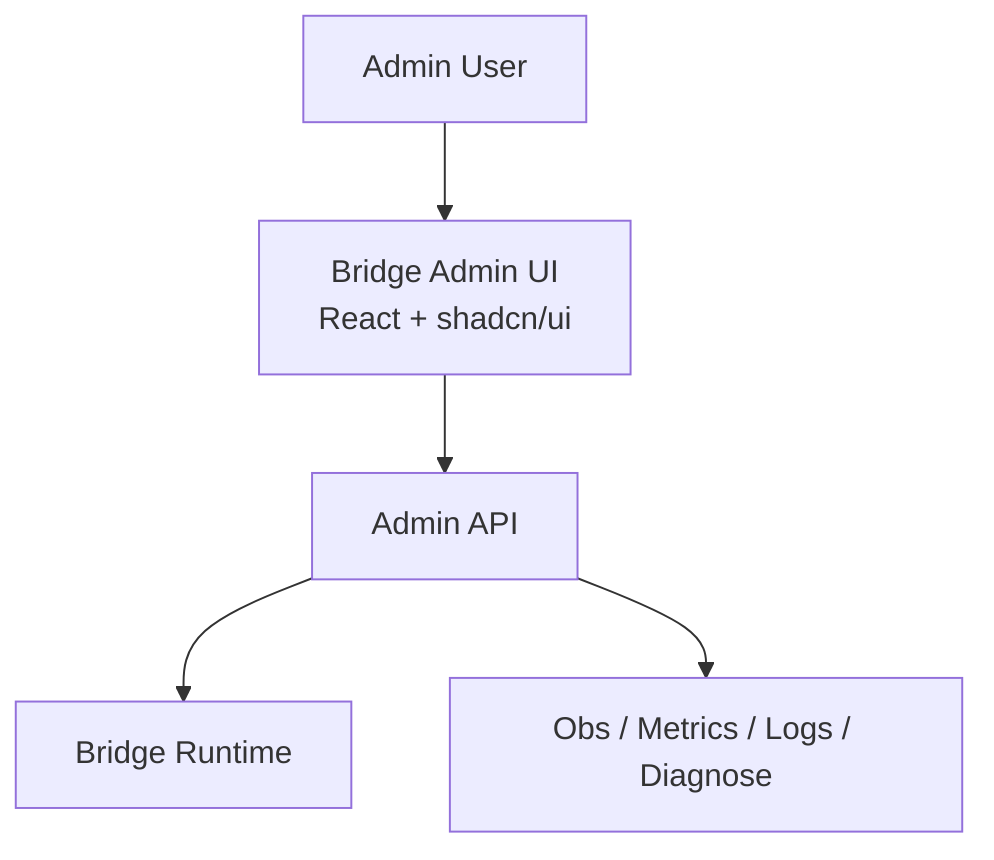

# Bridge 管理后台技术方案

## 1. 文档目标

本文档定义 **Bridge 管理后台** 的职责边界、系统架构、模块设计、接口分层、权限模型与实施顺序，用于支撑以下目标：

1. 管理 Bridge 的静态配置与运行态配置
2. 查看 route / service / session / tunnel / traffic 的运行态信息
3. 查看 Bridge 的 ingress、route resolve、connector proxy、direct proxy、hybrid fallback 执行结果
4. 查看指标、日志、诊断结果与关键错误
5. 提供有限、受控的运维管理能力
6. 保证后台能力不会破坏 Bridge 运行时关键不变量

本文档不重新定义 Bridge 与 Agent 的运行时协议，不改变既有运行时结构：

* Bridge 继续负责 ingress、route resolve、session/service/tunnel registry、connector proxy、direct proxy 与 hybrid fallback。
* Bridge 继续维护 `SessionRegistry`、`ServiceRegistry`、`RouteRegistry`、`TunnelRegistry` 等内存索引。
* Bridge 继续负责为 `connector_service` 分配 idle tunnel、发起 `TrafficOpen`、在 `TrafficOpenAck success` 后进入 relay。 

---

## 2. 设计范围

## 2.1 本期包含

本期 Bridge 管理后台包含：

1. 登录与基础权限控制
2. Bridge 运行状态总览
3. Route 管理与查看
4. Service / Connector / Session 查看
5. Tunnel Pool 与 Traffic 观测
6. 日志、指标、诊断页面
7. 有限运维操作入口
8. 静态资源内嵌发布

## 2.2 本期不包含

本期不实现：

1. 完整租户系统
2. 复杂 RBAC
3. 多 Bridge 集群统一后台
4. 多实例一致性协调
5. 直接在线编辑并热变更所有运行参数
6. 直接操控某条 tunnel 或某条 traffic 的低层运行时流程

这些边界也和你当前主方案一致：本期不做复杂 RBAC，不做多 Bridge 高可用或跨 Bridge 一致性。

---

## 3. 设计原则

## 3.1 后台是管理面，不是运行时控制面

Bridge 的核心运行时已经明确分成：

* ingress
* routing
* registry
* connectorproxy
* directproxy
* control
* obs。

管理后台只能建立在这些模块之上，读取它们暴露出的**稳定快照、聚合状态、诊断结果**。
不能把后台做成“直接伸手进 runtime 内部状态机”的工具。

因此，管理后台允许：

* 看状态
* 看配置
* 看日志
* 看指标
* 做有限运维命令

不允许：

* 直接操控某条 traffic 的状态跳转
* 直接指定某个 tunnel 进入 active
* 在线注入 `TrafficOpen` / `TrafficReset`
* 修改 connector proxy 内部握手行为
* 修改 direct proxy 的每条连接对象

---

## 3.2 管理后台不得破坏 Bridge 关键不变量

你当前技术方案已经明确了一些核心约束：

1. **单 tunnel 单 traffic**。
2. Bridge 侧 `TunnelRegistry` 维护 `idle / reserved / active / closed / broken` 状态，并负责 idle tunnel 分配与状态摘除。
3. `TrafficOpenAck success=true` 之后才能进入正式 relay。
4. idle tunnel 不足时，Bridge 采用 **短等待 + 触发补池 + 超时失败**。
5. `TrafficOpenAck` 超时后必须进入取消流程，而不是无边界挂起。

因此，后台绝不能提供会破坏这些不变量的直接操作接口。

---

## 3.3 后台接口必须区分三类能力

Bridge 后台接口统一分为三类：

### 1）只读快照类

适合页面初始化与详情页展示，例如：

* bridge 总览
* route 列表
* service 列表
* session 列表
* tunnel pool 统计
* traffic 聚合统计

### 2）事件与时间序列类

适合状态变化追踪，例如：

* session 状态变化
* tunnel pool 数量变化
* route 命中趋势
* open timeout 趋势
* fallback 触发趋势

### 3）有限运维命令类

适合后台操作，但必须收敛，例如：

* reload 配置
* drain 某 connector/session
* 手动触发一次诊断
* 导出当前运行快照

不允许做成“万能运行时命令执行器”。

---

## 4. 总体架构



---

## 5. 部署与发布方式

## 5.1 单体嵌入式发布

本期采用：

**Bridge Runtime + Embedded Admin UI Static Assets**

即：

1. 管理后台前端使用 React + shadcn/ui 开发
2. 构建为静态资源
3. 静态资源打包进 Bridge 可执行文件
4. Bridge 在管理入口路径下直接提供静态资源服务

这与现有方案完全一致：**Bridge 管理页面可使用 React + shadcn/ui，但发布包必须将 UI 静态资源内嵌到 Bridge 可执行文件**。

## 5.2 不单独拆后台服务

由于当前范围明确：

* Bridge 单体部署
* Bridge 内部分层，但不拆独立服务。

因此本期不拆：

* `bridge-admin-api`
* `bridge-console-service`
* `bridge-observer-service`

后台 API 与静态资源统一由 Bridge 本体提供。

---

## 6. 管理后台职责边界

## 6.1 后台负责的内容

### 6.1.1 Bridge 总览

展示：

* Bridge 版本
* 启动时间
* 当前运行模式
* ingress 监听状态
* route 总量
* active session 数
* service 总量
* idle / reserved / active / broken tunnel 数
* active traffic 数
* 最近错误摘要

### 6.1.2 Route 管理

展示与管理：

* route 列表
* route matcher 信息
* target 类型：

  * `connector_service`
  * `external_service`
  * `hybrid_group`
* scope、健康过滤结果
* route 命中统计
* fallback 命中统计

这与现有 `RouteResolver` 设计完全匹配：Bridge 需要根据 ingress 输入匹配 route，并判定 target 类型，同时过滤 scope 不匹配、service 不健康、connector 离线、session 非 active 等状态。

### 6.1.3 Service / Connector / Session 管理

展示：

* connector 列表
* connector 当前 active session
* session 状态：`ACTIVE / DRAINING / STALE / CLOSED`
* session 与 service 的绑定关系
* service 健康状态
* service endpoint 摘要

这也和 `SessionRegistry`、`ServiceRegistry` 的职责一致。

### 6.1.4 Tunnel Pool 管理视图

展示：

* tunnel 数量统计
* 状态分布：`idle / reserved / active / closed / broken`
* acquire wait 失败次数
* refill request 次数
* 最近 broken tunnel 摘要
* connector 维度 tunnel 使用情况

这直接对应 `TunnelRegistry` 的 Bridge 侧职责。

### 6.1.5 Traffic 观测

展示：

* active traffic 数
* route 维度请求量
* connector path 请求量
* direct path 请求量
* hybrid fallback 次数
* `TrafficOpenAck` 延迟分布
* open timeout 数
* cancel 数
* endpoint 真实命中情况

特别是你当前方案明确要求：**Bridge 必须把 `TrafficOpenAck.metadata` 中的 `actual_endpoint_*` 作为本次请求的最终观测真相写入日志与指标**。
所以后台必须把这部分作为核心观测能力，而不是可选项。

### 6.1.6 日志、指标、诊断

后台需要提供：

* 指标面板
* 结构化日志检索
* 关键错误分类
* 路由诊断
* connector/session 诊断
* tunnel pool 容量诊断
* fallback 诊断

---

## 6.2 后台不负责的内容

后台不得直接负责：

1. Traffic 数据面转发
2. tunnel 获取、保留、关闭等底层状态机驱动
3. 直接介入 `TrafficOpenAck` 握手
4. 直接改写 RouteResolver 的运行中判定结果
5. 动态注入低层 transport 命令
6. 对某个 active traffic 执行任意运行时跳转

---

## 7. 后台功能分层

## 7.1 页面分层

建议后台分为六个一级页面：

1. 总览 Dashboard
2. Route 管理
3. Connector / Session 管理
4. Tunnel / Traffic 观测
5. 配置与运维
6. 日志 / 指标 / 诊断

---

## 7.2 Dashboard

Dashboard 展示全局健康摘要：

* ingress 健康
* 当前 QPS / 请求总量
* route 命中分布
* active session 数
* active connector 数
* tunnel 状态分布
* open timeout 趋势
* `TrafficOpenAck` 延迟
* hybrid fallback 趋势
* 最近高频错误

### 设计目标

Dashboard 不做“细节列表全集中展示”，而是做：

* 现状快照
* 风险发现入口
* 故障排查入口

---

## 7.3 Route 管理页

Route 管理页负责：

* 展示 route 基本信息
* 展示 matcher 规则
* 展示 target 类型
* 展示 route 当前可用性
* 展示 route 最近命中量
* 展示 fallback 情况
* 展示失败原因分布

### 建议操作

允许：

* 查看 route 详情
* 导出 route 配置
* 启用/禁用 route（若你允许后台改配置）
* 验证 route 匹配规则

不建议允许：

* 在线直接修改并立即热生效复杂路由规则
  除非你后面明确补齐配置热更新与一致性保证。

---

## 7.4 Connector / Session 管理页

用于观察 Bridge 与 Agent 连接面。

展示：

* connector_id
* active session_id
* session_epoch
* session 状态
* 最近心跳时间
* 发布的 service 数
* tunnel pool 摘要
* 最近控制面错误
* 最近断连重连记录

### 可提供的受控操作

* drain 某 connector
* 标记 session 只读排空
* 触发诊断
* 查看发布 service 列表

### 不提供

* 强制篡改 session_epoch
* 强制篡改 service runtime identity
* 绕过 control handler 直接写 registry

---

## 7.5 Tunnel / Traffic 观测页

### Tunnel 维度

展示：

* idle / reserved / active / closed / broken 分布
* connector 维度 tunnel 数量
* acquire 成功率
* acquire 等待耗时
* refill request 次数
* broken 原因摘要

### Traffic 维度

展示：

* active traffic 数
* connector / direct / hybrid 分路占比
* open ack latency
* pre-open timeout
* cancel 次数
* reset 次数
* 最近失败 traffic 样本

### 必须强调

这是**观测页**，不是“traffic 在线控制台”。

不提供：

* 直接 reset 某 traffic
* 直接向某 traffic 注入数据
* 直接改变某条 active tunnel 的状态

---

## 7.6 配置与运维页

配置与运维页分为两类。

### 7.6.1 配置查看

查看：

* ingress 配置
* route 配置
* service 相关静态配置
* tunnel pool 容量相关配置
* timeout 相关配置
* hybrid fallback 相关配置

### 7.6.2 受控运维命令

建议仅支持：

* reload 配置
* 导出当前配置快照
* 触发 route 诊断
* 触发 connector/session 诊断
* 触发 tunnel pool 诊断
* 下载诊断包

### 约束

运维命令必须：

* 有审计日志
* 有权限校验
* 有明确作用域
* 有失败回执
* 不允许执行任意脚本

---

## 7.7 日志 / 指标 / 诊断页

### 日志页

支持：

* 结构化检索
* 按 connector_id / session_id / route_id / traffic_id / service_id 检索
* 错误等级筛选
* 时间范围筛选
* 导出日志片段

### 指标页

支持：

* QPS / latency / error rate
* route 命中趋势
* open timeout 趋势
* acquire wait 趋势
* fallback 趋势
* tunnel pool 水位趋势

### 诊断页

支持：

* route resolve 诊断
* service 健康诊断
* connector/session 诊断
* tunnel pool 容量诊断
* pre-open timeout 根因摘要

---

## 8. 后台与运行时的模块设计

当前 Bridge 运行时模块为：

```text
runtime/bridge/
  app/
  ingress/
  routing/
  registry/
  connectorproxy/
  directproxy/
  control/
  obs/
```

这是现有设计基线。

在此基础上，我建议新增后台相关模块：

```text
runtime/bridge/
  app/
  ingress/
  routing/
  registry/
  connectorproxy/
  directproxy/
  control/
  obs/

  adminapi/
    server.go
    auth.go
    middleware.go
    response.go

    dashboard.go
    route_api.go
    connector_api.go
    session_api.go
    tunnel_api.go
    traffic_api.go
    config_api.go
    ops_api.go
    logs_api.go
    metrics_api.go
    diagnose_api.go

  adminview/
    snapshot/
      bridge_snapshot.go
      route_snapshot.go
      connector_snapshot.go
      session_snapshot.go
      tunnel_snapshot.go
      traffic_snapshot.go
    event/
      bridge_event.go
    diagnose/
      route_diagnose.go
      session_diagnose.go
      tunnel_diagnose.go
```

---

## 8.1 `adminapi/` 模块职责

负责：

* 提供后台 HTTP API
* 做认证与权限检查
* 将 runtime 状态转换为后台输出
* 屏蔽内部模块细节
* 控制可执行运维命令范围

---

## 8.2 `adminview/` 模块职责

负责：

* 生成页面需要的快照对象
* 把运行时复杂状态折叠为稳定字段
* 生成诊断结果
* 做后台视图模型与内部模型的隔离

这个模块非常重要。
不要让前端直接绑定 `registry.SessionRuntime`、`registry.TunnelRuntime` 之类内部结构体。

---

## 9. 前端技术方案

## 9.1 技术栈

按你原文档约束，管理页面采用：

* **React**
* **shadcn/ui**

并构建为静态资源，最终内嵌进 Bridge 可执行文件。

### 补充建议

前端可选：

* React Router
* TanStack Query
* ECharts 或 Recharts
* Zustand（若状态不复杂）

---

## 9.2 前端页面结构

建议：

```text
web/bridge-admin/
  src/
    pages/
      dashboard/
      routes/
      connectors/
      sessions/
      tunnels/
      traffic/
      config/
      logs/
      metrics/
      diagnose/

    components/
      summary-cards/
      filter-bar/
      data-table/
      health-badge/
      latency-chart/
      state-pill/
      detail-drawer/

    services/
      dashboard.ts
      route.ts
      connector.ts
      tunnel.ts
      traffic.ts
      config.ts
      logs.ts
      metrics.ts
      diagnose.ts
```

---

## 9.3 前端交互原则

前端页面统一遵循：

1. **先拿 snapshot，再做增量刷新**
2. 高频页面使用轮询或 SSE，但只消费聚合事件
3. 详情页尽量基于结构化对象展示，不拼接自由文本
4. 所有运维按钮必须二次确认并记录审计信息

---

## 10. Admin API 设计

## 10.1 API 分层

建议分为以下资源域：

* `/api/admin/bridge/*`
* `/api/admin/routes/*`
* `/api/admin/connectors/*`
* `/api/admin/sessions/*`
* `/api/admin/tunnels/*`
* `/api/admin/traffic/*`
* `/api/admin/config/*`
* `/api/admin/logs/*`
* `/api/admin/metrics/*`
* `/api/admin/diagnose/*`
* `/api/admin/ops/*`

---

## 10.2 典型只读接口

### Bridge 总览

* `GET /api/admin/bridge/overview`

### Route 列表

* `GET /api/admin/routes`
* `GET /api/admin/routes/:routeId`

### Connector / Session

* `GET /api/admin/connectors`
* `GET /api/admin/connectors/:connectorId`
* `GET /api/admin/sessions`
* `GET /api/admin/sessions/:sessionId`

### Tunnel / Traffic

* `GET /api/admin/tunnels/summary`
* `GET /api/admin/tunnels`
* `GET /api/admin/traffic/summary`
* `GET /api/admin/traffic`

### Logs / Metrics

* `GET /api/admin/logs/search`
* `GET /api/admin/metrics/query`

### Diagnose

* `POST /api/admin/diagnose/route`
* `POST /api/admin/diagnose/session`
* `POST /api/admin/diagnose/tunnel`

---

## 10.3 受控运维接口

建议仅保留少量：

* `POST /api/admin/ops/config/reload`
* `POST /api/admin/ops/session/:sessionId/drain`
* `POST /api/admin/ops/connector/:connectorId/drain`
* `POST /api/admin/ops/diagnose/export`

### 约束

这些接口必须：

* 只操作管理面语义
* 不暴露数据面底层命令
* 有权限校验
* 有审计记录
* 有幂等或重复执行保护

---

## 11. 权限与安全设计

## 11.1 本期权限模型

因为当前范围明确**不做完整租户系统与复杂 RBAC**，所以本期建议用简单分层：

* `viewer`：只读
* `operator`：只读 + 受控运维
* `admin`：配置管理 + 运维

---

## 11.2 登录与认证

可选最简方案：

* 本地账号密码
* Session Cookie / Token
* 仅管理入口开启认证

若是内网使用，也不能完全省略认证层。

---

## 11.3 安全边界

后台必须做到：

1. 管理入口与业务 ingress 路径隔离
2. 后台操作带审计
3. 配置修改带版本与操作者信息
4. 敏感配置脱敏展示
5. 不提供任意代码执行、任意命令执行能力

---

## 12. 观测性设计

## 12.1 后台必须展示的关键指标

依据你现有方案，Bridge 后台最重要的不是“服务列表”，而是**路径选择与 pre-open 健康**。因此建议重点展示：

* ingress 请求量
* route 命中数
* connector / direct / hybrid 分路占比
* idle tunnel 数
* reserved tunnel 数
* active tunnel 数
* broken tunnel 数
* acquire wait 次数与耗时
* `TrafficOpenAck` latency
* open timeout 次数
* cancel 次数
* fallback 次数
* actual endpoint 命中统计

特别是 `actual_endpoint_*` 必须成为后台核心观测维度。

---

## 12.2 日志字段建议

日志至少应支持以下索引维度：

* request_id / trace_id
* route_id
* connector_id
* session_id
* session_epoch
* service_id
* tunnel_id
* traffic_id
* actual_endpoint_id
* actual_endpoint_addr
* failure_reason

这样后台排障才真正可用。

---

## 12.3 诊断能力建议

后台诊断重点不在“抓包”，而在“解释系统为何这样决策”。

建议提供：

### route diagnose

输入请求特征，输出：

* 命中的 route
* 未命中的 route 及原因
* 最终 target 类型
* 过滤掉的 connector/service 原因

### session diagnose

输出：

* connector 当前 session
* 最近心跳
* 最近状态变化
* 最近错误

### tunnel diagnose

输出：

* 当前池水位
* acquire wait 是否频繁
* refill 是否跟得上
* broken tunnel 原因分布

### traffic diagnose

输出：

* open timeout 原因摘要
* cancel 原因摘要
* fallback 是否因 no idle tunnel 或 open timeout 触发

---

## 13. 配置管理策略

## 13.1 配置分层

建议把后台可见配置分为三类：

### 静态启动配置

修改后需重启生效，例如：

* ingress 监听
* 管理入口绑定
* 核心 runtime 参数

### 可 reload 配置

例如：

* route 配置
* service 相关静态映射
* 部分阈值类配置

### 纯展示配置

例如：

* 构建版本
* 编译时间
* 运行目录

---

## 13.2 配置修改原则

配置修改必须：

1. 先校验
2. 再保存
3. 明确告诉用户是否需要 reload / restart
4. 记录审计日志
5. 能导出变更前后差异

---

## 14. 与现有运行时的集成要求

## 14.1 不额外复制运行时状态

后台页面数据应直接来自：

* registry 快照
* routing 快照
* connectorproxy 统计
* control 层状态
* obs 指标与日志

不要再单独维护一套“后台数据库镜像”，否则会产生双状态源。

---

## 14.2 后台数据以快照和统计为主

例如：

* `BridgeOverviewSnapshot`
* `RouteSnapshot`
* `SessionSnapshot`
* `TunnelPoolSnapshot`
* `TrafficStatsSnapshot`

而不是直接返回低层 runtime struct。

---

## 14.3 后台事件模型

若要支持自动刷新，建议只输出聚合事件，例如：

* `bridge.health.changed`
* `session.state.changed`
* `tunnel.pool.updated`
* `traffic.stats.updated`

不要输出底层帧事件。

---

## 15. 实施顺序

## 阶段一：最小后台骨架

* 嵌入式静态资源服务
* 后台登录
* Dashboard 总览
* route / connector / session 只读列表

## 阶段二：核心观测能力

* tunnel pool 页面
* traffic 页面
* actual endpoint 观测
* open timeout / fallback 趋势
* 日志检索

## 阶段三：配置与运维

* 配置查看
* 配置校验
* reload 配置
* drain connector/session
* 诊断接口

## 阶段四：稳态优化

* 审计日志
* 更细粒度权限
* 导出诊断包
* 页面级性能优化
* 更完善的异常提示与操作保护