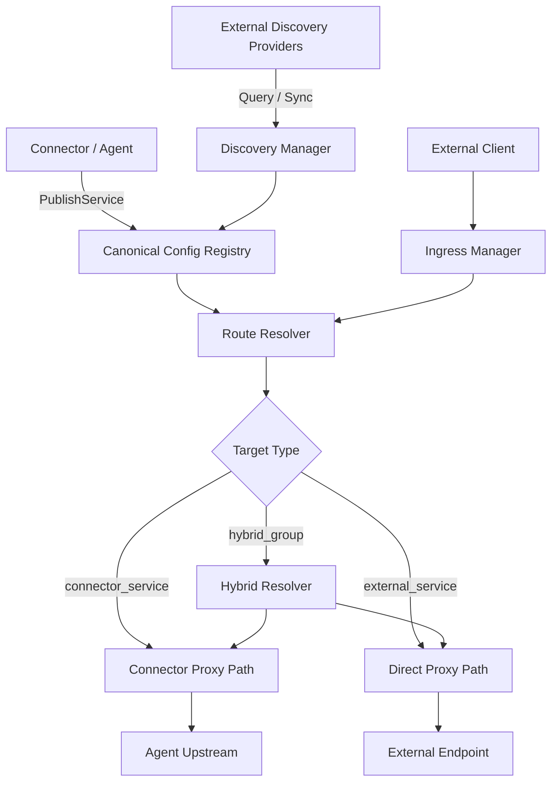
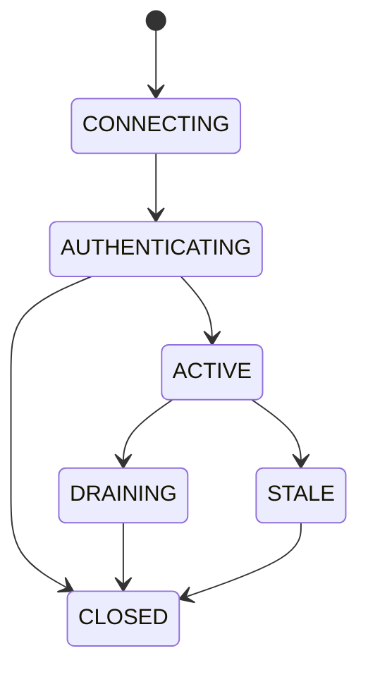
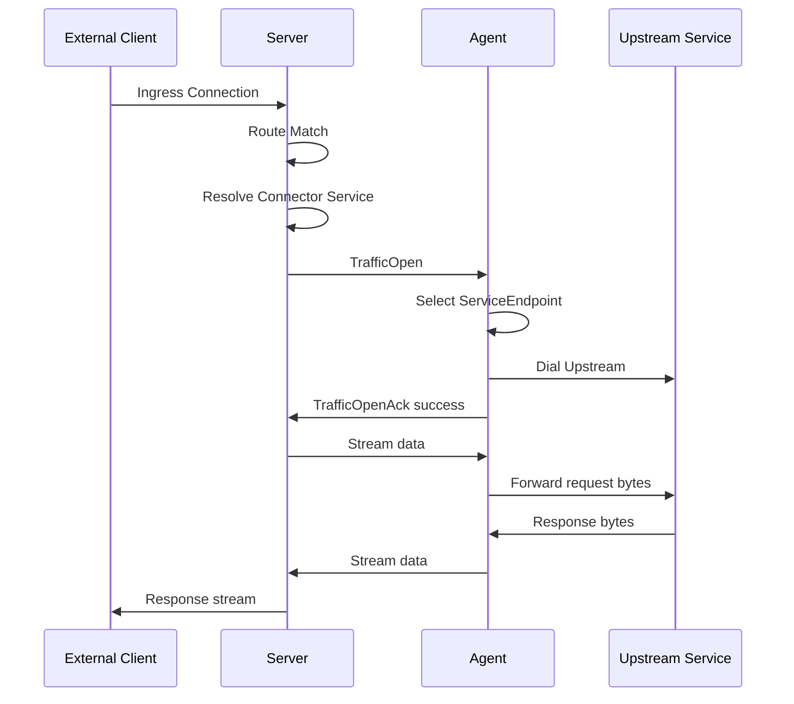
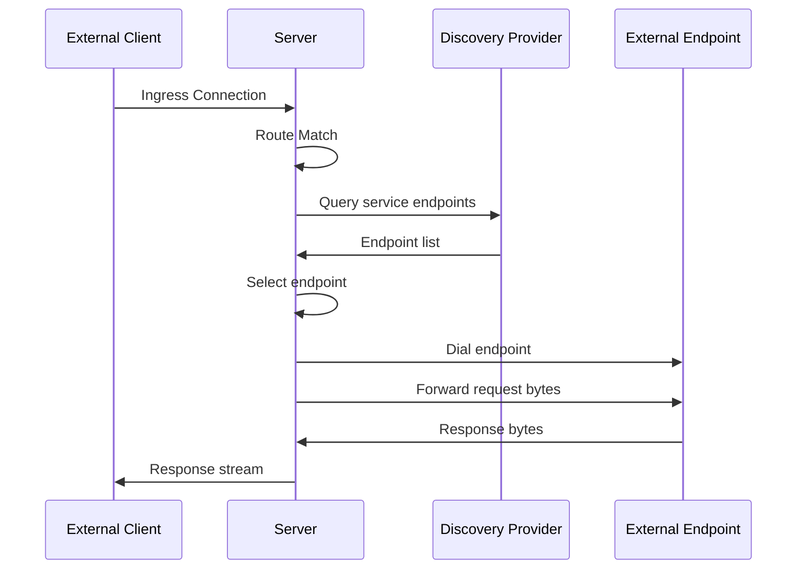
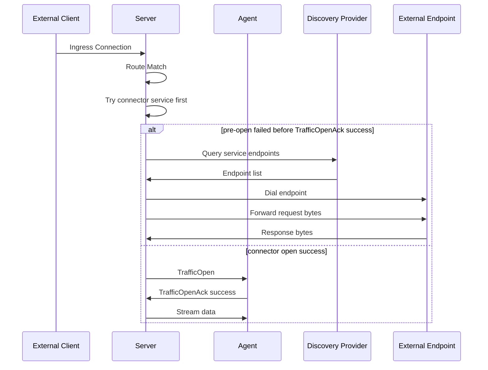

# DevBridge Loop 统一服务路由与连接器转发协议

## 最终定稿版（v2.1）

**文档状态**：Final
**版本**：v2.1
**定位**：中心汇聚式连接器网络、统一服务路由平面、混合来源服务转发层
**适用场景**：开发环境回流、内网服务暴露、中心化入口接入、第三方服务发现融合转发
**设计路线**：中期路线，抽象底层传输层，不强绑定 MASQUE

---

# 1. 文档目的

本文档定义一套中心汇聚式连接器路由与转发协议，以及对应的 server/agent 架构边界，用于支撑以下能力：

1. 多个 agent 主动连接中心 server
2. agent 将本地或内网服务发布给 server
3. server 统一接收入站流量
4. server 将流量路由并转发到 connector 发布的服务
5. 对于未注册在本系统中的依赖服务，server 可从第三方服务发现系统查询目标，并直接代理转发
6. server 可将内部公开服务导出到第三方发现系统
7. 上层协议与具体 transport binding 解耦，未来可演进到 QUIC / HTTP3 / Datagram

---

# 2. 非目标

本版不覆盖以下内容：

1. 不定义控制台 UI
2. 不实现完整租户系统和复杂 RBAC
3. 不实现跨 server 集群一致性协议
4. 不实现 session resume
5. 不实现 mid-stream failover
6. 不要求首版实现 datagram
7. 不要求首版兼容所有第三方服务发现系统的全部高级特性

---

# 3. 核心约束

这是本协议的硬约束。

## 3.1 最小作用域隔离是强制项

即使不做完整租户系统，也必须有：

* `namespace`
* `environment`

所有核心资源都必须带作用域：

* connector
* service
* route
* discovery query
* discovery projection

---

## 3.2 数据面禁止应用层二次复用

**1 个 traffic = 1 个底层 binding 的原生独立流单元。**

这意味着：

* 在 `grpc_h2` 下：1 个 traffic = 1 条 gRPC bidi stream
* 在 `quic_native` 下：1 个 traffic = 1 条 QUIC stream
* 在 `h3_stream` 下：1 个 traffic = 1 条 H3 stream
* 在 `tcp_framed` 下：1 个 traffic = 1 条独立数据连接

禁止在单个大 stream 里通过 `traffic_id` 手工复用多条流量。

---

## 3.3 Ingress 必须按协议能力分层

server 入口分为三类：

### L7 Shared Ingress

适用于：

* HTTP
* gRPC
* WebSocket over HTTP

路由依据：

* Host
* `:authority`
* path prefix

### TLS SNI Shared Ingress

适用于：

* TLS 封装的 TCP 服务

路由依据：

* SNI

### L4 Dedicated Port Ingress

适用于：

* 裸 TCP
* 无法从首包提取目标服务的协议

规则：

* 一服务一端口
* 不允许多个裸 TCP 服务复用同一对外导出端口

---

## 3.4 external direct proxy 与 connector tunnel data plane 必须切开

对于 `connector_service` 与 `external_service`，共享 route 抽象，但不共享同一条数据面控制语义。

### connector_service

server 会向 agent 发起 `TrafficOpen`，并走 connector proxy path

### external_service

server 自己查询 discovery、自己连 endpoint、自己直连转发
不会给 agent 发 `TrafficOpen`

---

## 3.5 控制面必须具备代际、一致性与幂等语义

单靠 `request_id` 不足以表达资源代际。
控制面必须引入：

* `session_epoch`
* `resource_version`
* `event_id`
* 幂等 ACK 语义

以防止：

* 断线重连后旧消息覆盖新状态
* 重试导致重复发布
* 旧 session 晚到消息污染新 session

---

# 4. 总体架构



---

# 5. 分层模型

## 5.1 Control Plane

负责：

* connector 接入
* 认证
* 心跳
* service publish / unpublish
* service health report
* route sync（可选扩展）
* 状态同步
* 错误通知

## 5.2 Data Plane

负责：

* 实际 traffic 转发
* 双向字节流传输
* 正常关闭
* 异常终止

## 5.3 Discovery Plane

负责：

* 查询 Nacos / etcd / Consul
* endpoint 缓存
* 内部服务导出
* 外部服务导入
* 为 route resolver 提供外部目标解析能力

## 5.4 Transport Binding Layer

负责：

* 底层连接承载
* control channel 收发
* data stream 映射
* stream / datagram 能力抽象
* 安全连接

---

# 6. 标识体系

这是本版新增的明确约束。

## 6.1 `service_id`

* 全局唯一 opaque identity
* 由 server 分配
* 不带业务语义
* 用于内部存储、version 管理、traffic 关联、审计

示例：

```text
svc_01J8Z6C4X9K7M2P4
```

---

## 6.2 `service_key`

* 稳定作用域引用键
* 格式固定为：

```text
<namespace>/<environment>/<service_name>
```

示例：

```text
dev/alice/order-service
```

---

## 6.3 主辅关系

* `service_key` 是 **canonical lookup key**
* `service_id` 是 **canonical identity key**
* `service_key -> service_id` 在当前系统中一对一映射
* route target 使用 `service_key`
* runtime / traffic / ACK / audit 使用 `service_id`
* 当 `PublishService.service_id` 为空时：
  * 若 `service_key` 已存在，server **必须复用既有 `service_id`**
  * 仅当 `service_key` 首次出现时，server 才分配新的 `service_id`

---

# 7. 资源模型

---

## 7.1 Connector

### 字段

* `connector_id`
* `namespace`
* `environment`
* `node_name`
* `display_name`
* `version`
* `labels`
* `capabilities`
* `status`
* `metadata`

---

## 7.2 Session

### 字段

* `session_id`
* `connector_id`
* `session_epoch`
* `binding_type`
* `state`
* `authenticated`
* `created_at`
* `last_seen_at`
* `remote_addr`
* `metadata`

### 说明

* `session_epoch` 由 server 分配，对同一 connector 单调递增
* 旧 epoch 的晚到消息必须被拒绝

---

## 7.3 Service

表示由 connector 发布的内部服务。

### 字段

* `service_id`
* `service_key`
* `namespace`
* `environment`
* `connector_id`
* `service_name`
* `service_type`
* `status`
* `resource_version`
* `endpoints`
* `exposure`
* `health_check`
* `health_status`
* `discovery_policy`
* `labels`
* `metadata`

### `status`

`status` 是 **server 维护的派生生命周期状态**，不是 agent 直接声明的配置字段。

首版收敛为：

* `ACTIVE`
* `INACTIVE`
* `STALE`

语义：

* `ACTIVE`：最新 publish 已被采纳，owner connector 在线，当前 `session_epoch` 有效，可参与 route resolve
* `INACTIVE`：服务已下线、被 revoke、或当前不满足接流条件，不参与 route resolve / export
* `STALE`：server 因 heartbeat/session 失效保留旧记录用于审计，但视为不可用

说明：

* `status` 与 `health_status` 正交
* export 规则中的 “service 状态为 `ACTIVE`” 指这里的生命周期状态
* v2.1 不要求单独定义 `ServiceStatus` 控制消息；该状态由 server 内部维护并对外暴露

---

## 7.4 ServiceEndpoint

替代旧版单字符串 `upstream`。

### 字段

* `endpoint_id`
* `protocol`
* `host`
* `port`
* `tls_mode`
* `server_name`
* `dial_timeout_ms`
* `read_timeout_ms`
* `write_timeout_ms`
* `weight`
* `metadata`

### 说明

* 首版通常只用一个 endpoint
* 模型上允许多个 endpoint，为后续扩展留口子

---

## 7.5 ServiceExposure

### 字段

* `ingress_mode`
* `host`
* `listen_port`
* `sni_name`
* `path_prefix`
* `allow_export`

### `ingress_mode`

* `l7_shared`
* `tls_sni_shared`
* `l4_dedicated_port`

---

## 7.6 HealthCheckConfig

### 字段

* `type`
* `endpoint`
* `interval_sec`
* `timeout_sec`
* `healthy_threshold`
* `unhealthy_threshold`

---

## 7.7 Route

### 字段

* `route_id`
* `namespace`
* `environment`
* `resource_version`
* `match`
* `target`
* `policy`
* `priority`
* `status`
* `metadata`

---

## 7.8 RouteMatch

### 字段

* `protocol`
* `host`
* `authority`
* `listen_port`
* `path_prefix`
* `sni`

---

## 7.9 RouteTarget

这是唯一 canonical schema。

### 字段

* `type`
* `connector_service`
* `external_service`
* `hybrid_group`

### `type`

* `connector_service`
* `external_service`
* `hybrid_group`

---

## 7.10 ConnectorServiceTarget

### 字段

* `service_key`
* `selector`

---

## 7.11 ExternalServiceTarget

### 字段

* `provider`
* `namespace`
* `environment`
* `service_name`
* `group`
* `selector`
* `cache_policy`

---

## 7.12 HybridGroupTarget

### 字段

* `primary_connector_service`
* `fallback_external_service`
* `fallback_policy`

### `fallback_policy`

首版仅允许：

* `pre_open_only`

---

## 7.13 Traffic

Traffic 是运行态对象，不是配置注册对象。

### 字段

* `traffic_id`
* `route_id`
* `target_kind`
* `service_id`
* `connector_id`
* `source_addr`
* `target_addr`
* `trace_id`
* `state`
* `started_at`
* `metadata`

### 说明

Traffic 进入 Runtime Traffic Registry，不进入 Canonical Config Registry。

---

# 8. 两套 Registry

---

## 8.1 Canonical Config Registry

只存低频、声明式、需要一致性的对象：

* connector
* session
* service
* route
* discovery projection metadata

这是系统配置真相源。

---

## 8.2 Runtime Traffic Registry

只存高频、短生命周期运行态：

* active traffic
* connector proxy traffic
* direct proxy traffic
* bytes / state / trace

---

# 9. Session 状态机



### 状态说明

* `CONNECTING`：底层 binding 建立中
* `AUTHENTICATING`：握手与认证
* `ACTIVE`：可承载控制面与新流量
* `DRAINING`：新 session 已接管，本 session 不再承载新流量
* `STALE`：心跳失活或 epoch 过期
* `CLOSED`：关闭完成

### 规则

同一 connector 建立新 `session_epoch` 后，旧 session 进入 `DRAINING` 或 `STALE`，并禁止再修改资源状态。

---

# 10. 控制面一致性语义

## 10.1 字段要求

所有资源变更消息必须带：

* `session_id`
* `session_epoch`
* `event_id`
* `resource_version`

---

## 10.2 语义定义

### `session_epoch`

用于判断消息是否来自当前有效会话。

### `resource_version`

表示资源代际。
同一 `service_id` / `route_id` 的新版本必须大于旧版本。

### `event_id`

用于幂等去重。
重复事件必须被 server 识别并安全 ACK。

---

## 10.3 ACK 语义

所有关键 ACK 消息都应返回：

* `accepted`
* `accepted_resource_version`
* `current_resource_version`
* `error_code`
* `error_message`

这样 connector 才能知道：

* 自己这次变更是否被采纳
* server 当前最终版本是多少

### 适用对象

至少包括：

* `PublishServiceAck`
* `UnpublishServiceAck`
* `RouteAssignAck`
* `RouteRevokeAck`

---

## 10.4 握手期 `session_epoch` 权威规则

* `ConnectorWelcome.assigned_session_epoch` 是 server 为本次握手预分配的 epoch
* `ConnectorAuthAck.session_epoch` 是认证成功后生效的 **最终权威值**
* 认证成功时，`ConnectorAuthAck.session_epoch` 必须等于 `assigned_session_epoch`
* 若认证失败，则该预分配 epoch 不进入 `ACTIVE` session
* 后续所有资源级消息必须以 `ConnectorAuthAck.session_epoch` 为准

---

# 11. Ingress 模型

---

## 11.1 L7 Shared Ingress

适用于：

* HTTP
* gRPC
* WebSocket over HTTP

### 路由依据

* `Host`
* `:authority`
* `path_prefix`

### 可导出方式

可将共享域名 / 共享端口导出到第三方发现系统，前提是调用方协议天然携带 Host / authority。

---

## 11.2 TLS SNI Shared Ingress

适用于：

* TLS 封装的 TCP 服务

### 路由依据

* `SNI`

### 约束

客户端必须发送 SNI。
若不能保证 SNI，则不能使用该模式。

---

## 11.3 L4 Dedicated Port Ingress

适用于：

* 裸 TCP
* MySQL
* Redis
* 自定义二进制协议

### 规则

每个 service 必须独占一个 server 监听端口。
导出到第三方发现系统时，注册的必须是：

* `gateway_host:dedicated_port`

不能多个裸 TCP 服务共用一个导出端口。

---

# 12. Discovery 集成模型

## 12.1 两种能力

### A. Export

将内部 connector service 导出到第三方发现系统

### B. Import + Proxy

在 route 命中时，从第三方发现系统查询 endpoint，并由 server 自己代理流量

---

## 12.2 总原则

第三方发现系统不是配置真相源。
它只是：

* 外部目标来源
* 公开投影视图

---

# 13. Export 规则

## 13.1 只有满足以下条件才允许 Export

1. connector 在线
2. 存在有效 session
3. service 状态为 `ACTIVE`
4. service 健康状态为 `HEALTHY`
5. `discovery_policy.enabled = true`
6. `exposure.allow_export = true`
7. server 已生成可达入口

---

## 13.2 Export 导出的不是 upstream 地址

导出内容必须是 **server 可达入口地址**，而不是 agent 本地地址。

### 示例

#### `l7_shared`

* `api.dev.example.com:443`

#### `tls_sni_shared`

* `tls.dev.example.com:443`
* metadata: `sni=order.dev.example.com`

#### `l4_dedicated_port`

* `gateway.internal:18081`

---

# 14. Import + Direct Proxy 规则

## 14.1 语义

当 route 的 target 为 `external_service` 时：

1. server 查询 discovery provider
2. 获取 endpoint 列表
3. 选择 endpoint
4. server 自己建立连接
5. server 自己代理转发

不会把服务发现结果返回给客户端。

---

## 14.2 查询模式

首版建议：

* `cache_first`
* `refresh_on_miss`
* `stale_if_error`

---

## 14.3 安全限制

必须支持：

* provider allowlist
* namespace allowlist
* service name allowlist
* endpoint 网段 allowlist / denylist
* 连接超时
* 并发限制

---

# 15. Route 解析规则

## 15.1 connector_service

从 Canonical Config Registry 查 service。
过滤：

* scope 不匹配
* service 不健康
* connector 离线
* session 非 active

然后选择 connector。

### endpoint 选择责任

对于 `connector_service`：

> **最终 ServiceEndpoint 由 agent 选择。**

server 只选择 connector 和 service。
`TrafficOpen` 不携带权威 `target_addr`，只允许携带非权威的 `endpoint_selection_hint`。

---

## 15.2 external_service

从 Discovery Manager 查询 endpoint。
过滤：

* scope 不匹配
* endpoint 不健康
* 缓存过期且无法刷新
* provider 不可用

然后选择 endpoint。

### endpoint 选择责任

对于 `external_service`：

> **最终 endpoint 由 server 选择。**

---

## 15.3 hybrid_group

先尝试 `connector_service`。
仅当以下阶段失败时允许 fallback 到 `external_service`：

* route resolve miss
* service unavailable
* `TrafficOpenAck` 失败
* agent 侧 pre-open timeout

### fallback 截止点

首版明确规定：

> `pre_open_only` 的截止点为 **收到 `TrafficOpenAck success` 之前**。

一旦 server 收到 `TrafficOpenAck success`，即使 agent 尚未向 upstream 写出第一个业务字节，也**不允许** fallback。

### 明确禁止 fallback 的场景

* 已收到 `TrafficOpenAck success`
* 已向 upstream 写出任意业务数据
* mid-stream reset
* response partial sent
* 任何 post-open 阶段失败

首版不做 mid-stream failover。

---

# 16. 健康检查模型

这是本版新增收口点。

## 16.1 Connector Service Health

### 执行责任

由 **agent 执行探测**。

### 探测对象

* agent 本地 `ServiceEndpoint`

### 原因

* server 不应直探 agent 本地 upstream 地址
* 直探会破坏网络边界
* server 未必可达 agent 内网目标

### 状态粒度

优先维护 **endpoint 粒度**，再由 agent 聚合为 **service 粒度**。

---

## 16.2 External Service Health

### 执行责任

由 **server / discovery manager** 维护。

### 健康来源

* discovery provider 返回的健康状态
* server 自己的拨号结果
* direct proxy 运行时失败信号

### 状态粒度

* endpoint 粒度为主
* route 解析时做聚合

---

## 16.3 明确禁止

对于 connector published service：

> **server 不得主动探测 agent 本地 upstream 地址。**

server 只能使用：

* agent 上报的 `ServiceHealthReport`
* 以及运行时 `TrafficOpenAck` / dial failure 等软信号

---

# 17. 关键时序图

## 17.1 Connector Service 路径



---

## 17.2 External Service 路径



---

## 17.3 Hybrid 路径



---

# 18. 控制面协议

## 18.1 长期控制通道

使用一个长期控制通道承载控制消息。

对于 `grpc_h2` binding：

```proto
rpc ControlChannel(stream ControlEnvelope) returns (stream ControlEnvelope);
```

---

## 18.2 关键控制消息

* `ConnectorHello`
* `ConnectorWelcome`
* `ConnectorAuth`
* `ConnectorAuthAck`
* `Heartbeat`
* `PublishService`
* `PublishServiceAck`
* `UnpublishService`
* `UnpublishServiceAck`
* `ServiceHealthReport`
* `ControlError`

### 可选扩展消息

以下消息只在启用 agent 侧 route cache / edge route sync 时使用：

* `RouteAssign`
* `RouteAssignAck`
* `RouteRevoke`
* `RouteRevokeAck`
* `RouteStatusReport`

### v2.1 核心路径约束

v2.1 核心数据路径中：

* route match / resolve 发生在 server 侧
* agent 只消费 `TrafficOpen` 与数据流
* agent **不要求**消费 `RouteAssign/RouteRevoke`

---

## 18.3 关键字段要求

`PublishService` / `UnpublishService` / `RouteAssign` / `RouteRevoke` 这类资源级消息必须带：

* `session_epoch`
* `event_id`
* `resource_version`

---

# 19. 数据面协议

## 19.1 基本原则

对于 `grpc_h2`：

> 1 个 traffic = 1 条独立的 gRPC bidi stream

---

## 19.2 gRPC 数据面接口

```proto
rpc TunnelStream(stream StreamPayload) returns (stream StreamPayload);
```

---

## 19.3 StreamPayload

```proto
message StreamPayload {
  oneof payload {
    TrafficOpen open_req = 1;
    TrafficOpenAck open_ack = 2;
    bytes data = 3;
    TrafficClose close = 4;
    TrafficReset reset = 5;
  }
}
```

### 说明

* `TrafficOpen` 只用于 connector proxy path
* 后续 `data` 不再带 `traffic_id`
* 该 gRPC stream 自身就是该 traffic 的数据通道

---

# 20. Route.policy 约束

当前大部分 schema 已经 typed 化，但 `Route.policy` 暂保留过渡字段。

## 20.1 当前规则

`policy_json` 不是 canonical schema。
它仅用于：

* 实验字段
* 过渡字段
* 尚未收敛的非核心策略字段

## 20.2 演进要求

一旦某个 policy 字段进入稳定使用范围，必须在后续版本中转为 typed message。
server 与 agent 不得将 `policy_json` 作为长期扩展主通道。

---

# 21. scope 规则

## 21.1 默认规则

`Route` scope 必须等于 target scope。

也就是：

* route 的 `namespace/environment`
* 必须与 `connector_service` 或 `external_service` 的 `namespace/environment`
* 保持一致

---

## 21.2 首版限制

首版**不允许跨 scope 引用**。

这意味着：

* 不允许 route 在 `dev/alice` 下直接引用 `prod/team-a` 的 target
* 不允许跨 environment fallback

如后续需要跨 scope，必须新增明确的授权模型和策略字段。

---

# 22. 最终 protobuf 草案

```proto
syntax = "proto3";

package devbridge.loop.v2;

option go_package = "your_project/devbridge/pb;devbridgepb";

message ControlEnvelope {
  uint32 version_major = 1;
  uint32 version_minor = 2;
  string msg_type = 3;
  string request_id = 4;
  string session_id = 5;
  uint64 session_epoch = 6;
  string connector_id = 7;
  string resource_type = 8;
  string resource_id = 9;
  string event_id = 10;
  uint64 resource_version = 11;
  bytes payload = 12;
}

message ConnectorHello {
  string connector_id = 1;
  string namespace = 2;
  string environment = 3;
  string node_name = 4;
  string version = 5;
  repeated string supported_bindings = 6;
  repeated string capabilities = 7;
  map<string, string> labels = 8;
  map<string, string> metadata = 9;
}

message ConnectorWelcome {
  string selected_binding = 1;
  uint32 version_major = 2;
  uint32 version_minor = 3;
  uint32 heartbeat_interval_sec = 4;
  repeated string capabilities = 5;
  uint64 assigned_session_epoch = 6;
  map<string, string> metadata = 7;
}

message ConnectorAuth {
  string auth_method = 1;
  map<string, string> auth_payload = 2;
  map<string, string> metadata = 3;
}

message ConnectorAuthAck {
  bool success = 1;
  string session_id = 2;
  uint64 session_epoch = 3;
  string error_code = 4;
  string error_message = 5;
  map<string, string> metadata = 6;
}

message Heartbeat {
  int64 timestamp_unix = 1;
  string session_state = 2;
  string load_hint = 3;
  map<string, string> metadata = 4;
}

message ServiceEndpoint {
  string endpoint_id = 1;
  string protocol = 2;
  string host = 3;
  uint32 port = 4;
  string tls_mode = 5;
  string server_name = 6;
  uint32 dial_timeout_ms = 7;
  uint32 read_timeout_ms = 8;
  uint32 write_timeout_ms = 9;
  uint32 weight = 10;
  map<string, string> metadata = 11;
}

message ServiceExposure {
  string ingress_mode = 1; // l7_shared | tls_sni_shared | l4_dedicated_port
  string host = 2;
  uint32 listen_port = 3;
  string sni_name = 4;
  string path_prefix = 5;
  bool allow_export = 6;
}

message HealthCheckConfig {
  string type = 1;
  string endpoint = 2;
  uint32 interval_sec = 3;
  uint32 timeout_sec = 4;
  uint32 healthy_threshold = 5;
  uint32 unhealthy_threshold = 6;
}

message DiscoveryPolicy {
  bool enabled = 1;
  repeated string providers = 2;
  string external_name = 3;
  string namespace = 4;
  string group = 5;
  map<string, string> tags = 6;
  map<string, string> metadata = 7;
}

message PublishService {
  string service_id = 1;      // may be empty on first publish; server must reuse existing id for known service_key
  string service_key = 2;     // <namespace>/<environment>/<service_name>
  string namespace = 3;
  string environment = 4;
  string service_name = 5;
  string service_type = 6;
  repeated ServiceEndpoint endpoints = 7;
  ServiceExposure exposure = 8;
  HealthCheckConfig health_check = 9;
  DiscoveryPolicy discovery_policy = 10;
  map<string, string> labels = 11;
  map<string, string> metadata = 12;
}

message PublishServiceAck {
  bool accepted = 1;
  string service_id = 2;
  string service_key = 3;
  uint64 accepted_resource_version = 4;
  uint64 current_resource_version = 5;
  string error_code = 6;
  string error_message = 7;
}

message UnpublishService {
  string service_id = 1;
  string service_key = 2;
  string namespace = 3;
  string environment = 4;
  string reason = 5;
}

message UnpublishServiceAck {
  bool accepted = 1;
  string service_id = 2;
  string service_key = 3;
  uint64 accepted_resource_version = 4;
  uint64 current_resource_version = 5;
  string error_code = 6;
  string error_message = 7;
}

message EndpointHealthStatus {
  string endpoint_id = 1;
  string health_status = 2; // HEALTHY | UNHEALTHY | UNKNOWN
  string reason = 3;
}

message ServiceHealthReport {
  string service_id = 1;
  string service_key = 2;
  string service_health_status = 3;
  repeated EndpointHealthStatus endpoint_statuses = 4;
  int64 check_time_unix = 5;
  string reason = 6;
  map<string, string> metadata = 7;
}

message ConnectorServiceTarget {
  string service_key = 1;
  map<string, string> selector = 2;
}

message ExternalServiceTarget {
  string provider = 1;
  string namespace = 2;
  string environment = 3;
  string service_name = 4;
  string group = 5;
  map<string, string> selector = 6;
  uint32 cache_ttl_sec = 7;
  uint32 stale_if_error_sec = 8;
}

message HybridGroupTarget {
  ConnectorServiceTarget primary_connector_service = 1;
  ExternalServiceTarget fallback_external_service = 2;
  string fallback_policy = 3; // pre_open_only
}

message RouteTarget {
  string type = 1; // connector_service | external_service | hybrid_group
  ConnectorServiceTarget connector_service = 2;
  ExternalServiceTarget external_service = 3;
  HybridGroupTarget hybrid_group = 4;
}

message RouteMatch {
  string protocol = 1;
  string host = 2;
  string authority = 3;
  uint32 listen_port = 4;
  string path_prefix = 5;
  string sni = 6;
}

message RouteAssign {
  string route_id = 1;
  string namespace = 2;
  string environment = 3;
  RouteMatch match = 4;
  RouteTarget target = 5;
  uint32 priority = 6;
  string policy_json = 7; // experimental only, not canonical schema
  map<string, string> metadata = 8;
}

message RouteAssignAck {
  bool accepted = 1;
  string route_id = 2;
  uint64 accepted_resource_version = 3;
  uint64 current_resource_version = 4;
  string error_code = 5;
  string error_message = 6;
}

message RouteRevoke {
  string route_id = 1;
  string namespace = 2;
  string environment = 3;
  string reason = 4;
}

message RouteRevokeAck {
  bool accepted = 1;
  string route_id = 2;
  uint64 accepted_resource_version = 3;
  uint64 current_resource_version = 4;
  string error_code = 5;
  string error_message = 6;
}

message RouteStatusReport {
  string route_id = 1;
  string status = 2;
  string message = 3;
}

message ControlError {
  string scope = 1;
  string code = 2;
  string message = 3;
  bool retryable = 4;
  map<string, string> metadata = 5;
}

message TrafficOpen {
  string traffic_id = 1;
  string route_id = 2;
  string service_id = 3;
  string source_addr = 4;
  string protocol_hint = 5;
  string trace_id = 6;
  map<string, string> endpoint_selection_hint = 7;
  map<string, string> metadata = 8;
}

message TrafficOpenAck {
  string traffic_id = 1;
  bool success = 2;
  string error_code = 3;
  string error_message = 4;
  map<string, string> metadata = 5;
}

message TrafficClose {
  string traffic_id = 1;
  string reason = 2;
}

message TrafficReset {
  string traffic_id = 1;
  string error_code = 2;
  string error_message = 3;
}

message StreamPayload {
  oneof payload {
    TrafficOpen open_req = 1;
    TrafficOpenAck open_ack = 2;
    bytes data = 3;
    TrafficClose close = 4;
    TrafficReset reset = 5;
  }
}

service DevBridgeControlService {
  rpc ControlChannel(stream ControlEnvelope) returns (stream ControlEnvelope);
}

service DevBridgeTunnelService {
  rpc TunnelStream(stream StreamPayload) returns (stream StreamPayload);
}
```

---

# 23. 模块划分

## 23.1 Server

```text
server/
  transport/
    grpc/
    quic/
  control/
  session/
  connector/
  service/
  route/
  ingress/
    manager/
    l7/
    tls_sni/
    l4_port/
  registry/
    canonical/
    runtime/
  discovery/
    manager/
    cache/
    reconciler/
    nacos/
    etcd/
    consul/
  proxy/
    connector_proxy/
    direct_proxy/
  selector/
  auth/
  metrics/
  audit/
```

---

## 23.2 Agent

```text
agent/
  transport/
    grpc/
    quic/
  control/
  session/
  auth/
  service/
  upstream/
  traffic/
  heartbeat/
  healthcheck/
  metrics/
```

### 说明

Agent 不直接感知第三方 discovery provider。
第三方发现集成逻辑只在 server 侧。
v2.1 核心路径中，Agent 不要求维护 route 表；只有启用可选 edge route sync 时才消费 `RouteAssign/RouteRevoke`。

---

# 24. 实现阶段

## 阶段一：最小闭环

实现：

* `grpc_h2`
* ControlChannel
* TunnelStream
* 单 traffic = 单 gRPC stream
* namespace / environment
* connector service publish
* connector proxy path

## 阶段二：Ingress 分类

实现：

* L7 shared ingress
* TLS SNI ingress
* L4 dedicated port ingress

## 阶段三：Discovery Import + Direct Proxy

实现：

* DiscoveryProvider 接口
* Nacos provider
* cache-first query
* direct proxy path

## 阶段四：Export

实现：

* 基于 ingress_mode 生成 export endpoint
* discovery export reconciler
* 健康状态同步

## 阶段五：Hybrid Route + QUIC

实现：

* hybrid pre-open fallback
* `quic_native`
* datagram 预研
