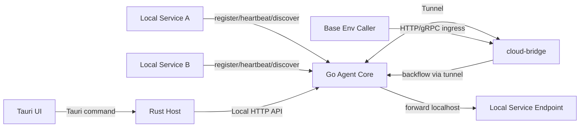
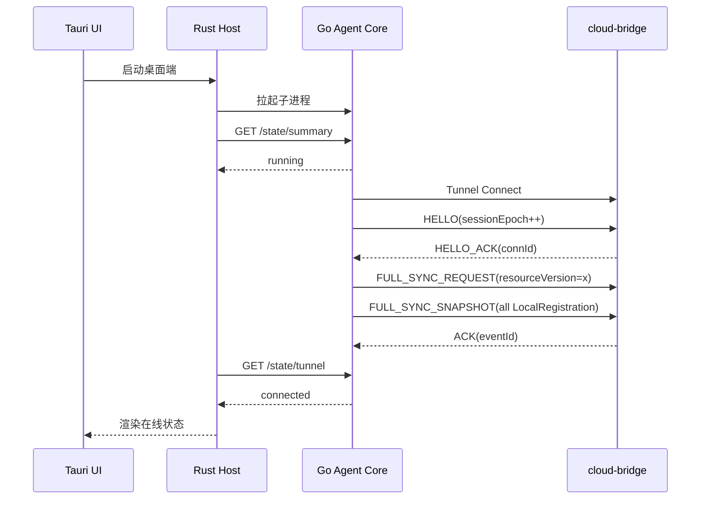
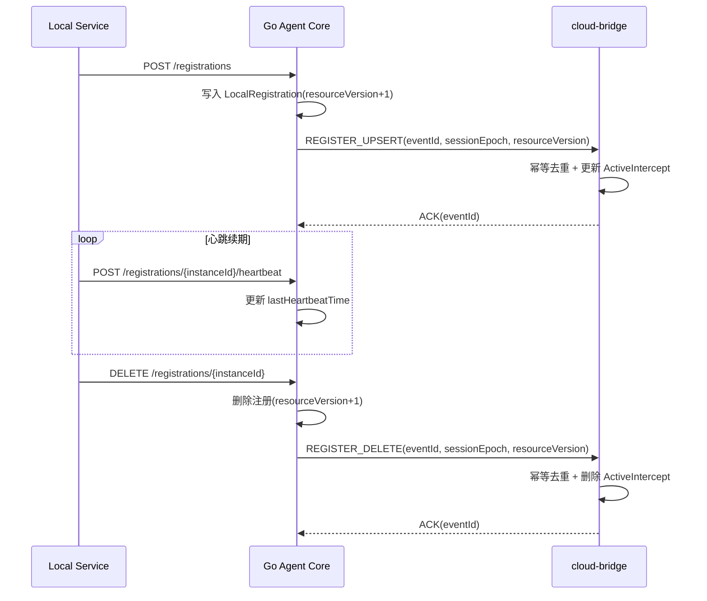
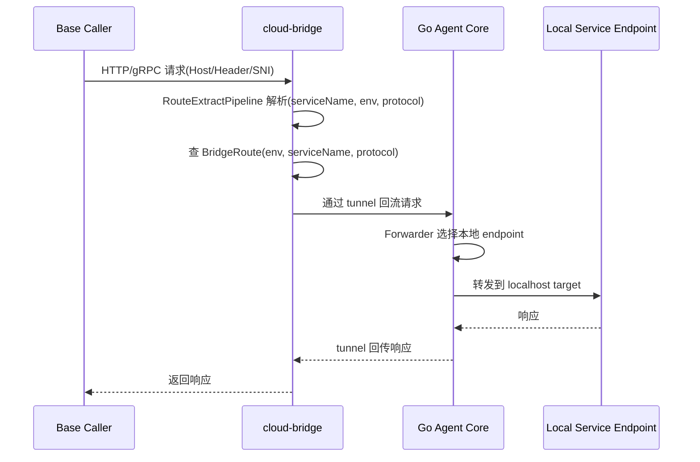
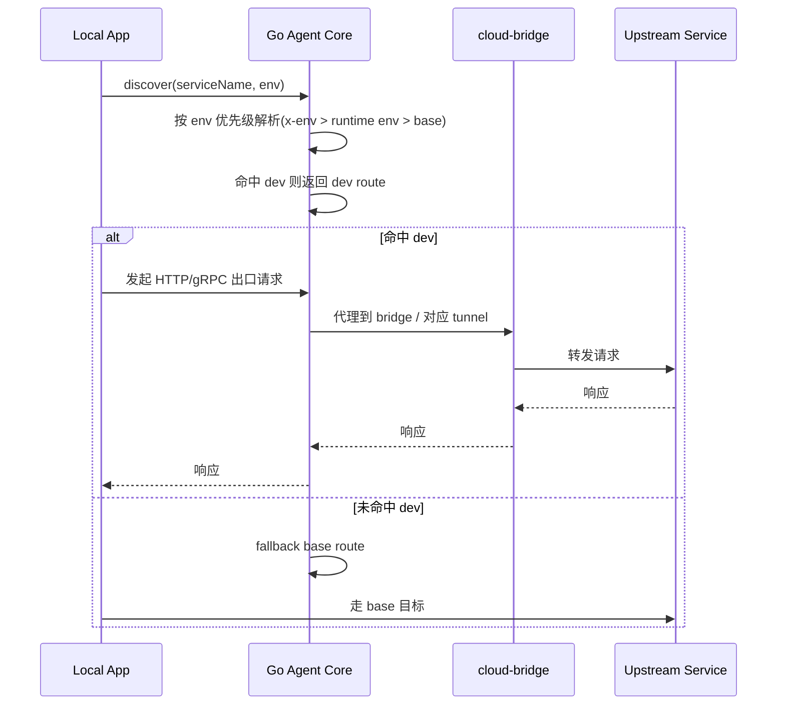
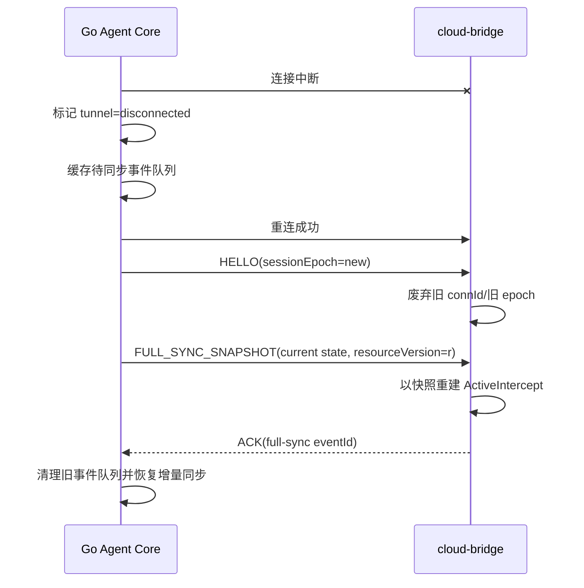
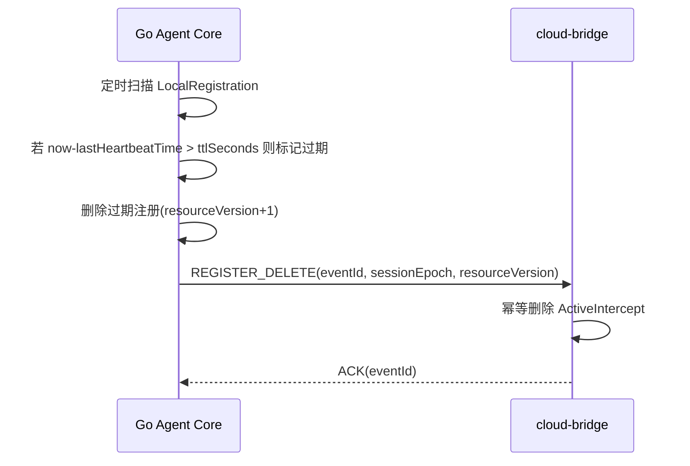

# DevLoop 一期完整技术方案

## 1. 文档目的

本文档定义 DevLoop 一期（MVP）的完整技术方案，覆盖架构、对象模型、接口契约、通信流程、一致性策略、验收口径与实施路径。  

---

## 2. 背景与目标

DevLoop 一期目标是构建研发联调闭环，打通以下链路：

1. Win11 本地桌面端 `dev-agent`（`Tauri UI + Rust Host + Go Agent Core`）
2. 云端 `cloud-bridge`
3. 业务系统 `agent registry` 接入
4. `HTTP` / `gRPC` 双协议联调能力

一期交付结果必须支持：

1. 本地服务注册到 `dev-agent`
2. `dev-agent` 通过 tunnel 将接管关系同步到 `cloud-bridge`
3. base 环境通过 bridge 访问到本地 dev 服务（入口回流）
4. 本地服务通过 `dev-agent` 完成发现与出口代理（dev 优先、base fallback）

---

## 3. 范围定义

### 3.1 一期必须实现

1. 协议可扩展架构（一期实现 HTTP/gRPC，模型支持新增协议）
2. 多实例、多端口注册模型
3. Route 提取抽象（`Host` / Header / `SNI`）
4. Rust Host 与 Go Agent Core 本地 `HTTP API` 控制面通信
5. tunnel 长连接、重连、全量重同步
6. 同步事件幂等（`sessionEpoch`、`resourceVersion`、`eventId`）
7. 注册心跳续期与 TTL 被动摘除
8. UI 实时状态展示与诊断信息输出

### 3.2 一期明确不做

1. agent 与 bridge 鉴权
2. 接管权限控制
3. token 加密存储
4. 主动健康检查（HTTP/gRPC probe）自动摘除
5. 路由来源可信级与 Header 防注入策略（企业内 VPN 场景下延期到二期）

---

## 4. 总体架构

### 4.1 组件与职责

1. `Tauri UI`
   - 展示状态、配置、日志、诊断数据
   - 通过 Tauri command 调用 Rust Host
2. `Rust Host`
   - 管理窗口、托盘、配置目录、日志目录
   - 拉起并管理 Go Agent Core 子进程
   - 通过本地 `HTTP API` 调用 Go Agent Core
3. `Go Agent Core`
   - 注册、心跳、注销、发现、出口代理
   - tunnel client、状态同步、回流转发
   - 运行时内存态状态机
4. `cloud-bridge`
   - tunnel session 管理
   - ActiveIntercept 管理
   - ingress（HTTP/gRPC）路由与转发

### 4.2 架构总览图



---

## 5. 设计冻结（一期强约束）

### 5.1 协议扩展模型

必须定义并实现以下抽象：

1. `ProtocolAdapter`：协议入口解析、出口代理、回流转发、错误映射
2. `IngressResolver`：入口请求上下文解析
3. `RouteTarget`：统一路由目标
4. `Forwarder`：agent 本地转发器
5. `EgressProxy`：出口代理器

约束：

1. HTTP/gRPC 以插件化适配器接入
2. tunnel/注册/路由/状态同步等协议无关逻辑独立
3. 新协议接入以新增适配器为主，不重构 tunnel 主干

### 5.2 注册模型

必须使用以下键模型：

1. `ServiceKey = (env, serviceName)`
2. `InstanceKey = (env, serviceName, instanceId)`
3. `EndpointKey = (env, serviceName, instanceId, protocol, listenPort)`

`instanceId` 规则必须冻结（推荐 `UUID`，或 `hostname + pid + startTs`）。

### 5.3 路由提取模型

必须实现：

1. `RouteExtractor`
2. `RouteExtractResult(serviceName, env, protocol, source)`
3. `RouteExtractPipeline`（优先级可配置）

一期必须内置：

1. `HostExtractor`
2. `HeaderExtractor`
3. `SNIExtractor`

### 5.4 env 透传与优先级

必须统一支持 `x-env` 与 `X-Env`，并配置化优先级。默认规则：

1. 显式请求头 `x-env` / `X-Env`
2. 运行时默认 `envName`
3. 回退 `base`

HTTP 与 gRPC 必须使用同一套 env 解析配置。

### 5.5 状态与持久化

必须采用运行时内存态注册表：

1. 注册表、发现结果、接管关系不持久化
2. agent 重启不恢复旧注册
3. tunnel 重连后按当前内存态全量重同步
4. 心跳超时后被动摘除并同步下线事件

### 5.6 同步一致性与幂等

agent 与 bridge 的同步模型必须包含：

1. `sessionEpoch`：每次 tunnel 建连成功后递增
2. `resourceVersion`：快照版本
3. `eventId`：事件唯一 ID

必须满足：

1. `register/unregister/full-sync` 可幂等重放
2. bridge 对重复事件返回成功语义
3. bridge 拒绝旧 epoch 事件

---

## 6. 核心对象模型

### 6.1 LocalRegistration

```text
serviceName: string
env: string
instanceId: string
metadata: map[string]string
healthy: bool
registerTime: timestamp
lastHeartbeatTime: timestamp
ttlSeconds: int
endpoints: []LocalEndpoint
```

### 6.2 LocalEndpoint

```text
protocol: enum(http|grpc|...)
listenHost: string
listenPort: int
targetHost: string
targetPort: int
status: enum(active|inactive)
```

### 6.3 ActiveIntercept

```text
env: string
serviceName: string
protocol: string
tunnelId: string
instanceId: string
targetPort: int
status: string
updatedAt: timestamp
```

### 6.4 BridgeRoute

```text
env: string
serviceName: string
protocol: string
bridgeHost: string
bridgePort: int
tunnelId: string
targetPort: int
```

### 6.5 TunnelSession

```text
tunnelId: string
rdName: string
connId: string
sessionEpoch: int64
status: string
lastHeartbeatAt: timestamp
connectedAt: timestamp
```

---

## 7. 接口契约

### 7.1 本地服务 -> Go Agent Core（管理面 API）

1. `POST /api/v1/registrations`
   - 注册服务实例与 endpoints
2. `POST /api/v1/registrations/{instanceId}/heartbeat`
   - 心跳续期
3. `DELETE /api/v1/registrations/{instanceId}`
   - 注销实例
4. `POST /api/v1/discover`
   - 发现目标服务（dev 优先，base fallback）
5. `GET /api/v1/registrations`
   - 查询当前注册表

### 7.2 Rust Host -> Go Agent Core（控制面 API）

1. `GET /api/v1/state/summary`
2. `GET /api/v1/state/tunnel`
3. `GET /api/v1/state/intercepts`
4. `GET /api/v1/state/errors`
5. `POST /api/v1/control/reconnect`

### 7.3 Agent <-> Bridge（tunnel 消息类型）

1. `HELLO` / `HELLO_ACK`
2. `FULL_SYNC_REQUEST`
3. `FULL_SYNC_SNAPSHOT`
4. `REGISTER_UPSERT`
5. `REGISTER_DELETE`
6. `TUNNEL_HEARTBEAT`
7. `ACK`
8. `ERROR`

消息头必须包含：

1. `sessionEpoch`
2. `resourceVersion`
3. `eventId`
4. `sentAt`

---

## 8. 通信流程（完整 Mermaid 图）

### 8.1 启动、握手与初次全量同步



### 8.2 注册、心跳、注销同步流程



### 8.3 入口回流（base -> bridge -> dev 本地）



### 8.4 出口发现与代理（dev 优先、base fallback）



### 8.5 断线重连与一致性恢复



### 8.6 心跳超时被动摘除



---

## 9. 错误模型与重试策略

### 9.1 统一错误分类

1. `ROUTE_NOT_FOUND`
2. `ROUTE_EXTRACT_FAILED`
3. `TUNNEL_OFFLINE`
4. `LOCAL_ENDPOINT_UNREACHABLE`
5. `UPSTREAM_TIMEOUT`
6. `INVALID_ENV`
7. `STALE_EPOCH_EVENT`
8. `DUPLICATE_EVENT_IGNORED`

### 9.2 重试规则

1. tunnel 断线后按阶梯退避重连（默认每次 +5s，最大 60s）
2. 可重试同步事件必须带同一 `eventId` 重放
3. 不可重试错误（协议解析失败、参数非法）直接返回并记录

---

## 10. 配置模型

### 10.1 关键配置项

```yaml
agent:
  rdName: "alice"
  envName: "dev-alice"
  tunnel:
    bridgeAddress: "bridge.example.internal:443"
    heartbeatIntervalSec: 10
    reconnectBackoffMs: [5000, 10000, 15000, 20000, 25000, 30000, 35000, 40000, 45000, 50000, 55000, 60000]
  registration:
    defaultTTLSeconds: 30
    scanIntervalSec: 5
  routeExtract:
    order: ["host", "header", "sni"]
  envResolve:
    order: ["requestHeader", "runtimeDefault", "baseFallback"]
```

---

## 11. 可观测性与诊断

### 11.1 诊断输出

1. 最近错误列表（带错误码与上下文）
2. 最近请求摘要（入口/出口、命中 env、延迟、结果）
3. tunnel 状态（connected、lastHeartbeat、sessionEpoch）
4. 当前注册表与 ActiveIntercept 摘要

### 11.2 UI 必须展示

1. agent 状态
2. bridge 状态
3. tunnel 状态
4. 当前 env、rdName
5. 本地注册项
6. 接管关系
7. 最近错误

---

## 12. 非功能目标（一期硬指标）

1. tunnel 断线重连后，P95 在 `10s` 内恢复有效路由
2. 注册变更同步到 bridge 生效延迟 P95 不超过 `2s`
3. 单 agent 运行时内存态至少支持 `200` 个 `LocalRegistration` 与 `400` 个 endpoint
4. 入口回流代理链路额外延迟 P95 不超过 `20ms`（同地域内网基准）

---

## 13. 实施阶段（P0-P8）

1. `P0` 设计冻结：抽象接口、对象模型、消息模型、错误码、NFR 指标
2. `P1` Tauri 桌面壳：UI、Rust Host、子进程管理
3. `P2` Go Agent Core 基础能力：注册/心跳/注销/发现/状态接口
4. `P3` cloud-bridge 基础能力：session/intercept/route 管理
5. `P4` tunnel 与同步：握手、心跳、重连、全量重同步、幂等
6. `P5` 入口回流：RouteExtractPipeline、HTTP/gRPC ingress、本地转发
7. `P6` 出口代理：discover、env 透传、HTTP/gRPC egress
8. `P7` UI 一期页面：Dashboard、注册列表、接管列表、日志、配置
9. `P8` Demo 联调：order/user 双服务，HTTP/gRPC 全链路验证

---

## 14. 验收口径

### 14.1 功能验收

1. Win11 可启动桌面端，Rust Host 稳定拉起 Go Agent Core
2. agent 与 bridge 长连接稳定，心跳正常
3. 本地注册、心跳、注销可实时生效并同步到 bridge
4. base->bridge->dev 回流链路可用（HTTP/gRPC）
5. 出口发现满足 dev 优先、base fallback
6. 多实例、多端口注册与转发正确
7. tunnel 重连后状态恢复正确
8. 异常退出可在 TTL 时间窗内被动摘除
9. 重复事件、乱序、重放不破坏最终一致性
10. UI 状态展示与后端真实状态一致

### 14.2 工程验收

1. UI/Rust/Go/Bridge 模块边界清晰
2. 协议无关层与协议适配层边界清晰
3. 新协议接入不需重构 tunnel 主干
4. 路由提取与 env 解析优先级均可配置
5. 日志可追踪、错误码可定位、配置项完整

---

## 15. 风险与应对

1. 风险：重连后状态漂移  
   应对：`sessionEpoch + full-sync + eventId` 幂等机制
2. 风险：实例异常退出造成脏注册  
   应对：心跳 + TTL 扫描被动摘除
3. 风险：多协议实现耦合过重  
   应对：强制 `ProtocolAdapter` 抽象与协议无关层隔离
4. 风险：联调问题难定位  
   应对：统一错误码、请求摘要、状态查询接口与 UI 可视化
